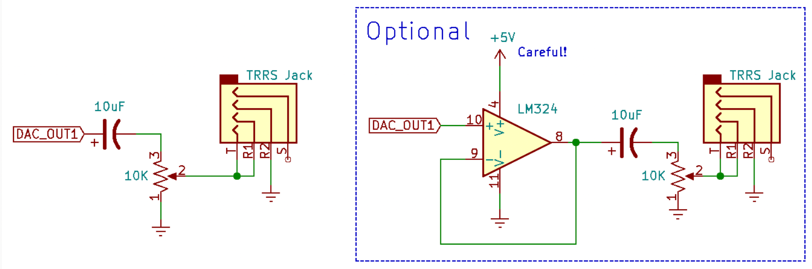

# Homework 7: The Music Machine
In this homework exercise, we're going to build a system to play music using timers for sequencing and frequency generation and using the DAC to produce analog signals. This is a common thing to do in a mini-project, so we want everyone to familiarize themselves with it right now. Most of the remaining homework will be for the purpose of exploring devices that you may want to use for mini-projects.

There is a lot to read here — if you want to — but all you need to turn in is the work for Step 4. Steps 1 - 3 gradually build up the concepts to allow you to understand what's going on.

To complete this work, you will use the subroutines you wrote for lab 6. You will turn in a main.c that is capable of playing one of the MIDI files provided to you.

## Step 0: Physical circuitry
Wire an LM324N and speaker to the DAC output of your STM32 as shown in the circuit below. Alternately, you may connect the DAC output to a set of amplified speakers. (You'll have a lot more fun if you use amplified speakers.) If you're using earplugs, consider adding a 10KΩ potentiometer between the capacitor and the TRRS jack. That way, you can control the volume and protect your hearing.



## Step 1: Make the following initial program work
There are several support files provided for you. You should download all of them now, although they won't all be used until Step 4. There are also support files:
- initial [main.c](src/main.c)  
- [midiplay.h](src/midiplay.h)  
- [step.c](src/step.c)  
- [wavetable.c](src/wavetable.c)  
    and over in the Reference Libraries page:
- [midi.c](src/midi.c)  
- [midi.h](src/midi.h)  

You will also need **one** of the provided encoded MIDI files as described below. If you download more than one, you should exclude all but one from compilation. You should start with [scale.c](src/scale.c).  
You should complete the missing parts of subroutines so that the nine notes that are audible and sound good together. Look for any "TODO" phrases in the code to ensure you find everything. Use your work from lab 6 as an aid to filling things in. You may want to experiment with using only one note at a time until you get things working correctly.

### Watch your math!
One of the things you'll need to do to complete `init_tim6()` is calculate values for PSC and ARR based on the symbolic constant RATE which is #defined at the top of the file. The goal is to be able to change RATE later to experiment with it. The step array is set up to work no matter what value you use for RATE.

There are many ways to make mistakes here, so this merits some discussion. A common thing to do is select a value for PSC and then use division to calculate the value to use for ARR. There is no hardware divide instruction on a Cortex-M0 CPU, so it's done (slowly) in software. That's acceptable for an initialization routine that's only called once. The real problem is that integer division in C does not always produce the desired effect. For instance, if you have the following statement:
```
int x = 30000 / 50000;
```
The result stored into **x** will be zero—because integer division always rounds <ins>down</ins>. Easy enough to understand.

If you use too large of a value for PSC, and then calculate ARR like this:  
```
	TIM6->ARR = 48000000 / ((TIM6->PSC+1) * RATE) - 1;
```

Then the division will result in a zero, and you'll end up storing (0 - 1) into the ARR. In binary, that's represented as all 1s. In hexadecimal, it's all Fs. It's often a surprise when this happens.

**How are you supposed to debug this?**
In SystemWorkbench, look at the I/O Registers tab, scroll down to the TIM section, look at TIM6, and look at the ARR value. (You may need to single-step through some code to make the value appear.) If you see 0xffff (or 0xffffffff for TIM2), then you know you have a division problem.

Generally, the right thing to do when you have a divisor that's going to potentially change is to use as small of a prescaler value as is possible. For instance, if RATE is 5000, and we don't think we'll ever make it any smaller than that, then we should set the prescalar as small as we can so that the ARR value still allows us to have a rate of 5000. For instance if we set PSC to 1-1==0, then ARR would need to be 48,000,000 / 5000 - 1 = 9600-1 to get the correct rate. Having a small prescaler avoids the division problem. If we increase RATE to something much larger, like 30000 then ARR will get smaller, but it's still not a problem.

**Try it**
This is about all you did in lab 6 except that there is now a table of step values in the step.c file. You can specify note number 69 to select 440 Hz. After filling in the subroutines, set up your main() as follows:
```
int main(void)
{
    init_wavetable_hybrid2(); // set up wavetable
    init_dac();         // initialize the DAC
    init_tim6();        // initialize TIM6
    note_on(0,0,60,128); // play C
    note_on(0,0,64,128); // play E
    note_on(0,0,67,128); // play G
    for(;;)
	asm("wfi");
    return 0;
}
```

## Step 2: Playing sequences of notes
Step 1 was only good for testing static notes and chords. Let's build something that can play sequences of notes so that we can play a song. For this step, change the main() function to be as follows:
```
int main(void)
{
    init_wavetable_hybrid2();      // set up wavetable form
    init_dac();         // initialize the DAC
    init_tim6();        // initialize TIM6
    init_tim2(500000);	// initialize TIM2
    for(;;)
	asm("wfi");
    return 0;
}
```

and then create a function called `init_tim2(int n)` that initializes timer 2 to invoke an interrupt every n microseconds. This is easy to do if you set the timer2 prescaler to divide by 48, right? (**NOTE: You really need to set the prescaler to divide by 48 for this. Do it.**) When `init_tim2()` is called with a value of 500000 it will invoke the ISR <ins>twice per second</ins>. Then, build the interrupt service routine as follows:
```
uint8_t notes[] = { 60,62,64,65,67,69,71,72,71,69,67,65,64,62,60,0 };
uint8_t num = sizeof notes / sizeof notes[0] - 1;
void TIM2_IRQHandler(void)
{
    // TODO: remember to acknowledge the interrupt here!

    // turn off previous note
    note_off(0,0,notes[num],128);
    // advance to next note
    num = (num + 1) % (sizeof notes / sizeof notes[0]);
    // turn on note
    note_on(0,0,notes[num],128);
}
```
When you get this working, you should hear a scale starting from C4 (a.k.a., middle "C", note 60), up to C3 (note72) and back down to to middle "C". Then it plays one zero note, which has a frequency of about 8 Hz. That's just sub-audible clicking, so it doesn't sound like a note. It makes a good space.

This is the minimum necessary to play a sequence of notes, although this is not a very interesting song for multiple reasons. We have only one note playing at one time, each note is exactly the same length, and each new note starts the moment the previous note stops. It's sort of limited for music.

## Step 3: Variable length notes
There are two fairly obvious ways to create variable length notes. One way would be to dynamically change the ARR value of the timer to produce an interrupt at the next time that a note is supposed to turn on or off. That gets a little tricky to handle when we get to the point of playing multiple notes at once—especially when the notes that are playing start and end at different times with respect to one another.

For this step, we'll used a fixed-rate timer that interrupts at a much higher rate than the rate of beats for the music. The idea is that it should be a high enough rate that we can make short notes have a small number of interrupts, and long notes will take many interrupts.

Change the `init_tim2()` argument so that it invokes an interrupt about 480 times faster than it did before. (You can just call it with the value 1000. Close enough.) Then change the interrupt service routine as follows:
```
// An array of structures that say when to turn notes on or off.
struct {
    int when;
    uint8_t note;
    uint8_t volume;
} events[] = {
        {480,84,0x73}, {556,84,0x00}, {960,84,0x74}, {1008,84,0x00},
        {1440,91,0x76}, {1520,91,0x00}, {1920,91,0x79}, {1996,91,0x00},
        {2400,93,0x76}, {2472,93,0x00}, {2640,94,0x67}, {2720,94,0x00},
        {2880,96,0x67}, {2960,96,0x00}, {3120,93,0x6d}, {3180,93,0x00},
        {3360,91,0x79}, {3440,91,0x00}, {4320,89,0x70}, {4408,89,0x00},
        {4800,89,0x73}, {4884,89,0x00}, {5280,88,0x73}, {5360,88,0x00},
        {5760,91,0x79}, {5836,91,0x00}, {6240,86,0x79}, {6308,86,0x00},
        {6720,86,0x76}, {6768,86,0x00}, {7200,84,0x76}, {7252,84,0x00},
        {8160,84,0x73}, {8236,84,0x00}, {8640,84,0x74}, {8688,84,0x00},
        {9120,91,0x76}, {9200,91,0x00}, {9600,91,0x79}, {9676,91,0x00},
        {10080,93,0x76}, {10152,93,0x00}, {10320,94,0x67}, {10400,94,0x00},
        {10560,96,0x67}, {10640,96,0x00}, {10800,93,0x6d}, {10860,93,0x00},
        {11040,91,0x79}, {11120,91,0x00}, {12000,86,0x76}, {12080,86,0x00},
        {12480,86,0x73}, {12552,86,0x00}, {13440,84,0x6d}, {13440,88,0x73},
        {13508,88,0x00}, {13512,84,0x00}, {13920,86,0x76}, {14004,86,0x00},
        {14400,86,0x76}, {14472,86,0x00}, {15152,81,0x3b}, {15184,83,0x44},
        {15188,81,0x00}, {15220,84,0x46}, {15228,83,0x00}, {15248,86,0x57},
        {15264,84,0x00}, {15284,88,0x5c}, {15292,86,0x00}, {15308,89,0x68},
        {15320,88,0x00}, {15336,91,0x6d}, {15344,89,0x00}, {15364,93,0x6d},
        {15368,91,0x00}, {15460,93,0x00},
};

int time = 0;
int n = 0;
void TIM2_IRQHandler(void)
{
    // TODO: Remember to acknowledge the interrupt here!

    // Look at the next item in the event array and check if it is
    // time to play that note.
    while(events[n].when == time) {
        // If the volume is 0, that means turn the note off.
        note_on(0,0,events[n].note, events[n].volume);
        n++;
    }

    // Increment the time by one tick.
    time += 1;

    // When we reach the end of the event array, start over.
    if ( n >= sizeof events / sizeof events[0]) {
        n = 0;
        time = 0;
    }
}
```

The big data structure is an array of events that say what note to turn on and what volume level to use. There's a trick built in to the `note_on()` function where it checks the volume (also called the "velocity" because it corresponds to the speed at which a piano key is struck) and invokes `note_off()` when the volume is zero.

This example plays the xylophone part in the song <ins>Somebody That I Used to Know by Gotye</ins>. (A lot of the time, I can't figure out what he's singing about, but this song mostly makes sense. And it has a plinky xylophone part that I thought would make a recognizable example.) A xylophone makes tones of short duration, and the timer routines allow that to happen because interrupts happen so much faster than the notes. If you listen closely, you can tell that there are two notes being played at the same time at one point in the song. In the trill at the end of the song, there are a few notes that overlap at the same time.

**A note about interrupt priority**
Try an experiment. Maybe you already did this in lab 6. If not, you should try it now. Add a useless loop in `TIM2_IRQHandler()` to make it run longer like this:
```
for(int x=0; x < 10000; x++)
	;
```
Now try it, and listen to what it sounds like. Not so good, right? That's because timer 2, which is checking to see if a new note should be played, naturally has a higher interrupt priority than timer 6, which is doing the job of playing that note. The timer 2 interrupt will *preëmpt* the execution of the timer 6 interrupt, and that makes the generation of sound waves skip a little bit. You can hear that. It's important to make the timer interrupt that's generating things <ins>with observable timing</ins> have a higher interrupt priority than anything else.

To correct the problem, change the priority of the interrupts from ther defaults to one that make the TIM6 ISR more important than the TIM2 ISR. This way, the TIM6 ISR will never be interrupted, and it will preëmpt the TIM2 ISR if it runs for a long time. Effectively, this means that the TIM2 ISR might be delayed slightly because it must wait on the TIM6 ISR to finish. You will not notice when a note starts or stops a few milliseconds later than it should. In contrast, if a tone is interrupted for a millisecond, you will hear it as a click. **This is the best example we can give you for the need for setting interrupt priorities.**

Recall that setting interrupt priority is fraught with difficulty since the NVIC_IPR registers must be read and written as 32-bit values, and they each contain the priorities for four interrupts. In each priority byte, only the two most significant bits are used. It makes for an unpleasant experience when attempting to use &= and |= to update values.

The C language supports *preprocessor* macros whose definition and use look like:
```
#define AddOne(x) (x+1)
...
int n = 5;
int y = AddOne(n);
```

Here `AddOne()` looks like a function call. It is really just a symbolic substitution of "AddOne(*name*)" with "*name*+1". The Standard Peripheral library has many macros, but you are generally discouraged from using them since they are a little too magical and get in the way of students actually understanding the mechanisms in use. Because setting interrupt priority is so complicated, *this is the one exception* to the prohibition on the use of macros. If you invoke `NVIC_SetPriority(TIM6_DAC_IRQn,0)` to `init_tim6()` and then add a call to `NVIC_SetPriority(TIM2_IRQn,3)` to `init_tim2()`, and try running the program again. It should sound nice and smooth even though `TIM2_IRQHandler()` still has that useless loop in it. Now, when `TIM2_IRQHandler()` is running it can be interrupted by `TIM6_DAC_IRQHandler()`.
Actually, `NVIC_SetPriority()` is not a macro. It's an *inline function*, which is almost the same thing. You can see what it does by looking at the definition in CMSIS/core/core_cm0.h in your SystemWorkbench project.

## Step 4: Using a Music File Interpreter
The song player in Step 3 works well enough, but it's very tedious to encode all of the notes into an array of structures as was done with the **events** array. Wouldn't it be nice to have some kind of standard notation that could be interchanged between different applications as well as hardware? Such a standard exists. It is called the Musical Instrument Digital Interface (MIDI), which defines not only a serial communication protocol to interface instruments to controllers, but also a Standard MIDI File (SMF) format for notated music.

A Standard MIDI File is somewhat similar to the the **events** array. (In fact, the **events** array used in Step 3 was manually extracted from a real MIDI file that played the entire song with multiple other instruments.) Each *track* in an SMF describes a list of events and time offsets at which they should occur. For instance, an event might be "Turn on note N of channel C with a velocity (volume) of V" or "change channel C to use instrument I". There are also "meta events" such as "set tempo" or "show lyric". The time offsets are encoded in as offset from the previous event in a track. The time offsets are calculated with respect to the "microseconds per beat" defined by a "set tempo" event along with a "divisions per beat" defined in the MIDI file header. By default, the SMF format uses 500000 microseconds per beat (two beats per second), and 48 divisions per beat. That means that a timer must be set up to occur at about 10417 times per second.

There is some inherent complexity to the SMF format because it supports multiple "tracks" that define different types of instruments. These tracks are separated through the file, but are expected to be played simultaneously. Your instructor wrote this MIDI interpreter to handle this for you (and he wonders why he never did this years before since it's such a useful thing). Here is what you need to do to use it:  
- The value for RATE is defined in midiplay.h and is 20000. This is used to st all of the values in the **step** array to make all of the notes correct. You may change that if you want to, but it will also sound much better when playing notes if it is much higher than 2500 Hz. (Nyquist's Law)
- Make sure the [midi.c](src/midi.c) and [midi.h](src/midi.h) files that define the interpreter are being compiled into your project.  
- The array `uint8_t midifile[]` must be compiled into your program. It is the encoded MIDI file. Download the [scale.c](src/scale.c) file that defines a simple song to play. It is an image of an SMF converted to a C array. Once that works, remove it (or exclude it from compilation) and replace it with a more complicated song such as one of the following:
    - [chariots-of-fire.c](src/chariots-of-fire.c) (by Vangelis)  
    - [eleanor-rigby.c](src/eleanor-rigby.c) (by The Beatles)  
    - [fur-elise.c](src/fur-elise.c) (by Beethoven)  
    - [imagine.c](src/imagine.c) (by John Lennon)  
    - [maple-leaf-rag.c](src/maple-leaf-rag.c) (by Scott Joplin)  
- Change `init_tim2(int n)` to configure TIM2 so that the CR1_ARPE bit is set. This will allow us to change the rate of timer 2 dynamically. **Make sure you set the initial PSC and ARR values before setting ARPE or you might have to wait 71 minutes for your music to begin.**
- Make the changes to your main() function as shown below.

The code changes are minimal. You already have functions called `note_on()` and `note_off()` that play notes. The MIDI interpreter is set up to use these automatically. (There are "weak" definitions for the same functions in midi.c. The "weak" functions do nothing. When you define your own "strong" function, it takes the place of the "weak" function and implement the mechanisms to do the work needed to play music.)

In addition to the `note_on()` and `note_off()` functions, you also need a `set_tempo()` function to change the rate of event processing. Add this, with the following new `TIM2_IRQHandler()` and `main()` functions below:
```
void TIM2_IRQHandler(void)
{
    // TODO: Remember to acknowledge the interrupt right here!

    midi_play();
}

int main(void)
{
    init_wavetable_hybrid2();
    init_dac();
    init_tim6();
    MIDI_Player *mp = midi_init(midifile);
    // The default rate for a MIDI file is 2 beats per second
    // with 48 ticks per beat.  That's 500000/48 microseconds.
    init_tim2(10417);
    for(;;) {
        asm("wfi");
        // If we hit the end of the MIDI file, start over.
        if (mp->nexttick == MAXTICKS)
            mp = midi_init(midifile);
    }
}
```

Three support function to turn notes on and off and set the tempo are really all you need to adequately play most MIDI files. The majority of work interpreting the music definitions is done by the MIDI interpreter in midi.c.

You should remove the **events** array and anything else from Step 3 that you no longer need.

## Submit your code
That's it! You should now have an application that will play any standard MIDI file. Submit the code for your updated [main.c](src/main.c) file here.


You're still here? You say you want more? You know you don't have to turn in anything else, right? No plans for spring break? Well, then keep on reading and experimenting...

## Step 5: Pitch Bending
The MIDI interpreter introduced in Step 4 is has enough functionality to produce recognizable tunes—even with only three support functions. There are a few deficiencies. For one, instruments like guitars and violins have much more tone flexibility than producing exactly an "B" or a "C". It is easy to use a guitar to produce a tone that is halfway between a "B" and a "C". Sometimes, this is written into music. MIDI supports it as well. Let's talk about that.

### Pitch Bending
MIDI organizes sound production into channels. Each channel is presumably connected to a different kind of instrument. For instance, you might connect a MIDI controller to a digital piano and call it channel 1. Each channel can play multiple simultaneous notes on the instrument it is connected to. Some digital pianos have a device known as a *pitch wheel* that can be used to adjust the tone of **all** of the notes simultaneously in a variable linear fashion up or down by one step. This is how MIDI implements pitch shift functionality.

A MIDI pitch wheel event specifies a channel and a 14-bit value. It adjusts the frequency of all notes being played on a particular channel. A value of 0x2000 denotes "no shift". A value of 0x3fff means one step up, and a value of 0x0 means one step down. Any value between 0x0 and 0x3fff can be used and multiple sequential pitch wheel events in sequence can be used to produce a glissando (slide) effect.

When `note_on()` is called, it records the channel of the note in the **voice** array entry it uses. The wavetable step size is also recorded in the voice array entry. All we need to do to honor a pitch wheel event is iterate through the voice array, find every one in_use for the specified channel, and multiply it by the right value. ...How do we come up with the multiplier?

**Math Alert!** This may sting a bit...

There are twelve notes in an octave, and a note one octave higher has twice the frequency as the original. Therefore, the ratio of each note to the next lower note is 2<sup>1/12</sup> (the 12th-root-of-2 or about 1.05946309436). If you start at 440 Hz (the "A" above middle "C"), and multiply it by the 12th-root-of-2 12 times, you'll have 880 Hz, the "A" on the next octave higher.

In order to sound right, we need to take a linear value, and turn it into a multiplier that will divide by 2<sup>1/12</sup> if the value is 0, multiply by 1 if the value is 0x2000, and multiply by the 21/12 if the value is 0x3fff. A value of 0x3000 should then represent a half-step (A.K.A. semitone) higher than normal, or a multiplier of the square root of the 12th-root-of-2. This is accomplished by taking the linear value, subtracting 0x2000 to normalize it to zero, and raising the 12th-root-of-2 to the difference **divided by 0x2000**. This will raise the 12th-root-of-2 to the first power when the value is 0x3fff, it will raise the 12th-root-of-2 to the zeroth power when value is 0x2000, and it will raise the 12th-root-of-2 to the -1 power when value is 0x0. You may be uncomfortable with raising a non-integer value to a non-integer power. It's not a problem.

We want the subtraction and division to be done using floating math as well so that we don't have integer division problems. (0x1fff / 0x2000 in C is 0.) So instead of saying 0x2000, we'll call it 8192.0 to make it do a full floating point calculation.

Basically, the multiplier is:
```
	// STEP1 is #defined near the top of the step.c file.
	float multiplier = pow(STEP1, (value - 8192.0) / 8192.0);
```
Whew! Still with us? To implement the pitch wheel event, create the following function in your main.c file. It will automatically be used by the MIDI interpreter:
```
	void pitch_wheel_change(int time, int chan, int value)
	{
		...
	}
```

It should do that multiplier calculation, then iterate through the **voice** array to find each element that is **in_use** and matches **chan**. For each matching entry, you want to make the entry's **step** to be the product of the global **step** array entry for the note and the multiplier.
(e.g. `step[voice[n].note] * multiplier`) **Also, make sure you only calculate the multiplier once in the function call. If you put the pow() call in the loop, it will be too slow.**

### This sounds really slow to compute
Oh, yes, the `pow()` function is slow even on CPUs that have hardware floating point without "transcendental" calculation support. On an STM32, it's tragically slow, but it turns out to not matter much. Even if it takes a millisecond to do all of the floating point math emulation to raise a number to a power. While it's doing that calculation, it will still be interrupted by timer 6 to produce DAC samples. If it takes a millisecond too long to compute the value, your ears will never notice it.

If it was necessary, the primary way to make code like faster is to *precompute* a limited table of values. There are 16384 possible pitch wheel values, and this would require 4*16384 bytes of memory... which is too much. Your ears cannot discern this many pitch offsets, so it would be acceptable to compute a subset of the value, perhaps every 256th value. This is easy enough to do with a Python 3 program:
```
#!/usr/bin/env python3

STEP1 = pow(2, 1/12)
print("const float pitch_array[] = {", end='')

for n in range(0,16384,256):
  if n % 2048 == 0:
    print('')
  multiplier = pow(STEP1, (n - 8192) / 8192)
  print('%f, ' % multiplier, end='')
print('\n};')
```
Which produces the following array definition:  
```
const float pitch_array[] = {
0.943874, 0.945580, 0.947288, 0.948999, 0.950714, 0.952432, 0.954152, 0.955876,
0.957603, 0.959333, 0.961067, 0.962803, 0.964542, 0.966285, 0.968031, 0.969780,
0.971532, 0.973287, 0.975046, 0.976807, 0.978572, 0.980340, 0.982111, 0.983886,
0.985663, 0.987444, 0.989228, 0.991015, 0.992806, 0.994599, 0.996396, 0.998197,
1.000000, 1.001807, 1.003617, 1.005430, 1.007246, 1.009066, 1.010889, 1.012716,
1.014545, 1.016378, 1.018215, 1.020054, 1.021897, 1.023743, 1.025593, 1.027446,
1.029302, 1.031162, 1.033025, 1.034891, 1.036761, 1.038634, 1.040511, 1.042390,
1.044274, 1.046160, 1.048051, 1.049944, 1.051841, 1.053741, 1.055645, 1.057552,
};
```
Then, all that is necessary is to compute the multiplier based on the appropriate pitch wheel table entry:  
`	float multiplier = pitch_array[value >> 8];`

If you try either way, you probably won't be able to hear a difference.

### Try it out!
Here are some more MIDI files with guitar effects and fake singing:
- [Don't Stop Believin'](src/dont-stop-believin.c) Listen to the guitar part about 55 seconds in.
- [Stairway to Heaven](src/stairway-to-heaven.c) Lots of fake singing about 50 seconds in. I don't think it sounds much like Robert Plant.
- [Every Breath You Take](src/every-breath-you-take.c) It only takes 20 seconds to get to the fake singing. (Sting doesn't sound like this at all.)

## Step 6: Interesting Improvements
Most of the examples have recommended using the "hybrid2" waveform because it is more audible at low frequencies, and it is just buzzy enough that it covers up some annoying clicks produced at note termination. Listen to this by calling the `init_wavetable_hybrid2()` subroutine in `main()`. If you listen carefully, there will be a sharp click at the end of many notes. This is because `note_off()` clears the in_use flag of a voice regardless of what the output level of that voice is. If it is in the highest part of the sine curve, and it is the only active voice, the next sample will go to zero. This sharp discontinutity is noticeable with the sine wave.

Higher-quality sound synthesis systems use an Attack/Decay/Sustain/Release (ADSR) parametric filter to represent the envelope of a wave so that it gradually rises (attack) when a note starts, fades out (decay) soon after the note starts, levels out (sustain) for a longer duration of note, and then falls smoothly when the note is turned off (release). The STM32 is already a little short on both CPU resources and memory, so and ADSR envelope is out of reach without a lot of effort or interesting tricks.

We can fairly easily have a more gradual drop-off at the end of a note. We don't need to have a "release" parameter that models a diminishing volume of the wavetable/offset/step. All we need is a means of turning the sharp discontinuity into a more gradual slope. To implement this, we'll use the **last_sample** field already in the structure definition for the **voices** array:
```
	struct {
		uint8_t in_use;
		uint8_t note;
		uint8_t chan;
		uint8_t volume;
		int     step;
		int     offset;
		int      last_sample;
	} voice[15];
```

Then, change the sound mixer as follows:

- The line that looks like  
	`sample += (wavetable[voice[x].offset>>16] * voice[x].volume) >> 4;`
    should change, instead, to  
	`voice[x].last_sample = wavetable[voice[x].offset>>16];`  
	`sample += (voice[x].last_sample * voice[x].volume) >> 4;`  
    This will let it remember the last level it produced.

- At the end of the mixer's in_use check, add an "else if" to handle decaying volume for a released note whose volume has not decayed to zero:  
```
	if (voice[x].in_use) {
		...
	} else if (voice[x].volume != 0) {
		sample += (voice[x].last_sample * voice[x].volume) >> 4;
		voice[x].volume --;
	}
```

- Make sure the `note_off()` function does not set the volume field of a voice no longer in use to zero. It should leave the voice alone.  

The end result of these changes is that notes that are no longer being played that had a high final sample level will gradually fall off and avoid a discontinutity in the output. Try it. Use the sine wavetable to play something such as [Maple Leaf Rag](src/maple-leaf-rag.c). You can easily compare the before/after change by adding and removing an assignment in `note_off()` that clears the volume field. When the **volume** suddenly goes to zero, you'll still hear the clicks.

### Finding MIDI files and converting them to C arrays
Are we creating all of these songs for you? No. They are commonly available in archives on the web. Some favorites:
- [bitmidi.com](https://bitmidi.com/)
- [Classical Archives](https://www.classicalarchives.com/midi.html)
- [kunsterfuge.com](http://www.kunstderfuge.com/)  
Some of them may have license restrictions on what you may do with them. Please honor the licenses.

Once you have a Standard MIDI Format file, you simply convert the entire file into an array of unsigned characters. If you have a Unix-like system, you can use the [mkcfile](/src/mkcfile.c) utility to do the conversion. You may have other means. We should probably put a conversion service on this web page.

### Multi-Instrument Support
So far, we've used only one instrument at a time although MIDI files allow each channel to have a unique instrument with its own distinctive sound. A set of preconfigured sounds is often supplied with a MIDI synthesizer and a [standard mapping of numbers](https://www.midi.org/specifications-old/item/gm-level-1-sound-set) to sounds has been decided. Selection of an instrument for a channel in a MIDI file is called a *Program Change* and it invokes the following function:
```
	void program_change(int time, int chan, int prog)
	{
		// prog will range from 0 ... 127
		// The standard MIDI sound are numbered 1 ... 128
		// (prog + 1) is the sound number.
	}
```
To support multiple sounds, we first need multiple wave tables. So far, the single wave table we've used has N (1000) entries of two bytes each. We cannot have too many of these wave tables, since they reside in 32K of RAM. Since they are only a single cycle of a periodic waveform, they do not need as much detail as we've given them. Reducing N from 1000 to 100 will allow us to have dozens of wave tables for the same memory cost as before, and without a discernable lost in quality. Get rid of the **wavetable** array, and replace it with new N-element arrays of "short int" types. Name them **sine**, **sawtooth**, **square**, **hybrid**, and **hybrid2** which should be initialized by `init_sine()`, `init_sawtooth()`, `init_square()`, `init_hybrid()`, `init_hybrid2()`, respectively.

We'll need another entry in the **voices** array structure definition to keep track of the wave table to use:
```
	struct {
		uint8_t in_use;
		uint8_t note;
		uint8_t chan;
		uint8_t volume;
		int     step;
		int     offset;
		int     last_sample;
		int16_t *wavetable;
	} voice[15];
```
We need an array that maps the configured instrument (wave table) to each channel and a way to update it with the `program_change()` function.
```
int16_t *channel_wavetable[20]; // It's zero, by default.

void program_change(int time, int chan, int prog)
{
    channel_wavetable[chan] = hybrid; // Use this by default.
    if (prog >= 71 && prog <= 79) // flutes, recorders, etc.
        channel_wavetable[chan] = sine;
    if (prog == 29) // overdriven guitar
        channel_wavetable[chan] = square;
    if (prog >= 52 && prog <= 54) // choir voices
        channel_wavetable[chan] = sine;
}
```

We need to change `note_on()` to initialize the wave table for any note of a particular channel:
```
	void note_on(...)
	{
	    ...
            if (channel_wavetable[chan] == 0)
                voice[n].wavetable = hybrid;
            else
                voice[n].wavetable = channel_wavetable[chan];
	    ...
```
And, finally, we need to change the mixer function to look at the **wavetable** field of the voice rather than a global **wavetable** array. So the following line:
```
voice[x].last_sample = wavetable[voice[x].offset>>16];
```

should be changed to  
```
voice[x].last_sample = voice[x].wavetable[voice[x].offset>>16];
```

Try it. Do you like the sounds? Perhaps you want to change the configuration of the wave tables and suggest new ones to other students.

### Vibrato
Here's something you can do if you're bored or curious...

Because the STM32 is so limited on RAM, it is difficult to have any more interesting sound effects. An interesting one that we can create is *vibrato*. This is, for instance, when a note does not have a constant frequency but oscillates around a center frequency. It apparently speeds up and slows down.

The mixer uses a fixed-point math mechanism for traversing a wave table with a constant step. As the offset is moved through the wave table, it can produce a note. If we vary that step size rather than keep it a constant, we can then increase and decrease the pitch of what would otherwise be a constant tone.

In the mixer subroutine just before the loop to calculate the sample for each voice, add the following code:
```
    int i;
    for(i=0; i<100; i++) {
        const int vibrato_step = (4.0 * N / RATE) * (1<<16);
        static int vibrato_offset = 0;
        int vibrato = sine[vibrato_offset>>16] >> 2;
        vibrato_offset += vibrato_step;
        if (vibrato_offset >= N<<16)
            vibrato_offset -= N<<16;

        int x;
        int sample = 0;
        for(x=0; x < sizeof voice / sizeof voice[0]; x++) {
            ...
```

Then change the update of the voice wave table offset from
```
        voice[x].offset += voice[x].step;
```
to this instead:
```
        voice[x].offset += voice[x].step + vibrato;
```
This will set the **vibrato** variable to the value of the sine wave table at the **vibrato_offset** and reduced by a shift amount. The **vibrato_offset** will make a full cycle through the sine wave table at a rate of 4.0 Hz. When this value is added to voice[x].offset it will cause the traversal of that voice's wave table to occur faster or slower. The end result is that every note played will warble at a rate of 4 Hz. You could consider this to be a form of frequency modulation.

The example code works well with wave table sizes of 100 and a DAC RATE of 20000. Try this with something like [Stairway to Heaven](src/stairway-to-heaven.c). Small warning: **This is verrry spooky-sounding... Like flying saucer, alien, horror movie stuff. Some people find this effect to be deeply unsettling, especially when it is set to such an exaggerated level. It's totally OK to feel that way. Turn this off RIGHT NOW you don't like it.**

### Optimization
This is probably the busiest you've ever made the STM32 so far. The vibrato effect may not even work depending on how your other code is structured because it may make the mixer routine too slow to keep up with the DAC. You certainly cannot turn up the RATE much higher. But you can actually squeeze out a few more resources available if you **optimize** your code.

By default, your code compiled so that the debugger can examine variables, and single-step through your code. You can tell the compiler to optimize the code so that it runs faster, but it's no longer possible for the debugger to work with it. To do so, use these steps:  
- In the SystemWorkbench Project View (not the debugger), there is a hammer icon in the top toolbar. Immediately to the right is a drop-down menu with checkmarks for "Debug" and "Release". Check the "Release" item.
- Select Run -> Run Configuration... and, in the box under the "C/C++ Application:" label it says something like "Debug/hw7.elf" Press the "Search Project..." button and select the item for "Release/hw7.elf" instead and press "Apply".  

Now, when you press "Run", SystemWorkbench will download the optimized code to the STM32. You can test this by increasing the RATE value to 30000. It will probably work. Keep this in mind someday if you want to integrate the MIDI library with another software subsystem.

Note that when you click to invoke the debugger, it will tell bring up a source code window that says **No source available for "main()...".** You'll need to reconfigure it to use the executable compiled for debug by selecting Run -> Debug Configuration... and selecting the "Debug/hw7.elf" file instead.


## Conclusion
We hope you had fun with this. This exercise is a great way to demonstrate mid-scale software development and optimization techniques. This about the only type of software system for which interrupt priority becomes observable.

>Questions or comments about the course and/or the content of these webpages should be sent to the Course Webmaster. All the materials on this site are intended solely for the use of students enrolled in ECE 362 at the Purdue University West Lafayette Campus. Downloading, copying, or reproducing any of the copyrighted materials posted on this site (documents or videos) for anything other than educational purposes is forbidden.
