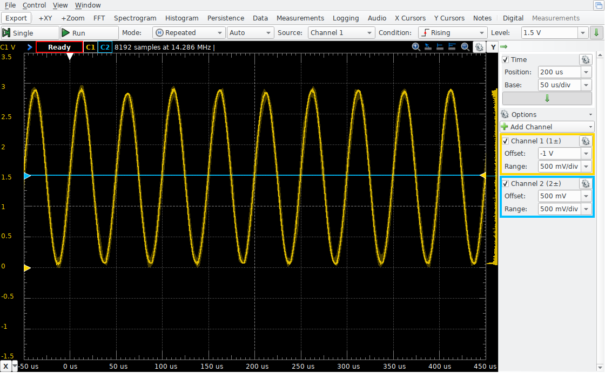
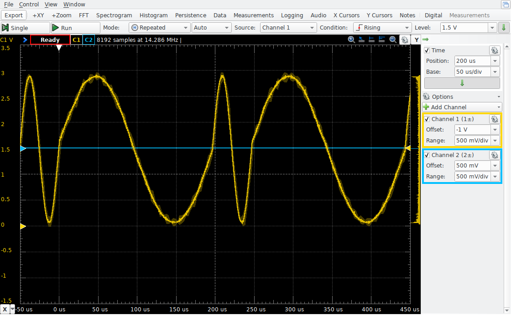

# Final Lab Practical Preparation
## Introduction
In this exercise, you'll review how to use the Direct Memory Access (DMA) unit with the DAC. In previous assignments, you used an ISR to feed samples to the DAC one at a time. Since there is overhead involved with invoking and returning from an ISR (saving and restoring registers), there are limits to how fast samples can be fed into the DAC. DMA avoids this overhead, so the resulting sample rate can be much higher. The downside is that, since DMA can only copy from one address to another, it cannot calculate any new values. It cannot, for instance, perform fixed-point step and offset calculations to sum together multiple precise musical notes.

**Template File**
```
#include "stm32f0xx.h"
#include <math.h>
#include <stdint.h>
#define SAMPLES 30
uint16_t array[SAMPLES];

void setfreq(float fre)
{
   // All of the code for this exercise will be written here.

}

int main(void)
{
    // Uncomment any one of the following calls ...
    //setfreq(1920.81);
    //setfreq(1234.5);
    //setfreq(8529.48);
    //setfreq(11039.274);
    //setfreq(92816.14);
}
```
## Step 0: Physical circuitry

You can use the audio circuitry you used for lab 6, but it will be necessary to carefully measure the output produced by the DAC channel 1. Since the waveforms produced will be outside the audible frequency range, this is best done with an AD2 or ADALM2000. You may connect the scope input directly to the PA4 pin and the ground to one of the ground pins of the microcontroller.

## Step 1: Decide on a timer and DMA channel

There are two ways that this system can be implemented:
1. The timer can trigger both the DAC, as well as a DMA channel.
2. The timer can trigger the DAC, and the DAC can trigger the DMA channel.

Either way will work just as well as the other. The common factor is that the DAC must be triggered with a timer. When you look at the Family Reference Manual for the TSEL1 field of the DAC_CR register, you can see that it can be triggered by the following sources:
| Setting  	| Trigger source|
| -------   | --------------|
| 000	| Timer 6 TRGO|
| 001	| Timer 3 TRGO|
| 010	| Timer 7 TRGO|
| 011	| Timer 15 TRGO|
| 100	| Timer 2 TRGO|
| 101	| (Reserved)|
| 110	| EXTI Line 9|
| 111	| Software trigger|

The DAC can be triggered by only the five timers that are shown. Choose any one of them. If this was a problem on a lab practical, you would be told which timer to use. Be prepared for that.

### 1.1 Configure the timer TRGO (trigger output)
Notice that the trigger source is listed as "TRGO" rather than something like the UPdate or CHannel trigger that you used for generating interrupts or for the DMA trigger in various labs.

The trigger output (TRGO) of a timer is configured by the MMS field of the timer's CR2 register. See the documentation for the CR2 register of the timer you've selected to find out what value you must put into the MMS field to produce a TRGO event when the counter Update occurs. (There are also options for "Reset" and "Enable". Don't worry about these.)

Once the TRGO event is configured, you may set up the timer as you normally would to produce update events at the desired rate.

### 1.2 Triggering DMA with the DAC

You learned in lab experiment 8 that DMA can be triggered by the SPI device when it is ready to transmit more data. The DAC is capable of making the same kind of request. By setting the DMAEN1 bit of the DAC_CR register, each time the DAC is triggered (by the timer you selected) the DAC will trigger a DMA channel. Only one DMA channel can be triggered by DAC channel 1. Which one is it? To find out, look at Table 31, on page 203 of the Family Reference Manual. Find the row that says "DAC" and scan across to find out which DMA channel can be triggered by this peripheral. There is only one DMA channel that can be used. (Yes, you can look at Table 33 to find out the very special things that the STM32F091 can do, but save that effort for a time when you have a large project where you have already used the obvious DMA channel for something else, and you need to use a different one.)

If you choose to use this method, the DAC decides which DMA channel to use, and there is only one.

### 1.3 Triggering DMA with the timer

To trigger a DMA channel with the timer you selected, look at Table 31 of the Family Reference Manual, find the row corresponding to the timer you chose, and scan across to find which DMA channel the timer is capable of triggering. With this method, you set the UDE bit of the DIER register of the timer to trigger a DMA transfer when the timer update event occurs.

## Step 2: Create a waveform
In the analog synthesis lab, you used a simple function to create a pure sinusoid that ranged from -32767 to 32767 in an array of 16-bit integers. Since you're going to be transferring samples from the array directly to the DAC, they must be properly pre-formatted to directly be dropped into the DAC holding register. For the sake of clarity, let's assume that you will only use the DHR12R1 register, the right-aligned 12-bit sample holding register for DAC channel 1. This register expects a 16-bit value where only the lower 12 bits are set. The smallest value is 0, and the largest value is 4095. A sinusoid must be centered in the middle of the range, so the "zero" level of the wave should be centered at the value 2048. Because the "edges" of the DAC output are sometimes flattened and distorted, let's say that the highest value should be 4000 (2048+1952) and the lowest value is 96 (2048-1952).

To produce a sinusoid of this form, with SAMPLES entries, use the following code:
```
    for(int x=0; x < SAMPLES; x += 1)
        array[x] = 2048 + 1952 * sin(2 * M_PI * x / SAMPLES);
```
## Step 3: Set up the timer
Set up the timer that you chose to use so that an update event happens frequently enough that the entire wavetable is traversed as close as possible to `fre` times per second. That means the result should be a `fre` Hz sine wave at the output. The `fre` argument will range from 1000 to 100000, so the clock division will be small for this. The `fre` argument is a floating-point value, and the timers have integer registers, so it probably won't be possible to get exactly the value specified. You must get it as close as you can. If you do the calculation of the timer register values using floating-point and assign that value to the (integer) timer register values, they will be converted to the next lower integer. (i.e., it's the floor() function.) That's good enough.

Remember that you should never set ARR to 0 (1-1), but it is allowable to set the PSC to 0, and that allows for the highest possible output rate.

Things to remember:
- The RCC clock for the timer must be enabled before making any changes.
- Make sure that the rate of update events (48000000/(PSC+1)/(ARR+1)) is set so that all samples of the wave table are sent to the DAC fre times per second.
- Make sure you configure the TRGO event to happen on update.
- Make sure you enable the timer.
- **If you're using the timer to trigger the DMA channel, set the UDE bit.**

## Step 4: Set up DMA
Things to remember:
- The RCC clock for the DMA must be enabled before making any changes.
- The memory source of data transfer is the array.
- The peripheral destination of data transfer is the DAC DHR12R1.
- The count of data elements to transfer is the number of elements in the array (SAMPLES).
- The direction of transfer is from memory to peripheral.
- The memory address should be incremented after every transfer.
- The array will be transferred repeatedly, so the channel should be set for circular operation.
- Make sure you enable the DMA channel.

## Step 5: Set up the DAC
Things to remember:
- The RCC clock for the DAC must be enabled before making any changes.
- Set the TSEL1 field so that the DAC is triggered by the timer you selected.
- Make sure you enable the trigger for channel 1.
- Make sure you enable channel 1.
- **If you're using the DAC to trigger the DMA channel, set the DMAEN1 bit.**

## Step 6: Observe and Debug
Don't despair if you don't see a sine wave. You've overlooked something.
To debug your work, look at one system at a time. Open the I/O Register Debug tab in SystemWorkbench and look at the following:
- Check the CNT value of the counter you've chosen. Repeatedly click on it to refresh the view of its value. Is it changing? If not, you did not set up the timer correctly?
- Also, for the timer CNT, is the value larger than the ARR? If you are using Timer 2, it is possible to misconfigure the counter so that it exceeds ARR. When that happens, it may take a very long time for the 32-bit CNT to wrap back around to zero and start over.
- Check that the timer TRGO is configured correctly.
- Check the DMA channel registers in the I/O Register debug tab. Click on the CNDTR value to see if the value changes. If not, then the DMA channel is not being triggered. If CNDTR is changing, check that the CMAR and CPAR are as you expect and that the CCR bits are set as you expect.
- Check the DAC DHR12R1 register in the I/O Register debug tab. Click on the DHR12R1 multiple times to see the last value deposited. If it is not changing, either the DMA channel is not copying correctly or it is copying the wrong thing.
- If the DAC DHR12R1 is changing, perhaps you did not enable the PA4 output?
Hopefullly, you will now see the fre Hz sinusoid on an oscilloscope connected between PA4 and GND. It should range between 0.3 V to 2.9 V and should be smooth with no flat peaks or troughs.


## Step 7: Turn it in
Once it works, turn it in. submit your main.c file. We'll try to grade this automatically by removing your `main()` function and calling your `setfreq()` function repeatedly to check the peripheral configuration values. Make sure that you enable only one timer and one DMA channel. Otherwise, you should expect it to get a low score. We may need to look over your code manually and then watch the results of running it while looking at an oscilloscope. That would take a long time, so we'll try to avoid that.

## Step 8: Do some things on your own
We used the exercise below as a final lab practical programming problem a few years ago. Can you do all eight of these steps in less than an hour? With practice, you certainly could.

After you've turned in your program, you might consider modifying your program to dynamically change the frequency of the output wave. We'll use the DMA interrupt to do this.

Create an ISR for the DMA channel you're using. You should definitely look up the name for the ISR in the start_stm32.s and copy/paste it. Unless you're using DMA Channel 1, the name is too long and complicated to remember. The symbol for the IRQ number, in these cases, has mixed case that differs from the ISR name. (Why?) Remember to enable that in the NVIC ISER. For your convenience, here is a helpful table of ISR names and IRQ numbers.

|ISR name	|IRQ number|
|----------|-------|
|DMA1_CH1_IRQHandler	|DMA1_Ch1_IRQn|
|DMA1_CH2_3_DMA2_CH1_2_IRQHandler	|DMA1_Channel2_3_IRQn|
|DMA1_CH4_5_6_7_DMA2_CH3_4_5_IRQHandler|	DMA1_Channel4_5_IRQn|

Other things to do:
- In your DMA configuration, enable the "transfer complete" interrupt for the channel.
- In your timer configuration, set the ARPE bit. This delays update of the value used for the ARR until the next update occurs. You'll see why that's needed below.

Suppose `setfreq()` was called with the value 20000. In the ISR, read the current value of the ARR and alternately set it to the value you calculated to produce a 20 kHz wave, or a value that will produce a 5 kHz wave. In other words, if the ISR sees that the ARR is set for a 20 kHz wave, it should update the ARR to produce a 5 kHz wave. Otherwise, it should update the ARR to produce a 20 kHz wave.

Remember to acknowledge the interrupt in the ISR. This is done by setting the appropriate bits of the DMA IFCR register. If the ISR does not acknowledge the interrupt, the ISR will be continually reinvoked and updating the timer ARR. It will almost always result in the same frequency of resulting waveform.

Each time the DMA channel has copied all the wavetable samples, it tells the timer to change its rate. That rate change will be deferred until the next update of the timer. That will be just in time for the second sample of the next wavetable cycle. What you will see is as follows:  


## Discussion

There is plenty to consider here, but you don't have to if you're bored by this material.


Still reading?


So glad you're still interested!

The system you created here is effectively a frequency-shift keying (FSK) waveform generator. It alternates back and forth, but you could have had a counter to mark longer runs of either frequency. This is similar to a MODEM (MOdulator/DEModulator) encodes digital bits into an audio channel for long-distance, low-data-rate communication. Significantly higher rates can be achieved by using a shorter wave table.

Consider what happens if you choose too high of a frequency and then try to switch back and forth between it and 4x the frequency. For instance, try a 100 kHz waveform, and adjust the timer PSC or ARR to produce a 400 kHz wave. Notice that it doesn't work. If you measure the frequency, it might not look like anything recognizable. What's going on here?

There are limits to how frequently a DMA channel can transfer data over the AHB. The CPU is also moving instructions from Flash memory via AHB. It generally gets highest priority. If you try to trigger the DMA at eight million times per second or more, it might not have the available memory bandwidth to satisfy the request, and it will be forced to wait. Eventually the waiting causes the DMA channel to fall behind and it misses some triggers.

Sometimes, students ask about the arbitration of the AHB bus when there is contention between the CPU and DMA controller. Now you can see what that looks like.

>Questions or comments about the course and/or the content of these webpages should be sent to the Course Webmaster. All the materials on this site are intended solely for the use of students enrolled in ECE 362 at the Purdue University West Lafayette Campus. Downloading, copying, or reproducing any of the copyrighted materials posted on this site (documents or videos) for anything other than educational purposes is forbidden.
