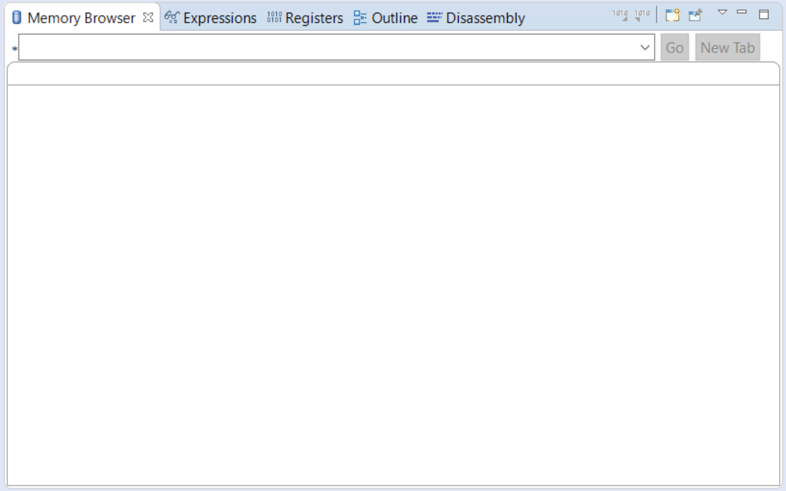
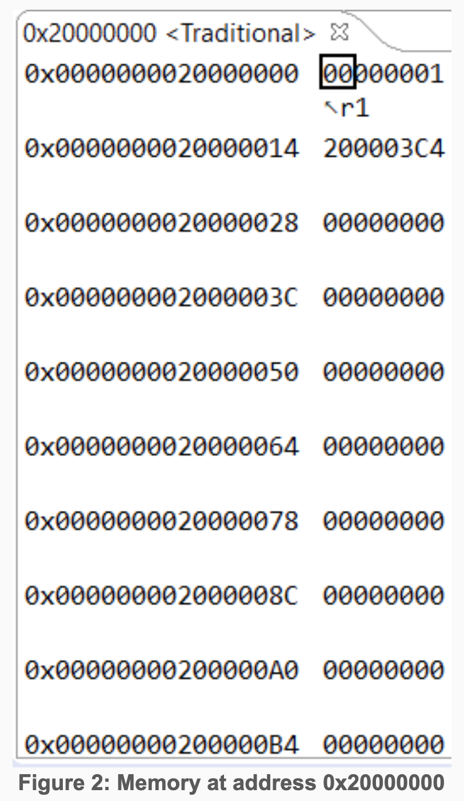
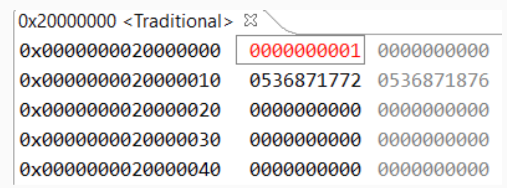

# ECE 362 Lab Experiment 2: Assembly Programming

Now that you know how to use an Integrated Development Environment and use assembly instructions, it is time to actually do some programming. In the prelab assignment, you will test your knowledge of how various instructions actually work. For the in-lab experiment, you will write short assembly language programs that perform simple tasks.

Now that you know that the hardware in your lab kit works, you are comfortable with creating projects, and you've had some experience typing in programs, you will be expected to complete this lab autonomously. If you need help, ask a teaching assistant. This lab will also not need to be evaluated when you finish it. You will receive a completion code on the serial port as you did with Lab 0.

## Instructional Objectives
Analyze the operation of simple assembly instructions.
Practice writing assembly language routines which perform simple tasks.

## Table of Contents
Step	Description	Points
0	Prelab Exercises	40
1	Background on assembler directives
2	Experiment
3	Submit your postlab results	60
4	Clean up and log out	(-20)
 	Total:	100
* All the points for this lab depend on proper completion of and submission of your post-lab results.

When you are ready for your lab evaluation, review this checklist.

## Step 0: Prelab Exercises:
Be familiar with lectures up to and including (04) Assembly Language Programming.
Read this entire lab document.  
Ensure that your development board and serial port are working before you start the lab.
Do the prelab exercises and submit them before attempting the lab experiment.

## Step 1: Background understanding for program generation

### 1.1 Computer Architecture, Instruction Sets, and the Thumb ISA
The set of rules and methods which govern the functionality, organization, and implementation of a particular microprocessor is known as that microprocessor's architecture. Architecture can be broadly categorized into two subdomains: microarchitecture and instruction set architecture (ISA). Microarchitecture can be thought of as the hierarchical organization and implementation of a given computer processor. Details such as the size and types of system buses, hardware-level low-power features, and hardware-level interrupt support, are described in a microprocessor's microarchitecture. A thorough treatment of microarchitecture is beyond the scope of this course, and will be covered in more advanced courses within the ECE curriculum. Programming a microprocessor requires the use of a set of instructions which it recognizes. The list of supported instructions, arguments, and modes supported by a microprocessor is known as its instruction set architecture, or ISA. It can be thought of as the "contract" between hardware and software; an ISA is a guarantee to a programmer of a given device regarding which instructions will be available.

### 1.2 Assembler Directives
In embedded applications, especially when performance is key, programs are written in assembly language. You should have some familiarity with assembly programming from the previous lab. An assembly program cannot run directly on the microcontroller, it needs to be converted to a binary (machine code) which the microcontroller can understand. This is done using an assembler and linker.

When an assembly program is written, most of the code is intended to be instructions for the CPU. However, there are some keywords that instruct the assembler to perform specific actions when converting the assembly program to binary, these are called assembler directives. All assembler directives have names that begin with a period (‘.’). The rest of the name is letters, usually in lower case. Here is a small list of assembler directives that are useful for ECE362:

Here is a small list of assembler directives that are useful for ECE 362:

- .text .text: The memory addressed by a CPU is generally broken down into four basic blocks or segments text, data, heap and stack. The text segment is set of memory locations used for storing instructions. All the instructions for a program are stored in text segment which is read only. Any attempt to write to this memory will result in a fault or exception. Anything in the assembly file following the ".text" keyword will be placed in the text segment by the assembler. There can be multiple uses of the .text directive in a single file, and they can be intermingled with .data references (see below). The final result will be that all text segment entries will be merged together into a contiguous block of read-only memory.  
- .data The data segment is a set of memory locations used for storing mutable data related to the assembly program. Unlike the ".text" section the .data section allows both reads and writes. Anything in the assembly file following the ".data" keyword will be placed in the data segment. There can be multiple uses of the .data directive in a single file, and they can be intermingled with .text references. The final result will be that all data segment entries will be merged together into a single contiguous block of read/write memory.  
Most ".data" usages are followed by a label and an assembler directive. A label is an address that is calculated by the assembler. This allows the programmer to refer to addresses with "names" (i.e. the labels) rather than the actual address. It is important to understand that a label is an address. Did we mention that a label is an address?  

Example:
```
                lsls r0, #1
                ...
                ...
                ldr r0, =quot

                .data
                quot: .byte 0x56
```
Here "quot" is the label (a label is an address) and the value of "quot" is the first address/memory location allocated under the data segment. At the address "quot" we instruct the assembler to store the byte 0x56. And the instruction ldr r0,=quot puts the address of the byte 0x56 (i.e. quot which is an address) in register r0. Note that this is different than putting 0x56 in register r0. It’s putting the address in r0. If you wanted to subsequently load the single-byte value stored at that address into r1, you could then use this instruction:
```
                ldrb r1,[r0]
```

- .byte <value> This instructs the assembler to store a single byte specified by <value> at the location ".byte" is encountered. In the previous example we encountered it at "quot" which is the first address under the .data section, hence the assembler places the byte 0x56 at the address "quot" (remember: a label is an address).  
- .word <value> This instructs the assembler to store a single word (in the case of ECE362, 32 bits) specified by <value> at the location ".word" is encountered. This is similar to ".byte" except that the value is 32 bits rather than 8 bits in case of a byte.  
- .hword <value> This is also similar to ".byte" except that the value stored is 16 bits (in the context of ECE362).  
- .string "<characters...>" or .asciz "<characters...>" This allocates a chunk of memory equal in size to the count of the characters inside the quotation marks PLUS ONE. The extra allocated byte is at the end of the characters and is automatically set to 0x00. This is the indicator for the end of the string. It is a string of ASCII-encoded characters terminated by a zero (asciz). Using the directive like this: .string "ABC" would result in the following four bytes being placed contiguously: 0x41, 0x42, 0x43, 0x00.  
- .space The ".space" fills the number of bytes specified by S with zeroes. The zeroes are filled at the location/address .space is encountered.  
- .balign <A> The ".balign" directive instructs the assembler to check if the address it encountered .balign is divisible by <A>, if not, the assembler will "pad" the memory location with zeroes until the address is divisible by <A>. For instance, if the statement .balign 16 appeared in code, a sufficient number of zeros would be inserted so that the next instruction or space reservation would occur on an address that is evenly divisible by 16.  

This is a small subset of assembler directives. A more complete list is available here.

#### Using the memory browser
System Workbench allows you to use the debugger to observe memory locations in real-time as they are modified. Listings can be rendered in a variety of formats, including bytes, integers, and characters. Consider the following assembly language program:
```
            .cpu cortex-m0
            .thumb
            .syntax unified
            .fpu softvfp
            .text
            .global main
            main:
                ldr  r1, =array
                ldr  r0,[r1]
                adds r0,#1
                str  r0,[r1]
                ldr  r0,[r1,#4]
                adds r0,#2
                str  r0,[r1,#4]
                bkpt
            .data
            array:
                .word 0
                .word 0
```

You will only see the memory browser in the "debug perspective" of SystemWorkbench. By default, the memory browser may not be open, if not, go to Window >> Show View >> Memory Browser. When open, you will see a tab as in Figure 1.

  

Since we want to observe the address 0x20000000, we enter the address in hex into the text box next to the "*". This should start rendering the memory from the microcontroller (see Figure 2). On the left most side of the tab is the address in memory, followed by the contents of that memory location. The default rendering is hexadecimal and ASCII text (the text is rendered at the right most side of the memory browser).


  

To make it easier to observe changes and byte boundaries we shall make the following configuration changes to the memory browser. To make these changes right click within the Memory Browser >> Columns >> 4. Similarly right click on the Memory Browser >> Cell Size >> 4 Bytes. And similarly right click Memory Browser >> Radix >> Decimal Signed. Now step through your program. When a change is made to a memory location, it is highlighted in red as seen in Figure 3.


  

Memory browser is a versatile tool. A lot more features are baked into the Memory browser in Eclipse, however the tutorial provided here should be more than sufficient to see you through ECE 362.

Try the prelab exercises with the memory browser to make sure you can view changes and understand what is being updated.

## 2.0 Experiment
You will not receive the exercises you are to implement until you are in your lab section. You will be given two problems that consist of short programs written in C. They will be similar to those that you did in the prelab. These programs are short enough that they can be done in an hour even if you are a new assembly language programmer. Nevertheless, we give you the full lab time and the assistance of TAs to work through any difficulties (technical or otherwise) that you need to work through.

You will also be given an autotest.o module that is specific to your particular problem set. It will indicate success on the serial port that you've used for previous labs.

Another reason this lab is constructed this way is to try out some of the mechanisms we will use for lab practical exams.

## Step 3: Submit your postlab results
Once your lab experiment works to your satisfaction, and you see how many parts work correctly on the serial port. The autotest module will display a code on the serial port similar to that of Lab 1. This code is a cryptographic confirmation of your completion of the lab experiment as well as your identity and your score. (Remember to change the "login" variable from "xyz" to your login.) It is normal for the code to change every time you run it. Choose one of the codes and carefully enter all 32 characters into the postlab submission for this lab experiment.

For this lab, and most to follow, you must also submit the program that you wrote so that it can be checked by the course staff. Either upload the file or copy it from SystemWorkbench and paste it into the text box. Make sure that your entire program is shown there.

## Step 4: Clean up and log out
No one wants to arrive at a lab station that has a mess left by the previous student. You also don't want to leave your lab station computer logged in. That would allow someone to access your files. These are important enough that we assign a penalty for not doing them. Clean up. Log out.

## Lab Evaluation Checklist
Normally, we'll have a checklist of things that you should review before going into your evaluation. There will be no evaluation for this lab experiment.
- You did not share your microcontroller with anyone else, right? We will know if you did.

- You checked that the integer subroutine works as it should.

- You checked that the character subroutine works as it should.
- You cleaned up your lab station and logged out before you left.


>Questions or comments about the course and/or the content of these webpages should be sent to the Course Webmaster. All the materials on this site are intended solely for the use of students enrolled in ECE 362 at the Purdue University West Lafayette Campus. Downloading, copying, or reproducing any of the copyrighted materials posted on this site (documents or videos) for anything other than educational purposes is forbidden.
