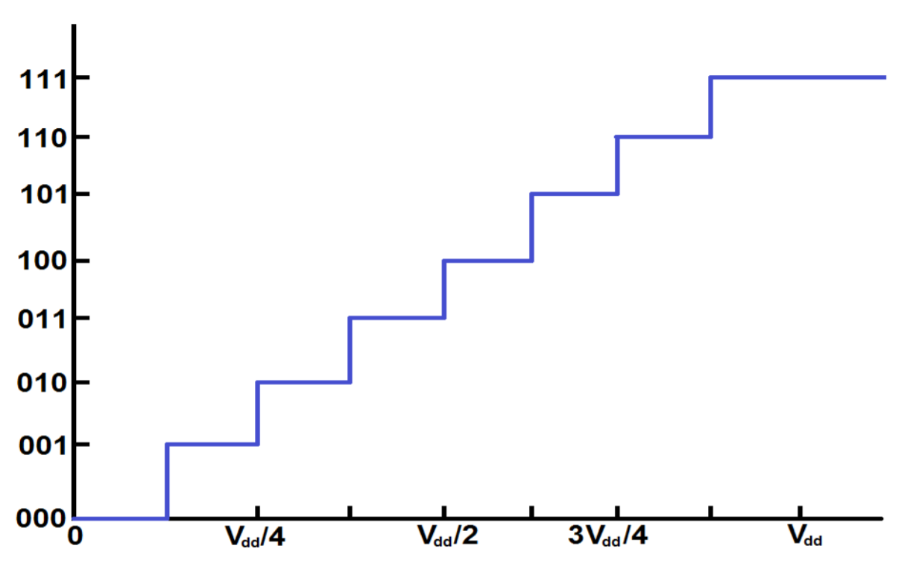
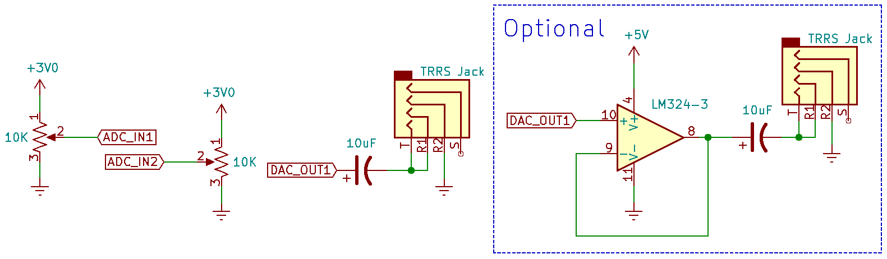
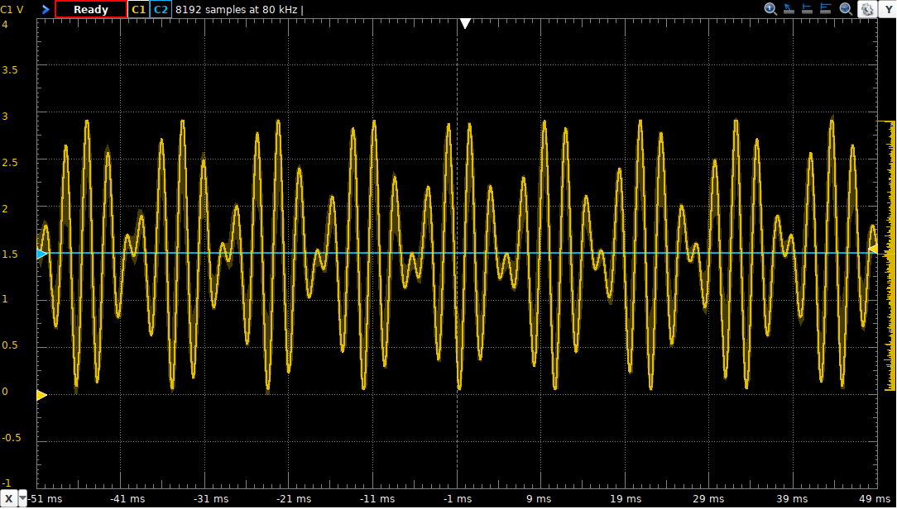
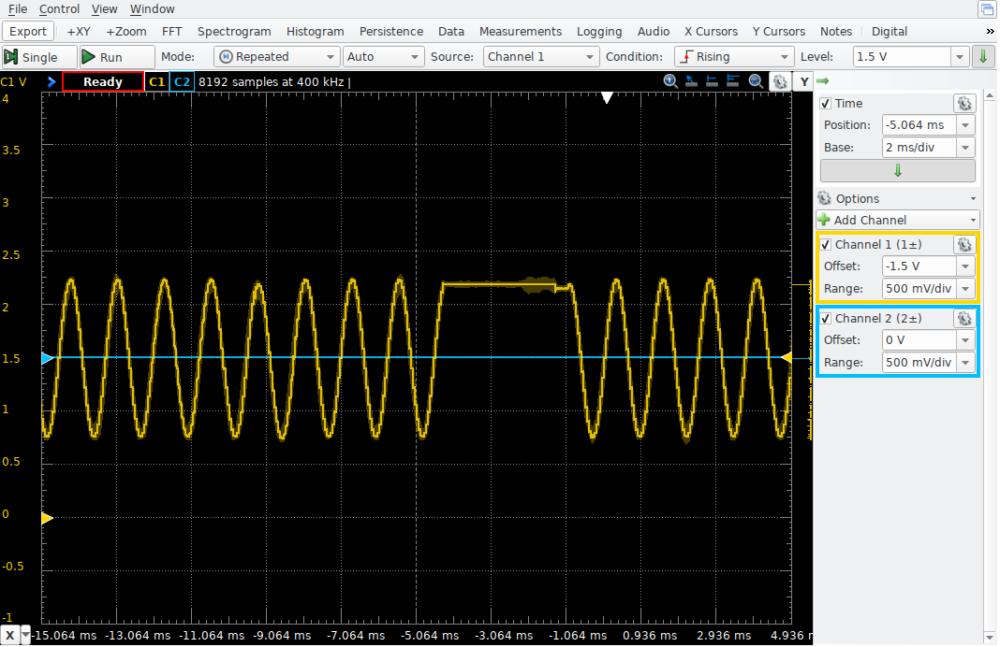

# ECE 362 Lab Experiment 6: Analog Input/Output
## Introduction
Interfacing a microcontroller with real-world devices often means working with analog voltages that are not constrained by digital logic’s high/low dichotomy. In this lab, you will gain experience using the digital-to-analog converter and the analog-to-digital converter built in to your microcontroller. You will also practice writing code to manipulate the converted values as well as display them on an output device.

Direct Memory Access (DMA) allows you to automatically transfer a region of memory to a peripheral, a different location in memory, or any memory mapped region of the device. In this lab, you will also gain experience using DMA.

## Instructional Objectives
- To understand the concept of analog-to-digital conversion
- To understand the concept of digital-to-analog conversion
- To learn how to use STM32F0 peripherals to measure and process analog information
- to use DMA to automatically transfer data to and from peripherals

## Table of Contents
| Step  | Description	| Points |
| ----  | -----------   | ------ |
| 0	| Prelab Exercises	| 30  |
| 1	| Background  | |
| 2	| Experiment  | |
| 2.1	| DMA Transfer to 7-segment Displays	| 20  |
| 2.1.1	| enable_ports  | |
| 2.1.2	| Configure DMA transfers  | |
| 2.1.3	| init_tim15  | |
| 2.2	| Scanning and Debouncing a Keypad	| 10  |
| 2.2.1	| Timer 7 ISR  | |
| 2.2.2	| Initialize Timer 7  | |
| 2.3	| Reading an Analog Voltage	| 20  |
| 2.3.1	| Configure the ADC  | |
| 2.3.2	| Timer 2 ISR  | |
| 2.3.3	| Initialize Timer 2  | |
| 2.4	| DAC Output	| 20  |
| 2.4.1	| Initialize a Wavetable  | |
| 2.4.2	| set_freq()  | |
| 2.4.3	| setup_dac()  | |
| 2.4.4	| Timer 6 ISR  | |
| 2.4.5	| Initialize Timer 6  | |
| 3	| Adjust Interrupt Priorities  | |
| 4	| Submit your postlab results	| *  |
|  	| Total:	| 100  |  

* All the points for this lab depend on proper completion of and submission of your post-lab results.

When you are ready for your lab evaluation, review this checklist.

## Step 0: Prelab Exercises:
- Be familiar with lectures up to and including Analog-to-Digital Conversion.
- Read Chapter 11 of the Family Reference Manual to understand how to configure the proper DMA channel.
- Scan Chapters 13 and 14 of the STM32F0 Family Reference Manual to become familiar with the DAC and ADC subsystems.
- Read this entire lab document.
- Leave the devices and wiring you did for Lab 5 in place and add the things described in section 1.9.
- After doing the previous steps, including reading the entire lab document, then do the prelab exercises and submit them before attempting the lab experiment.

## Step 1: Background
### 1.1 Direct Memory Access
The STM32F09x family of microcontrollers have 2 Direct Memeory Access (DMA) controllers, each with 7 and 5 channels, respectively, that can autonomously move one or more words of various sizes between memory and peripherals. Once values are written to a DMA channel’s configuration registers, the CPU can be used for other purposes while the transfers operations continue. Each incremental DMA operation can be triggered by a peripheral’s readiness to be written to or read from. Some microcontrollers allow DMA channels to be arbitrarily associated with peripheral devices, but the STM32F0 requires that each peripheral be used with only the specific DMA channel that it is wired to. Table 32 and 33 of the Family Reference Manual shows the peripheral-to-DMA channel mapping.

Under normal circumstances, when moving a number of words of memory (indicated by the CNDTR register) to or from a single peripheral address (in the CPAR register), the register that points to the memory address (CMAR) will be incremented by the size of the word. This increment is optional and must be set with the MINC bit of the channel’s CCR register. A DMA request is activated by setting the EN bit of the channel’s CCR register. Once the requested number of words has been moved, the EN bit for that channel is cleared. Each DMA channel can be configured for circular operation by setting the CIRC bit in the CCR register. In circular mode, the DMA channel moves the specified number of words (CNDTR) between the addresses in CMAR and CPAR, incrementing these registers as requested, but when finished, instead of disabling the EN bit, the CMAR, CPAR, and CNDTR registers are reset to their original values, and the channel request is restarted. A circular request is one that continually moves words between a region of memory and a peripheral register.

Each DMA channel can give updates on its progress by invoking interrupts. Three interrupts are possible. First, the Transfer Complete interrupt indicates that all words of the DMA request have been moved. Second, the Half Transfer interrupt indicates that half of the words of the DMA request have been moved. (This is useful when using a circular buffer to indicate that the first half of the buffer is ready.) Finally, a Transfer Error interrupt indicates that an access was attempted to a memory location that was not permitted for the type of operation requested.

### 1.2 Debouncing a Keypad
In lab experiment 5, you learned how to scan a keypad matrix. In this lab experiment, you will do that again (in C), debounce the presses so that you can determine the moment each one is pressed and released, and do translation of keys.

Briefly, the history method keeps track of the last eight readings from each button on the keypad in a byte of memory. When the byte is `00000000`, it has been idle for a long time. When the byte is `00000001`, it has been read as pressed recently. When the byte is something like `10101011`, it was pressed some time ago, and it is still bouncing. When the byte is `11111111`, it has been pressed for a long time and is no longer bouncing. When the byte is `11111110`, it has been read as recently released.

In lab experiment 5, there was discussion about how you could detect multiple button presses if you could configure the keypad scanning outputs as _open-drain_ (either pulled low or floating high) and enable pull-up resistors on the keypad scanning inputs. That way, each input would naturally float high, and any key press on a selected column would force a row low. This way different columns would not be high and low, and pressing two buttons in the same row no longer creates an indeterminate voltage level on the row. For instance, if Col1 was pulled low and the others were floating pressing the '4' and '5' buttons will only cause the Row2 output to go low. Col2 is not pulled high or low, so pressing the '5' button does not interfere.

It would be simpler to understand if an output pin could be configured to either push high or float. This configuration is called _open-source_, and it is not supported by the STM32 GPIO system. (By the way, it has nothing to do with "open-source software".) From an electrical standpoint, it is no better or worse to do so with open-drain outputs. This was not recommended at the time because implementing it in assembly language would have been too difficult. Now that we're using the C language, it's more feasible.

Each time a button is pressed or released, an entry will be placed in a _circular queue_. For the purposes of this lab experiment, a two-element queue will be enough. The main loop of your program will check the queue quickly and remove entries before it is filled up by a button press.

The subroutine to wait on keys and return their value will sleep waiting on interrupts and check the queue every time it wakes up. If there is something in the queue to indicate a button press, it will note what it is, translate it into the ASCII character representation, clear the queue entry, and advance to watching the next entry in the queue. By clearing each queue item after it is read, subsequent reads of the queue can recognize the presence of a new button press by looking for a non-empty queue entry.

>In this lab, you will be using pins on Port C for the keypad. This means you will modify the GPIOC_MODER configuration. Remember that, if you modify the configuration for pin PC12, you will disable the serial port. Double-check your MODER updates to make sure they will not change pin 12. We won't use the serial port for this lab, but this kind of double check will be useful for future lab exercises when we use it again.

### 1.3 Analog-to-Digital Conversion
Audio signals, analog sensor input waveforms, or input waveforms from certain types of input devices (sliders, rotary encoders, etc.) are all examples of analog signals which a microcontroller may need to process. In order to operate on these signals, a mechanism is needed to convert these analog signals into the digital domain; this process is known as analog-to-digital conversion.

In analog-to-digital conversion, an analog signal is read by a circuit known as an analog-to-digital converter, or ADC. The ADC takes an analog signal as input and outputs a quantized digital signal which is directly proportional to the analog input. In an n-bit analog-to-digital converter, the voltage domain of the digital logic family is divided into 2n equal levels. A simple 3-bit (8-level) analog-to-digital quantization scheme is shown in figure 1, below:




### 1.4 Configuring the STM32F0 ADC
The STM32F0 microcontroller has an integrated 12-bit analog-to-digital converter. The converter has 19 channels, allowing for readings from up to 16 independent external pins and three different internal sources. The ADC is capable of converting signals in the 0-3.6V range, although it is limited by the reference voltage on the development board (approximately 2.95 V). It is able to capture and convert a new sample every 1μs. Many other ADC features are described in greater detail in the microcontroller documentation.

Before any ADC configuration can be done, a few initializations must be done. First, the ADC clock must be enabled using reset clock control (RCC), as was done with other peripherals in previous experiments. Which bit in which register? It is up to you to consult the documentation for the RCC registers to determine the bit to set.

Next, the inputs which are to be configured as analog I/O must be configured for analog mode in the corresponding GPIOx_MODER register. This is described in further detail in section 9.3.2, "I/O pin alternate function multiplexer and mapping", of the STM32F0 family reference manual.

Prior to performing any configuration of the ADC, the peripheral must first be enabled. ADC activation must take place before any other ADC configurations are performed; failure to follow this order may result in the ADC entering an unknown state, at which point the ADC must be disabled and restarted. Enabling the ADC requires writing '1' to the ADC enable bit, ADEN, in the ADC control register, ADC_CR. Once this is done, software must wait until the ADC is in a ready state, indicated by the bit ADRDY (located in the ADC status register, ADC_ISR) being read as '1' to software.

For the purposes of this experiment, we are interested in configuring the microcontroller ADC for single conversion, software-driven mode. This means that the ADC will perform a single conversion, initiated in software. The ADC will then await the next software trigger before another conversion is initiated. This is the default operating mode of the ADC, and no special configurations will be needed within the ADC peripheral. In the event that special operating conditions (DMA, continuous conversion mode, etc.) need to be performed by the ADC, operating modes can be specified via the ADC configuration registers: ADC_CFGR1 and ADC_CFGR2.

When performing a conversion, the ADC will read and convert values on any active channels. By default, all ADC channels are disabled. Prior to use, it is important to enable those channels on which conversions will be performed. This is done through the ADC channel selection register, ADC_CHSELR.

### 1.5 Using the STM32F0 ADC
Once the ADC has been properly enabled and configured, initiating an analog-to-digital conversion is as simple as writing a '1' to the ADSTART bit in the ADC_CR register. Writing a '1' to this bit instructs the converter to automatically begin conversion of all ADC channels. This bit will automatically be cleared by hardware once the conversion has completed. Converted ADC data is ready to be processed by the core once the end of conversion bit, EOC, is activated in the ADC_ISR register.

In some situations, particularly when disabling the ADC, it may be desirable to stop a conversion which is already in process. This can be done by writing a '1' to bit ADSTP of the ADC_CR register. Doing so will stop the ongoing conversion process, discarding any data, and will automatically clear the ADSTART bit.

Once an analog-to-digital conversion has been completed, the converted data can be read from the ADC data register, ADC_DR. Data will be right-aligned or left-aligned, depending on configuration settings (right-aligned by default).

>It is worth reiterating that, when an external pin is configured for analog operation, it puts delicate internal circuitry at risk. If you expose an external pin to greater than 4.0 V even for a fraction of a second, it will permanently, irreparably damage either the pin or the entire microcontroller. Disconnect your microcontroller from power when you are wiring circuits. Don't connect anything to the 5 V power pin of the microcontroller. Check your circuitry before applying power to your development board. There is some "optional" wiring you can do in section 1.9 that involves connecting 5V to an external chip. If you elect to do that, you should be careful.

>In this lab, you will be using pins on Port A for analog operations. This means you will modify the GPIOA_MODER configuration. Remember that, if you modify the configuration for pins PA13 or PA14, you will lose the ability to debug or even re-program the microcontroller. Double-check your MODER updates to make sure they will not change pins 13 or 14.

>When you misconfigure GPIO Port A, remember that you can restore the ability to use the debug/programming interface by:
    - repairing your program,
    - pressing and holding the reset (SW1) button,
    - pressing "Run" on SystemWorkbench to reprogram the microcontroller
>Depending on what kind of mistake you made, you might have to hold down the reset button for only one second after pressing "Run". You may also need to reprogram the microcontroller twice before it works again. Be patient. Do not give up. Ask a TA for help with this process.

### 1.6 Digital-to-Analog Conversion
A digital-to-analog converter (DAC) is similar to analog-to-digital conversion in reverse. An n-bit digital quantity is written to a data register, the conversion is triggered, and the quantized analog value appears on an output pin. One significant difference is that, since the conversion mechanism uses only a resistor network, the conversion is nearly instant. There is no need to continually check a DAC to find out if the conversion is complete.

Like the ADC input, the DAC output cannot represent all values. For an n-bit DAC, there are 2n distinct values. A digital value of n zeros usually represents an analog conversion of 0 V. A digital value of all ones usually represents an analog conversion of the reference voltage (VREF). If treated as an n-bit integer, each increment results in an approximately VREF / 2n V increase in output voltage.

### 1.7 Configuring the STM32F0 DAC
The STM32F091 microcontroller has an integrated 12-bit DAC with two output channels. Samples can be written to the DAC, converted, and alternately written to either channel to produce stereo audio. For this lab experiment, however, we will use only the first channel. (Read section 14.4 of the Family Reference Manual if you want to learn more about "Dual-Mode" output control.)

To configure and use the DAC, the RCC clock must first be enabled. The pin to use for analog output must be configured for analog mode by setting the appropriate value in its GPIOx_MODER register field. Next, DAC channel 1 must be enabled by setting the DAC_CR_EN1 bit in the DAC_CR register. Finally, the type of trigger to use to initiate a conversion must be selected. For this lab experiment, we'll use a software trigger.

### 1.8 Using the STM32F0 DAC
Because it does not require polling to determine the completion of a conversion, use of the DAC is less complicated than the ADC. All that is necessary to produce an analog value on an DAC output when configured for software trigger mode, is to write a value into the appropriate Data Holding Register (DHR) and initiate the conversion by writing a '1' to the trigger bit of the DAC_SWTRIGR register. The DAC is ready to receive another sample in the next APB clock cycle.

Like the ADC, the DAC has variable bit sizes as well as left-aligned and right-aligned data handling capabilities, but they do not need to be selected in advance. If you wish to output an 12-bit left-aligned data value, you write it to the DAC_DHR12L1 register before triggering the conversion. If it is a 12-bit right-aligned value write it to the DAC_DHR12R1 register instead. The only other bit size available is an 8-bit right-aligned register, DAC_DHR8R1. There is no left-aligned 8-bit data holding register, nor are there any other sizes.

It is important to understand that writing to any of the channel 1 holding registers (DAC_DHR12L1, DAC_DHR8R1, DAC_DHR12R1) effectively creates a holding register value equivalently. For example, doing any of the following three writes
- Writing 0x0000d700 to DAC_DHR12L1 or...
- Writing 0x00000d70 to DAC_DHR12R1 or...
- Writing 0x000000d7 to DAC_DHR8R1
will deposit the 12-bit value 0xd70 into the 12-bit hardware register waiting to be converted by the DAC.

### 1.9 Wiring for this lab
For this lab, you will use a USB oscilloscope (e.g., the Digilent Analog Discovery 2) to observe the output of the DAC.

You will use potentiometers to connected between 3V and Gnd with the center tap acting as a voltage divider. The center tap of the potentiometer will be connected to analog inputs. As long as you are certain to connect the potentiometers only between 3V and Gnd, no damage to the analog inputs is possible.  
  

## Step 2 Experiment
Create a project in SystemWorkbench called "lab6", and replace the automatically-generated main.c file with the main.c skeleton file provided for you.

For this lab experiment, you are provided many support subroutines that do interesting and useful things with the peripherals that you configure. In the past, we've asked students to write some of them on their own -- with mixed results. These subroutines are sometimes difficult to fully test without using them. Often, students' work passed our tests without actually functioning correctly.

8^(

Fundamentally, this course is not a programming class, per se. For this lab, you will write only the code to configure and enable the peripherals you use. You can look at the support code to see what it does and how it does it. The file is support.c.

Keep this code in mind when you do a mini-project. For instance, if you want to have a keypad to input numbers or commands, this will be exactly what you want to use.

### 2.1 DMA Transfer to 7-segment Displays
In lab 5, you set up a timer to periodically output 11-bit patterns on Port B GPIO pins to select a digit and present an 8-bit pattern on it. By doing so rapidly, you created the illusion that all eight digits were shown simultaneously.

In this lab you'll do this again. Instead of using an ISR to set up the GPIO outputs, you will use the DMA subsystem to copy from an eight-entry memory buffer to copy 16 bits at a time into the ODR. That's 5 more bits than you need, but they won't matter as long as the upper 5 pins are not configured to be outputs.

#### 2.1.1 enable_ports()
Fill out the subroutine `enable_ports` with the following configurations:

- Enables the RCC clock to GPIOB and GPIOC without affecting any other RCC clock settings for other peripherals
- Configures pins PB0 – PB10 to be outputs
- Configures pins PC4 – PC7 to be outputs
- Configures pins PC4 – PC7 to have output type open-drain (using the OTYPER)
- Configures pins PC0 – PC3 to be inputs
- Configures pins PC0 – PC3 to be internally pulled high
This is similar to the GPIO configuration you've done in previous labs, but now we will do it using the CMSIS constants in C. As you will see, this is much more readable.

As usual, you should not alter the configuration for any other pins. For instance, if you were to improperly alter the MODER setting for PC12, the serial port would stop working.

#### 2.1.2 Configure DMA transfers
Here, you will set up a circular DMA transfer to the GPIOB peripheral's ODR register. The trigger will be triggered whenever TIM15 has an update event. As soon as the timer reaches the ARR value, the DMA channel will be triggered to write a new value into the data register.

Remember that TIM15 works with one particular channel of the DMA1 controller. You will use that default channel.

Have you determined which DMA channel Timer 15 can trigger? Good. Write a C subroutine named `setup_dma()` that does the following things:

- Enables the RCC clock to the DMA controller and configures the following channel parameters:
    - Turn off the enable bit for the channel.
    - Set CPAR to the address of the GPIOB_ODR register.
    - Set CMAR to the msg array base address
    - Set CNDTR to 8
    - Set the DIRection for copying from-memory-to-peripheral.
    - Set the MINC to increment the CMAR for every transfer.
    - Set the memory datum size to 16-bit.
    - Set the peripheral datum size to 16-bit.
    - Set the channel for CIRCular operation.

Write one more C subroutine named `enable_dma()` that does only the following operation:
- Enable the channel.  

There is a lot of variation in students' work. On occasions when we use autotest to check their work, it's check all possible cases once a DMA channel is enabled and running. We want you get used to keeping this step separate. Remember to not enable the DMA channel in setup_dma.

#### 2.1.3 init_tim15()
Fill out the subroutine `init_tim15()` to enable TIM15's clock in RCC and trigger a DMA request at a rate of 1 kHz. Do that by setting the UDE bit in the DIER. Do not set the UIE bit in the DIER this time. There is no ISR to invoke for this timer this time. The timer will trigger the DMA channel directly. The DMA operation will do the copying that you had to do in the ISR in lab 5.

Once you implement these subroutines `main()`, you should see "ECE 362" on the 7-seg LED array. The interesting thing to notice here is that the circular DMA operation continually and automatically copies the buffer array `msg` to the display. This creates the illusion that the memory is mapped into the display.

#### 2.1.4 When it doesn't work...
So you've done all these steps and it does nothing. Is it time to call the course staff and have them just tell you exactly what to type?

(It is never time to ask the course staff to tell you what to type.)

So many circumstances in this class depend on getting many details exactly correct before something works. Now, you have an opportunity to develop your debugging skills so that you are prepared for future situations. Here are the steps to take when using DMA. Invoke the program in the System Workbench debugger and use the I/O Register Debug panel to interrogate items one at a time to ensure they are correct.

- Is the program stuck in the DefaultHandler? Did something cause a fault?
- Is the RCC clock to Port B enabled?
- Are pins PB0 - PB10 configured as outputs?
- Look at timer 15:
    - Is the timer enabled?
    - Repeatedly click on the CNT register to update its view. Is it changing? If not, it probably means that the timer is not runing.
    - Is the CNT value larger than the ARR? That's usually a sign that you set up the ARR after you set the CEN bit to enable the timer's counter. Always set CEN last.
    - Did you set the UDE timer to trigger the DMA channel?
    - Look at the DMA channel you've configured:
    - Are you sure you picked the right DMA channel? Look at Table 32 on page 205 of the Family Reference Manual to check your assumption. Only one particular DMA channel will work with Timer 15. Make sure you use that one.
    - Repeatedly click on the CNDTR register to update its view. Is it changing? If not, it probably means that the DMA channel is not being triggered or some configuration issue, explained below, is happening.
    - Did you set the CMAR and CPAR addresses properly? Look up the address of the GPIOB ODR in the I/O Register debugger.
    - Did you set the DMA channel direction to copy from memory to the GPIOB ODR?
    - Did you set the MINC bit to increment the CMAR and clear the PINC bit to not increment the CPAR after each copy?
    - Did you configure the DMA channel for circular operation?
By systematically check all of these elements, you can find the root cause(s) of any problem.

#### 2.1.5 Demonstrate it
Uncomment the `#define SCROLL_DISPLAY` stanza. This will define a symbol that will enable compilation of the code block enclosed in the #ifdef ... #endif below it.

#### 2.1.6 How does it work???
Look at the code for `print()` in the support.c file. It copies one byte at a time into the `msg[]` array. For historical reasons, every ASCII character is defined by the lower seven bits of the byte. That let's us use the most significant bit to indicate that the dot on a character should be set. This will be used in the code to show key events in the next section.

### 2.1 Debouncing a Keypad
Similar to the previous lab, we will set up a software-debounced keypad. This time we will employ a queue of length 2 to parse key presses. And of course, this time it is in C.

#### 2.1.1 Timer 7 ISR
Write the interrupt service routine for Timer 7. Be sure to copy its exact name from the startup/startup_stm32.s file so that you get the name correct. The code should do something similar to what you did in lab 5:
```
        // Remember to acknowledge the interrupt here!
        int rows = read_rows();
        update_history(col, rows);
        col = (col + 1) & 3;
        drive_column(col);
```

First, the rows are read. Later, the column is updated. This allows for the R-C components that comprise any electrical circuit to charge up and stabilize in time for the next invocation of the ISR. If you look at the implementation of read_rows() and drive_column() in the support.c file, you will see that they are similar to the ones you used in lab 5, but they are inverted. Remember that we are using active-low signals with open-drain configurtion to be able to read multiple button presses simulataneously.
In the middle of the code is a call to `update_history()` which keeps track of the past eight samples of each button. If any button's history has the bit pattern 00000001, it means that the button has just now been recognized as pressed for the first time. If any button's history has the bit pattern 11111110, it means that the button has just now been recognized as released for the first time. Either of these situations cause update_history to record the event in the two-entry `queue[]` array.

#### 2.2.2 init_tim7()
Write a C subroutine named `init_tim7()` that causes the Timer 7 ISR to be invoked at a rate of 1 kHz.

#### 2.2.3 Demonstrate your work
Put a comment before the previous `#define SCROLL_DISPLAY` stanza and then uncomment the `#define SHOW_KEY_EVENTS`. This will enable a call to the `show_keys()` subroutine, which does not return. It will continually call `get_key_event()` and display the result on the seven-segment display. Each time a key is pressed, get_key_event() returns the ASCII code for the key with the most significant bit set. On the seven-segment display, this is shown with the decimal point. When a key is released, get_key_event() returns the ASCII code for the key with the most significant bit clear.

If you press and hold the '1' key, the display should show '1.' (a '1' with the decimal point lit). When you release it, a '1' without the decimal point will be shown.

The interesting thing about using open-drain configuration to scan the keypad is that you can register a second button press without having to release the first one. Try pressing and holding the '1' and '2' keys. Release one at a time. See the results on the seven-segment display.

#### 2.2.4 When it doesn't work
Use the System Workbench I/O Register Debugger to determine what the problem is when it does not work.
- Is the RCC clock enabled for Timer 7?
- Is the Timer 7 counter enabled?
- Repeatedly click on the Timer 7 CNT register to update its value. Is it changing? If not, the timer is probably not enabled.
- Is the UIE bit set?
- Set a breakpoint in the Timer 7 ISR. Is it ever invoked? If not, you may not have named it correctly.

#### 2.2.5 How does it work?
Look at the `update_history()` subroutine in support.c file. It uses the `push_queue()` subroutine to put new event entries in the two-entry `msg[]` queue. Then, look at the `get_key_event()` function. It checks the two-entry queue to wait for a non-zero value. It removes that value, using `pop_queue` and returns it. As an efficiency improvement, it embeds a WFI instruction so that it does not continually run. A button event can only happen as a result of an interrupt, so it doesn't miss anything by waiting for the WFI to complete.

### 2.3 Reading an Analog Voltage
In this section, you will set up the analog-to-digital converter (ADC) and repeatedly check it to update a global variable. Since there is always some amount of noise, you will smooth out the readings by creating a boxcar averaging mechanism and using that average to update a variable.

#### 2.3.1 setup_adc()
Write a C subroutine named `setup_adc()` that initializes the ADC peripheral and configures the pin associated with ADC_IN1 to be analog mode. To write this subroutine, you should carefully examine the example on page 15 of the lecture on Analog-to-Digital Conversion. You should also consider examples A.7.2 and A.7.4 of the Family Reference Manual appendix. The subroutine should do the following:
- Enable the clock to GPIO Port A
- Set the configuration for analog operation only for the appropriate pins
- Enable the clock to the ADC peripheral
- Turn on the "high-speed internal" 14 MHz clock (HSI14)
- Wait for the 14 MHz clock to be ready
- Enable the ADC by setting the ADEN bit in the CR register
- Wait for the ADC to be ready
- Select the corresponding channel for ADC_IN1 in the CHSELR
- Wait for the ADC to be ready

Your subroutine can use the default configuration of right-aligned 12-bit conversion. Really, not much more need be done than is shown in the example on page 15 of the lecture. We just want to do the minimum needed to make the ADC work.

#### 2.3.2 Timer 2 ISR
Create the ISR for Timer 2. Set it up to do the following steps:
- Acknowledge the interrupt.
- Start the ADC by turning on the ADSTART bit in the CR.
- Wait until the EOC bit is set in the ISR.

Implement boxcar averaging using the following code:
```
            bcsum -= boxcar[bcn];
            bcsum += boxcar[bcn] = ADC1->DR;
            bcn += 1;
            if (bcn >= BCSIZE)
                bcn = 0;
            volume = bcsum / BCSIZE;
```

This makes for a rather long-running ISR, but we actually want that to demonstrate the effects of interrupt priority in a later step.

#### 2.3.3 init_tim2()
Complete the `init_tim2()` subroutine so that it sets up Timer 2 to invoke the ISR exactly ten times per second.

#### 2.3.4 Demonstrate it
Re-comment the #define SHOW_KEY_EVENTS above and uncomment the #define SHOW_VOLTAGE stanza. This will enable code that continually calls `printfloat()` for a calculation that estimates the voltage on the ADC_IN pin.

Because the boxcar is 32 samples wide, and because new samples are only taken ten times per second, it will take about three seconds to converge on any new value. If you start the code with the potentiometer on full, it will gradually display values between zero and (approximately) 2.9. If you change the potentiometer, it will take another three seconds to converge on the new value.

#### 2.3.5 When it doesn't work
Use the System Workbench I/O Register Debugger to diagnose the problem:
- Is the RCC clock enabled for Timer 2?
- Is the Timer 2 counter enabled?
- Are the Timer 2 PSC and ARR values as you expect them to be?
- Repeatedly click on the Timer 2 CNT register to update its value. Is it changing? If not, the timer is probably not enabled.
- Is the CNT value higher than the ARR value? This is an especially important problem for Timer 2, where the ARR and CNT registers are 32 bits in size. It takes a long time to wrap around back to zero. You will have this problem if you enable the timer counter before you set the ARR.
- Is the UIE bit set?
- Set a breakpoint in the Timer 2 ISR. Is it ever invoked? If not, you may not have named it correctly.
- Is the RCC clock for Port A enabled? Are the pins configured for analog operation? (Do you know which pin ADC_IN corresponds to?)
- Is the RCC clock for the ADC enabled?
- Look at the ADC ISR register. Is the ready bit set? Does the Timer 2 Interrupt Service Routine turn on the ADSTART bit? (The bits will change to quickly to read them in the I/O Register Debugger.)

### 2.4 DAC Output
For the final step of this lab exercise, you'll configure the DAC and an ISR to create and mix sine waves with arbitrary frequency.

#### 2.4.1 Initialize a Wavetable
A subroutine named `init_wavetable()` that computes an N-entry sine wave and writes it into the array named `wavetable[]` is written for you to see. Each entry of the array is a signed 16-bit integer which can represent values from -32768 to 32767. For reasons of symmetry, your sine wave values should range from -32767 to 32767. This is done like so:
```
        for(int i=0; i < N; i++)
            wavetable[i] = 32767 * sin(2 * M_PI * i / N);
```

The STM32F091 has no floating-point hardware, so this will be computed with slow, emulated mechanisms. It is still fast enough that it can be done at program startup without being noticed. You must, however, avoid floating-point calculations in time-critical situations such as interrupt handlers. That is the entire idea behind fixed-point calculation described in the lecture on Polyphonic Sound Generation.

#### 2.4.2 set_freq()
A subroutine `set_freq(int chan, float f)` is provided for you. It updates one of two sets of global values that are the fixed-point step and _offset_ into the wave table for the two channels. See the lecture notes on sound generation to understand how these work.

#### 2.5.3 setup_dac()
Write a C subroutine named `setup_dac()` that initializes the DAC peripheral and configures the output pin for DAC_OUT1 for analog operation. Consider the example on page 22 of the lecture on Digital-to-Analog Conversion as well as the examples in Appendix A.8. Your subroutine should do the following:

- ~~Enable the clock to GPIO Port A~~
- ~~Change the configuration only for DAC_OUT1 for analog operation~~
- Enable the RCC clock for the DAC
- Select a TIM6 TRGO trigger for the DAC with the TSEL field of the CR register
- Enable the trigger for the DAC
- Enable the DAC
You don't need to disable the buffer-off (BOFF) bit or first disable the DAC enable before you set values. Just do the minimum necessary steps to enable the DAC as specified.
By the way, before December 2021, none of the course staff knew that all that was needed to configure the DAC_OUT pin as an analog output was to enable the DAC. It is not necessary to turn on the RCC clock to Port A or change the configuration of the pin to analog mode. Now you know too.

#### 2.5.4 Timer 6 ISR
Write the ISR for Timer 6. It should do the following to setup the next value to stage the next value for the DAC:
```
        // Acknowledge the interrupt right here!
        offset0 += step0;
        offset1 += step1;
        if (offset0 >= (N << 16))
            offset0 -= (N << 16);
        if (offset1 >= (N << 16))
            offset1 -= (N << 16);
        int samp = wavetable[offset0>>16] + wavetable[offset1>>16];
        samp = samp * volume;
        samp = samp >> 17;
        samp += 2048;
        DAC->DHR12R1 = samp;
```

The code accomplished the following things.
- Increment `offset` variables by the `step` amounts
- If the integer portion of `offset` is greater than N, find the fixed-point representation of N and subtract it from the offset. (See the notes on sound generation.)
- Get the sample from the `wavetable` at index of the integer portion of offset.
- Multiply the sample by `volume`.
- Shift the sample to the right by 17.
- Add 2048 to the sample.
- Write the sample to the 12-bit right-aligned data holding register of the DAC.

The sum of the two wavetable values will be between -65535 and +65535. The `volume` variable is a 12-bit number, so it has a maximum value of 4095. If this is multiplied by a sample the product will range between +/-268435456 (which is +/- 228). When this value is shifted right by 17, it will result in a signed 12-bit value. Adding 2047 to it will put it in the range 0 - 4095, which is appropriate for DAC output.
In order to realize a digital-to-analog conversion of a value written to the DAC data holding register (DHR12R1), it is necessary to trigger the DAC. In the lecture notes, you've seen this done by writing to the software trigger register, but the ISR shown above does not do this triggering. Instead, you configured the DAC to be triggered by the Timer 6 TRGO. Remember to set up Timer 6 to enable that.


#### 2.5.5 init_tim6()
A symbolic constant, `RATE` is #defined in main.c. Write a subroutine `init_tim6()` that initializes timer 6 so that it's interrupt is called at RATE times per second (20000 for this exercise). It would be best if the code used RATE to calculate the values to use to set up the timer so that you can change RATE later.

Remember that timer 6 must be configured to trigger the DAC. To do so, look at the CR2 register for the "Master Mode Select" field. Set the value that enables a TRGO on an **Update** event.

#### 2.5.6 When it doesn't work
Use the System Workbench I/O Register Debugger to look at the values you've written to configuration registers. In particular:
- Look at the value in the DAC DHR12R1 register. Is it non-zero? Does it ever change? In a working system, you will see a change each time you update it.
- If the DHR12R1 register does not change, set a breakpoint in the Timer 6 ISR. Is it ever invoked? Does it have the right name? Is the Timer configured correctly?
- Step through the code in the ISR when it is invoked. Make sure it computes a new DHR12R1 value that is not always the same.

#### 2.5.7 Demonstrate it
Uncomment the `#define ONE_TONE` which reads a floating-point value from the keypad. To enter a decimal point, press '*'. To finalize the number entry, press '#'. For instance, to enter the value 466.164, press
```
          4 6 6 * 1 6 4 #
```

The frequency should be produced on the DAC_OUT1 pin.
The potentiometer serves as a volume control for the output. If you connect earbuds or amplified speakers to the output, you should be able hear it clearly. You may also view the waveform produced on DAC_OUT1 with an Analog Discovery system.

You can also uncomment the `#define MIX_TONES` stanza to enable two-frequency mixing. Select a channel by first pressing 'A' or 'B'. Then enter the floating-point frequency as before. For instance, to produce a 261.626 Hz tone with channel 0 and a 329.628 Hz tone with channel 1, press the following keys:
```
          A 2 6 1 * 6 2 6
          B 3 2 9 * 6 2 8
```

Finally, if you comment all of the #define stanzas in the main.c file, it will fall all the way through to the invocation of the `dialer()` subroutine. This subroutine produces a North American dial tone. Pressing the buttons on the keypad produces the Dual-Tone Multi-Frequency (DTMF) tones that can be used to dial a phone. Pressing '#' re-dials the previously entered number (up to 16 digits). If you have a "land line" you can actually dial the phone by holding the handset microphone to a speaker connected to DAC_OUT1.


  

## Step 3: Interrupt Priorities
This is a good time to look at the effects of setting interrupt priorities and their effects on programs that have multiple interrupts. We chose to use Timer 2 for the ADC sampling specifically because it has a higher priority than the other timer interrupts. In other words, as long as the Timer 2 ISR is running, the Timer 6 ISR cannot be invoked. If the Timer 6 ISR is running when the Timer 2 interrupt is raised, the Timer 6 ISR will be preempted to allow the Timer 2 ISR to run.

Since Timer 6 is used to generate audio samples, it is very important that it have consistent timing. Any interference with its 20 kHz rate will be easily heard. To demonstrate this, add the following (useless) code to the Timer 2 ISR:
```
        for(int x=0; x<10000; x++)
            ;
```

Then look at the output of a single sine wave generation on an oscilloscope (or simply listen to it). You will see a wave form that has interruptions that look like Figure 4:

  

Since the Timer 2 ISR takes a long time to run, it prevents the Timer 6 ISR from putting new updates into the DAC DHR. To avoid problems like this, every ISR should be as short as possible. For instance, you didn't notice this problem until the long loop was inserted into the Timer 2 ISR! Nevertheless, sometimes it is necessary to make long calculations in an ISR. Another solution would be to use a timer with a lower priority interrupt. That would ensure that the Timer 6 ISR ran on time. Another solution is to lower the priority of the Timer 2 interrupt. To do so, simply add the following line to the `init_tim2` subroutine:
```
        NVIC_SetPriority(TIM2_IRQn, 3);
```

Recall that the upper two bits of the ISPR register bytes define four allowed interrupt priorities, from highest-to-lowest: 0, 64, 128, and 192. For some unknown reason, the `NVIC_SetPriority()` subroutine is configured to simply specify only those two bits, so the values of the second argument are 0, 1, 2, and 3.

## Step 4 Submit your postlab results
Submit the program you wrote in main.c to the post lab submission for this lab experiment.

>Questions or comments about the course and/or the content of these webpages should be sent to the Course Webmaster. All the materials on this site are intended solely for the use of students enrolled in ECE 362 at the Purdue University West Lafayette Campus. Downloading, copying, or reproducing any of the copyrighted materials posted on this site (documents or videos) for anything other than educational purposes is forbidden.
