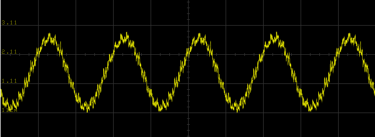
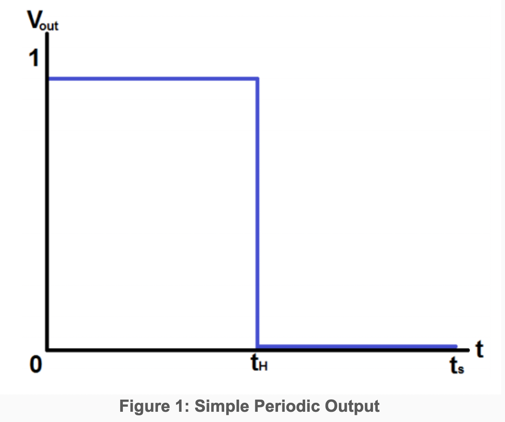
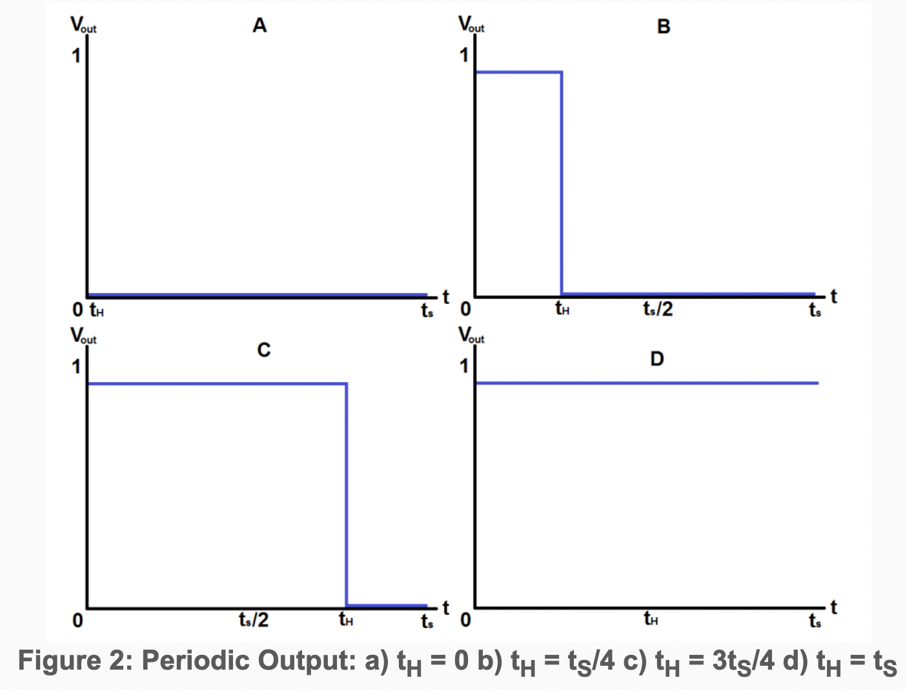
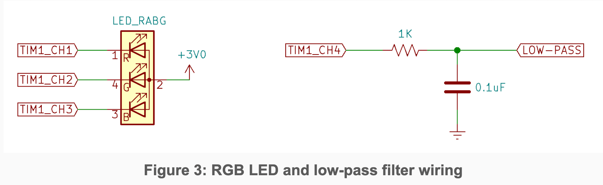
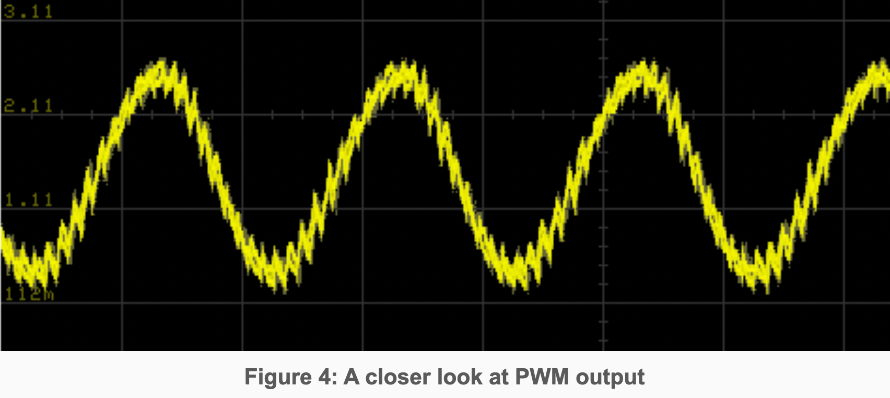

# ECE 362 Lab Experiment 7: Pulse Width Modulation
## Introduction

A microcontroller’s interaction with the real world (and real humans) often requires the generation of voltages that can vary over a continuous spectrum. Although your microcontroller has an on-board digital-to-analog converter (DAC), it is too weak to drive any load that requires high power. Even with amplification, a DAC is inefficient for the purpose of driving heavy loads. Digital electronic systems are well-suited to switching circuits on and off. In circumstances where a load can be switched on and off in such a way that the average output voltage is treated (or perceived) as the signal, a solution is Pulse-Width Modulation (PWM). In this experiment, you will learn about configuring and using PWM to control a high-power load (a light) and generate a variable duty-cycle waveform.

## Instructional Objectives
- To understand the concept of pulse-width modulation
- To use PWM in place of a DAC

## Table of Contents
| Step	| Description	                       | Points |
|-------| ------------------------------------ | ------ |
| 0     | Prelab Exercises                     | 15     |
| 1     | Background                           |        |
| 2     | Experiment                           |        |
| 2.1	| Preliminary Experiments with Timer 3 | 25     |
| 2.2	| PWM Output Configuration	           | 20     |
| 2.3	| PWM Sine Wave Synthesis	           | 20     |
| 2.4	| setrgb()	                           | 20     |
| 3	    | On Your Own                          |        |
| 4	    | Submit your postlab results	*      |        |
|       | Total:	                           | 100    |

There is no autotest for this lab so all scores will be determined by demonstrating your work to your TAs.  

## Step 0: Prelab Exercises:
- Be familiar with lectures up to and including Pulse-Width Modulation.
- Read Chapter 16 of the STM32F0 Family Reference Manual to become familiar with Timer 1.
- Read Chapter 15 of the textbook, and pay particular attention to section 15.3 PWM Output. (Very helpful!)
- Read the datasheet for the RGB LED.
- Read this entire lab document.
- Leave the devices and wiring you did for Lab 5 in place and add the things described in section 1.5.
- After doing the previous steps, including reading the entire lab document, then do the prelab exercises and submit them before attempting the lab experiment.

## Step 1: Background
### 1.1 Pulse-Width Modulation
Consider a digital logic circuit which outputs a repeating, periodic signal over a known time period, tS. Within the signal period, the circuit can output logic '1' for a subinterval, tH, and for the remaining time, outputs a logic '0'. This is illustrated in Figure 1, below.
  

Expanding on the output above, suppose the circuit can be made to vary the logic '1' interval tH to any value between 0 and tS. A variety of potential outputs could result:

  

The relationship between the time the periodic signal spends high (tH) and the total period of the repeating signal (tS) is known as the signal’s duty cycle and is usually expressed as a percentage. In figure 2, signal 2a could be said to have a 0% duty cycle, signal 2b, 25%, 2c, 75%, and 2d, 100%. By controlling the duty cycle of the repeating, periodic output signal, a pulse-width modulator is capable of controlling average delivered current or power to a given load, and can further be used, possibly in conjunction with filtering, for crude approximations of analog values. Sometimes these values must be low-pass filtered to yield an analog value. For devices such as LEDs, the human visual system acts as a natural low-pass filter.

### 1.2 PWM on the STM32F0
On STM32 microcontrollers, pulse-width modulation is integrated into the various TIM peripherals. For the purposes of this experiment, TIM1 will be used for PWM outputs; you may wish to revisit the basics of timer operation from Lab Experiment 5.

As with all other peripheral configurations, the first step for configuring a peripheral is to enable the clock signal to it. This is done within the reset and clock control (RCC) system of the processor. Use of PWM, as well as other non-analog microcontroller peripherals, requires the use of alternative pin input functions. Alternate pin functions are detailed in the pin definitions table of the STM32F091RCT6 datasheet. Alternate function mode is specified using the GPIOx_MODER register for the appropriate GPIO port. Some pins can have more than one alternate function associated with them; specifying which alternate function is to be used is the purpose of the GPIOx_AFRL and GPIOx_AFRH registers.

Each timer peripheral on the STM32F0 features 4 independent channels, each of which can be set up to output a PWM signal. Specifying a channel as a PWM output requires writing to the TIMx_CCMRx registers. In PWM mode, the PWM frequency is specified through the TIMx_ARR register and duty cycles of the channels are controlled through the TIMx_CCRx registers. Aside from specifying alternate function mode on the associated I/O, additional steps must be taken in order to route the PWM signal from the internal peripheral to the external I/O pin. PWM is part of the timer’s capture/compare subsystem, thus the capture compare output for the selected channels must be activated in the timer capture/compare enable register, TIMx_CCER. The TIM1 subsystem is very similar to the TIM3 subsystem which was studied at length in lecture. One difference with TIM1 is that it has a "break and dead-time register" (BDTR). We will not use these features for this experiment, **but the MOE bit of this register must be enabled to generate output on any of the channels of TIM1**. At the end of timer configurations, remember to enable the timer, in the TIMx_CR1 register. For further assistance in setting up PWM, consult the example in appendix A.9.8 of the family reference manual.

You will use three PWM channels to control an RGB LED, a device where the human visual model already acts as a low-pass filter. You will use a fourth PWM channel as an analog synthesizer output similar to that of the DAC in lab experiment 6.

### 1.3 Synthesizing a Waveform with PWM
With low-pass filtering of the PWM output, the PWM duty cycle is forms an analog level. The duty cycle is determined by the TIMn_CCRx value divided by the TIMn_ARR+1. As long as at least one full PWM cycle passes for every change in duty cycle, it will work as well as a DAC. A higher PWM frequency means a shorter period, which means fewer cycles in which to vary the duty cycle. This means there is a trade-off between the PWM frequency and the PWM duty cycle _resolution_.

In lab experiment 6, we updated the DAC output 20000 times per second with 12-bit resolution (0 – 4095). If we wanted to update the PWM duty cycle 20000 times per second, with the highest resolution, we would take the following steps:
- Set the prescaler to divide by 1 (Set TIMn_PSC to 0). Remember that is permissible to set the PSC to zero. Never set the ARR to zero though.
- Set the ARR so that the counter updates (goes back to zero) 20000 times per second. For a 48 MHz clock, that means the counter should have a cycle of 2400 clock ticks between update events.
- The highest meaningful CCRx value is then the ARR+1, so there are 2401 distinct PWM duty cycle settings.  

A range of 0 – 2400 is a little more than half the resolution of the DAC. If we used a PWM frequency of 10 kHz, it would allow a CCRx range of 0 – 4800, but 10 kHz is in the audible range, so the noise would make the resulting signal sound rather bad for higher tones.

For this experiment, you will use a PWM frequency of 20000 for the sole reason of being able to do analog synthesis at the same rate you did in lab 6. The PWM frequency is, arguably, too high for LEDs. LEDs have a response time and the on-off rate is better at around 100 Hz, but the effect is not terribly degraded at 200 times this rate. It is **certainly** high enough that your eyes will not perceive any flickering.

Using a PWM update rate of 20 kHz means that you can take the wavetable synthesis subroutines from lab 6, and use them with only two changes:
- Instead of writing to DAC_DHR12R1, you will write to TIM1_CCR4. There is no need to "trigger" the "conversion".
- Since the range of the duty cycle is 0 – 2400, rather than a range of 0 – 4095 for the DAC, the final sample should be shifted right by 18 rather than 17. A value of 1200 should be added center the duty cycle at 50% rather than adding 2048, which was the center value for the 12-bit DAC output.

Other than these changes to the Timer 6 ISR, all other subroutines like `init_wavetable()`, `set_freq()`, and `setup_timer6()` are the same as before.

### 1.4 Wiring for this lab
For this lab, you will use a USB oscilloscope (such as a Digilent Analog Discovery 2 or an Analog Devices ADALM2000) to observe the timer PWM outputs.

Figure 3 shows the wiring for the new components for this lab.**Be sure to leave all of the other lab 5 wiring in place. You will be using it for number entry and display.** The LOW-PASS signal can be connected to the audio jack (where the DAC was connected to from the previous lab). A set of powered speakers will have a high impedance and can be directly connected to the LOW-PASS signal. If you're using it to drive low-impedance headphones or earbuds, you should use the LM324 op-amp between the LOW-PASS signal and the headphones.
  

The RGB LED looks like a white LED with four leads rather than two. The RGB LEDs in your lab kit are common-anode devices. The anode is connected to 3 V, and each of three color component LEDs has a separate cathode. By connecting a cathode to a low voltage, the particular color of the LED is illuminated. In an additive color scheme red, green, and blue combine to produce white light. **Remember that, since the *cathodes* of the LEDs are connected to the pins of the STM32, they will be illuminated when the pin outputs are in the low state.**

Under most circumstances, we would want to include limiting resistors in series with the LEDs. In this case, we want the LED output to be as bright as possible because we will dim each color by varying the PWM ON time of each channel. Each color of the RGB LED is able to tolerate the maximum current per pin that can be sunk by the STM32.

## 2.0 Experiment
In this lab experiment, you will configure timer 1 for autonomous PWM operation. Other timers will invoke interrupts that read from the keypad, update the 7-segment display, and update the PWM duty cycle.

Create a project in SystemWorkbench called "lab7", and replace the automatically-generated main.c file with the main.c skeleton file and the support.c file provided for you.

### 2.1 Preliminary Experiments with Timer 3
Complete the `setup_tim3` subroutine to visualize what PWM channels look like. The code should do the following:
- Configure PC6 - PC9 to be the outputs of Timer 3 channels 1 - 4. These are the four LEDs on your development board.
- Enable the RCC clock for Timer 3.
- Configure Timer 3 prescaler to divide by 48000.
- Configure Timer 3 for PWM mode 1 so that each channel output can have a CCR value between 0 and 1000:
    - Configure the ARR so that the timer update rate is 1 Hz.
    - Set each of the OCxM fields of the TIM3_CCMR1 and TIM3_CCMR2 registers to set up PWM mode 1.
    - Enable the four channel outputs in the TIM3_CCER register.
    - Enable the Timer 3 counter.
- Set each the Timer 3 CCRx registers as follows:
    - TIM3_CCR1 = 800
    - TIM3_CCR2 = 400
    - TIM3_CCR3 = 200
    - TIM3_CCR4 = 100

Once these steps are done, uncomment the #define TEST_TIMER3 stanza in main().

**Have a TA check you off for this step.** (TA Instructions: You should see the lights for PC6 - PC9 flashing in the expected pattern. Ask the student to change the Timer 3 prescaler to 480 instead of 48000. You should see that the LEDs now have an apparent brightness proportional to their CCR value).

### 2.2 PWM Output Configuration
Copy the functions you completed for lab experiment 6 into the main.c file for lab experiment 7. For the demonstrations below, you should be able to use the keypad to enter information to demonstrate the things you implement.

Write a C subroutine named `init_tim1()` that configures Timer 1 for PWM operation and routes the output to the external pins used for TIM1_CH1, TIM1_CH2, TIM1_CH3, and TIM1_CH4. (These are distinct from TIM1_CH1N, TIM1_CH2N, etc, which are the negated version of the same functions.) By now, you should know how to look up which physical pins can be used for these "functions". Looking those up will also inform you how to set the alternate function configurations. Refer to the examples and discussion on pages 14 – 30 of Lecture 10 on Advanced Timers for help in making this work. Your subroutine should do the following:
- Activate the RCC clock to GPIO Port A.
- Configure the MODER for the four pins to set them for alternate function use.
- Set the alternate function register to route the timer function to the external pins. The alternate function register is actually an array of two registers (GPIOA->AFR[0] and GPIOA->AFR[1]). You will have to choose the correct array element to update.
- Activate the RCC clock to Timer 1.
- You will be using Timer 1 for PWM output rather than interrupt generation. In order for output to work at all you must enable the MOE bit of the break and dead-time register (BDTR). Do that now so you don't forget.
- Set the prescaler to divide by 1, and set the ARR so that an update event occurs 20000 times per second.
- Configure the output channels of Timer 1:
    - Configure the "capture/compare mode registers", CCMR1 and CCMR2, to set channels 1, 2, 3, and 4 for PWM mode 1. There are two 3-bit fields in each register that must be adjusted to accomplish this.
    - Configure the CCMR2 register to set the "output compare preload enable" bit only for channel 4.
    - Enable the (uninverted) channel outputs for all four channels by turning on the CC1E, CC2E, etc. bits for in the "capture/compare enable register", CCER. Until you do this for each channel, the timer will not affect the outputs.
    - Enable the timer.

This configuration is long and tedious, and it won't work at all if you set slightly wrong bit patterns (Your instructor has done this dozens of times and still has to ask "What did I forget?"). When it does not work, remember that you are in good company. Patience and diligence is strongly encouraged.  
You will know when you succeed in getting the timer and channels configured properly, because the LED will be illuminated bright white. Spend a little time setting values in the CCR1, CCR2, and CCR3 registers. Use the I/O Registers control panel in SystemWorkbench to update them interactively. You might use a scope to see the effect of setting a value in the register on the duty cycle of the PWM output. Initialize the CCRx values their maximum value, 0xffff, to ensure that the PWM outputs remain high, and the LEDs remain off. This will ensure you are not blinded in the time it takes to write the control software to change the intensity of the LEDs.  

Finally, note that is is entirely possible to use the update event of Timer 1 to raise the interrupt that recomputes analog samples. That's maybe too much complexity for this lab. It's easier to set it up standalone and reuse the code from lab 6 to produce the waveforms.  

**Have a TA check you off for this step.** (TA Instructions: Student's LED should continually ramp up from dim to bright white. Check the init_tim1() function too).

### 2.3 PWM Sine Wave Synthesis
Copy the implementation of following subroutines from your lab 6 solution to your lab 7 solution:
    - enable_ports(),
    - setup_dma(),
    - enable_dma(),
    - init_tim15(),
    - init_tim7(),
    - setup_adc(),
    - init_tim2(),
    - init_wavetable(),
    - set_freq(),
    - setup_tim6(), and
    - the Timer 6 ISR  
Make the following changes outlined in the background section:
- Turn off TRGO generation for Timer 6.
- Reduce the final combined sample with:  
    `sample = ((sample * volume)>>18) + 1200;`  
- Instead of writing sample to the DAC DHR12R1 register, write it to Timer 1 CCR4.  

Once you put each of the subroutines in place and modify the ISR, the code in `main()` will produce a 1 kHz sine wave. If you have earphones, and feel so inclined, you can listen to the result on the **LOW-PASS** signal connection. It should sound as smooth as if it was generated using the DAC. Observe the wave with an oscilloscope by connecting it to the **LOW-PASS** signal connection. The wave should appear smooth, with no glitches or drop-outs:  
Notice that the more slowly-changing waves in the center appear to be thicker than the waves that quickly range from 0 to 3 V. This thickness is due to the 20 kHz PWM noise that is always either pushing the capacitor higher or pulling it lower. Figure 4 shows more detail of the synthesized waveform.
  

The center of the jagged wave represents the desired signal and the jagged edges represents the noise signal. The size of the deviation from the desired signal is significant. If this were an application where such deviations would affect the operation of a piece of equipment, filtering could be used to further diminish the 20 kHz content of the waves. For instance, if you could substitute a 10 KΩ resistor for the 1 KΩ resistor, you will see a much smoother waveform even at high magnification.

If the end result is to produce an audible waveform, the 20 kHz noise content will not be audible to human ears. Dogs and cats will be greatly bothered by it. It may also cause greater power dissipation in an amplification system.

**Have a TA check you off for this step.** (TA Instructions: Student should demonstrate a sine wave outputed on PA11 using the oscilliscope or AD2 that is adjustable from the keypad)

### 2.4 setrgb()
Several subroutines are provided for you that will read entire floating point and RGB number sets from the keypad while giving feedback on the seven-segment displays. The value returned by the `getrgb()` is a 6-digit BCD (4-bit representation of decimal digits) value to represent the RGB value to display using the RGB LED in the format 0xrrggbb. For instance, 0x009900 would be the maximum possible value for green (99) and the red and blue components turned off (00). The value 0x010005 would be the smallest visible illumination of red (01) and a slightly higher amount of blue (05). The example code in `main()` passes the return value of `getrgb()` into `setrgb()`.

Write the C subroutine named `setrgb()` so it picks apart its argument (which is a value constructed by `getrgb()`) and uses it to set the TIM1_CCR1, TIM1_CCR2, and TIM1_CCR3 registers to set the red, green, and blue illumination appropriately. For instance, if the value is 0x112599, the duty cycle for the output connected to the red LED should be set so that it illuminates the red LED 11% of the time. The green LED should be illuminated 25% of the time, and the blue LED should be illuminated 99% of the time. (Using this scheme, it will not possible to set the PWM output to illuminate any of the colors 100% of the time.)

You cannot treat the number passed to `setrgb()` as a normal decimal integer. For instance, the BCD value 0x112599 is 1123737 if you look at as a two's-complement binary integer. How will you turn that into the RGB components for the LED? It's important that you think of it as six separate 4-bit BCD integers. To extract the numbers, remember that you can shift (>>) and mask (&) the value to look at different parts. For instance, if you entered the RGB value 0x123456, you can find the ten's-place of the red component by shifting the value right by 20 and looking at only the four least significant bits by ANDing it with 0xf. To get the one's-place of the red component, you would shift the value right by 16 and AND it with 0xf. Do some math, take your time, and make it work.

Remember that the LEDs are on when the corresponding PWM output is low, so a little more calculation will be necessary to make the LEDs have the proper intensity.

The user interface code in main() works as follows:
- Press B followed by a 6-digit RGB value to set the three color components of the LED.
- Press A followed by the digits on the keypad to specify the frequency to use for the sine wave.

The '*' button is the decimal point. Press '#' to accept the number.
For instance, to produce a sine wave with a frequency of 426.386 Hz, press:  
`A 4 2 6 * 3 8 6 #`  
All of the analog waveform synthesis is generated using PWM channel 4 of Timer 1.  
Button 'D' allows you to input a six-digit BCD RGB value to control Timer 1 PWM channels 1, 2, and 3. For instance, to set red to 1%, green to 9%, and blue to 5%, you would press:  
`B 0 1 0 9 0 5`  
Just enter the 6-digit BCD number. No terminating '#' is needed.   

**Have a TA check you off for this step.** (TA Instructions: Student should demonstrate changing the RGB LEDs color/intensity using the keypad.)

## Step 3: On Your Own
In semesters past, this lab has been constructed to also allow adjustment of the PWM frequency as well as the duty cycle for LEDs. That would have complicated the calculations needed to do waveform synthesis. You might try, on your own, the steps needed to control the frequency. Use the `getfloat()` subroutine for entry, and use the number to form the nearest possible PSC divisor. When doing so, it is still possible to use the waveform synthesis subroutines, but it will be necessary to change the `RATE` #define to a global floating-point variable.

## Step 4: Submit your postlab results
For this lab you must submit the program that you wrote so that it can be checked by the course staff. Either upload the file or copy it from SystemWorkbench and paste it into the text box. Make sure that your entire program is shown there.

Be sure to get your checkoffs for parts 2.1, 2.2, 2.3, and 2.4 of the Experiement section to get all your points for this week's lab as well

>Questions or comments about the course and/or the content of these webpages should be sent to the Course Webmaster. All the materials on this site are intended solely for the use of students enrolled in ECE 362 at the Purdue University West Lafayette Campus. Downloading, copying, or reproducing any of the copyrighted materials posted on this site (documents or videos) for anything other than educational purposes is forbidden.
