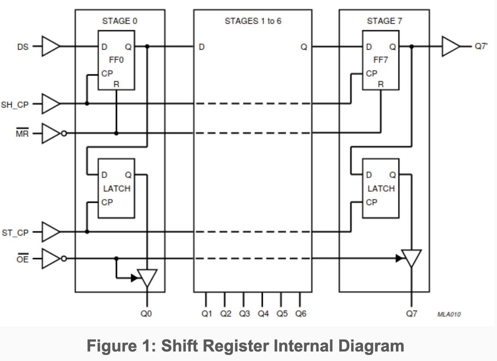
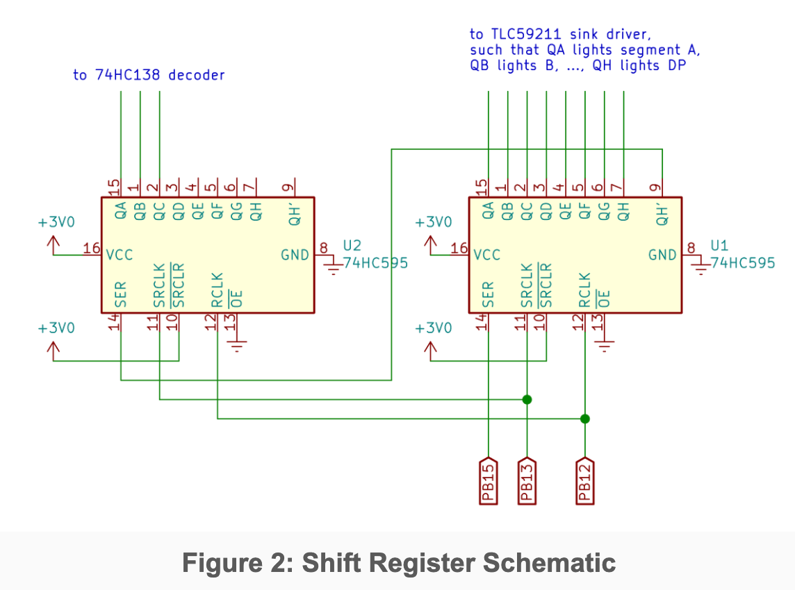
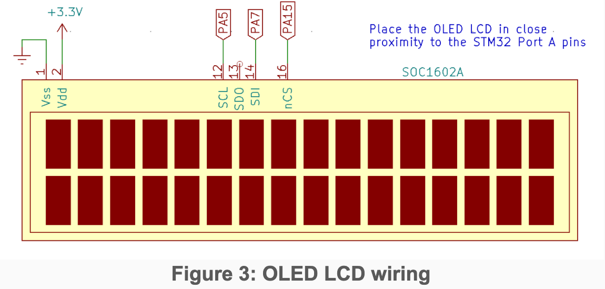
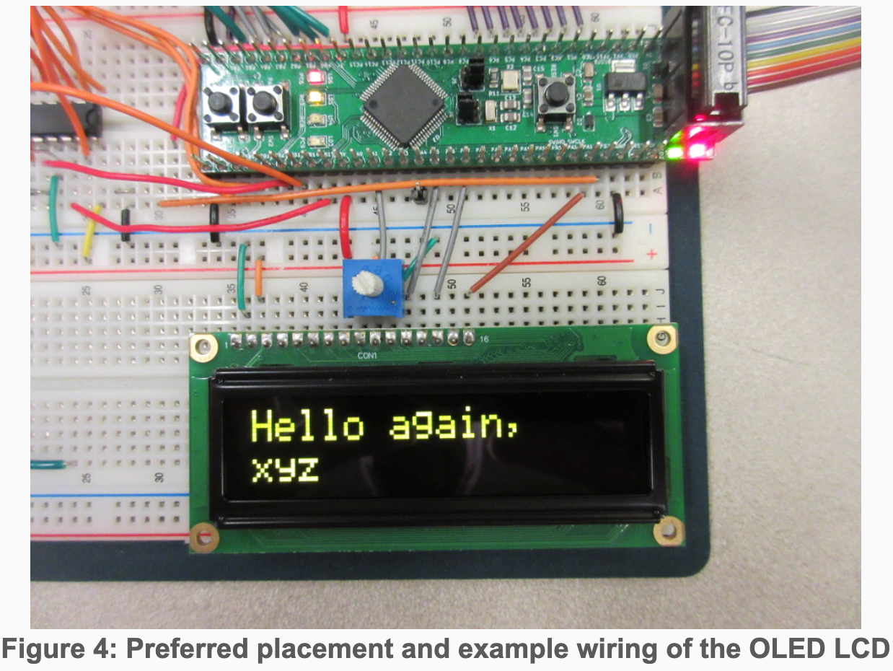

# ECE 362 Lab Experiment 8: SPI and DMA
##Introduction
The Serial Peripheral Interface (SPI) is a widely-used method for communicating with digital devices with an economy of wires and connections. It is possible to control such devices by "bit-banging" the protocol using GPIO, but your microcontroller has high-level support for SPI devices that simplifies the use of such interfaces. This support also allows for the use of Direct Memory Access (DMA) to automatically transfer a region of memory to the device. In this lab, you will gain experience using SPI and DMA with display devices.

## Instructional Objectives
- To understand the Serial Peripheral Interface format
- To use and observe an SPI device
- to use DMA to automatically transfer data to an SPI device
## Table of Contents
|Step|Description|Points|
|----|-----------|------|
|0	|Prelab Exercises	|25|
|1	|Background||
|2	|Experiment|
|2.1	|Driving an SPI interface by "bit-banging"|	20|
|2.2	|Using the hardware SPI channel	|20|
|2.3	|Trigger DMA with SPI_TX	|10|
|2.4	|Using SPI to drive the OLED LCD	|25|
|3	|Play the game||
|4	|Submit your postlab results	|*|
| 	|Total:	|100|

* All the points for this lab depend on proper completion of and submission of your post-lab results.

When you are ready for your lab evaluation, review this checklist.

## Step 0: Prelab Exercises:
- Be familiar with lectures up to and including the Serial Peripheral Interface.
- Read Chapter 27 of the [STM32F0 Family Reference Manual](../../manuals/FRM.pdf) to become familiar with the SPI subsystem.
- Read Chapter 11 of the Family Reference Manual to understand how to configure the proper DMA channel.
- Read Section 22.3 of the textbook
- Read the datasheet for the [SOC1602A OLED LCD display](../../manuals/SOC1602A_datasheet.pdf).
- Read this entire lab document.
- Leave the devices and wiring you did for Lab 5 in place and add the things described in section 1.5.
- After doing the previous steps, including reading the entire lab document, complete the [prelab exercises](prelab8.pdf) and submit them **before** attempting the lab experiment.

## Step 1: Background
### 1.1 Serial Peripheral Interface
When communication speed is not high priority, it is helpful to minimize wiring by using a serial communication protocol. It is named so because bits are sent one at a time, one after another. The Serial Peripheral Interface (SPI) is a common way of doing so. SPI turns words into a stream of bits and vice-versa. To send an entire word through the serial output, a programmer need only write the word into the SPI data register, and the hardware takes care of converting into a bit stream.

SPI is a synchronous protocol, so it requires a clock signal to indicate when each bit of data sent should be latched-in to the receiver. SPI defines devices that act in two distinct rôles: A master device is responsible for directing operations by asserting a slave select line, driving the clock, sending data on a MOSI (master out, slave in) pin, and optionally listening to input on a MISO (master in, slave out) pin. A slave device responds to operations when its slave select pin (SS or NSS) is asserted, reads data on the MOSI pin, and sends data on the MISO pin on each clock pulse. Because SPI is synchronous, there is no need for devices to agree, in advance, on a particular baud rate to communicate with each other. As long as the master device does not drive the clock at a frequency that is higher than a slave device can tolerate, data will be received correctly.

The SPI driver in the STM32 can be configured for several different modes of operation. For instance, the clock output can be configured to latch data on the rising edge or falling edge. Also, the NSS output can be set to automatically pulse low for each word written, but only when the clock is in a specific configuration. NSS pulse generation is generally not useful in situations where multiple slave devices share the same MOSI, MISO, and SCK pins. For that, you would want to control multiple individual SS pins. Since we are using a single device, and since that device demands that NSS go high after every word written to it, we will use the NSSP feature.

The baud rate (another name for the rate at which bits are sent) for an STM32 SPI channel can be set to a fraction of the system clock. The SPIx_CR1 register has a BR field that defines a prescale divisor for the clock. The size of the word to be sent and received by an STM32 SPI channel is set with the SPIx_CR2 DS field. This 4-bit field is unique among other I/O registers in that ‘0000’ is not a legal value. An attempt to clear this field before setting it to something new will result in it being reset to ‘0111’ which defines an 8-bit word size. For this lab experiment, we will connect a SOC1602A OLED LCD display which communicates in bytes with two extra bits to indicate a register selection and read/write selection–10 bits total. To set the DS field to a 10-bit word, it is necessary to write the bit pattern directly without clearing the DS field first. This should be the first thing done to the CR2 register. Thereafter, other bits can be ‘OR’ed to CR2.

### 1.2 Shift Registers and 7-Segment Display
In Lab 5, you built an eight-character display out of multiplexed 7-segment LED displays. Since then, you have been using it through a parallel interface — you need to output 11 bits on Port B at the same time in order to display a character at a particular position. To reduce the number of STM32F091RC pins needed to drive your display, it is possible to use external shift registers as a serial interface for it.

Since each [74HC595](../../manuals/74hc595.pdf) shift register in your lab kit only provides 8 output pins, you will need to cascade two together to effectively build a 16-bit shift register. Connect the serial input of one 74HC595 shift reigster to PB15 (MOSI). Connect the serial input of the other shift register to the serial output (Q7') of the first. Tie both shift register clock inputs (SH_CP) together, and connect them to PB13 (SCK). The outputs of the shift registers replace your previous Port B connections.

*Note: You may find it useful to place the 74HC595 shift registers on your breadboard upside-down, so the outputs of the shift registers are facing the inputs of the decoder and sink driver.*

The output pins of each 74HC595 shift register are gated by an internal storage register. In order to update outputs, the storage register must be clocked (by asserting ST_CP). Tie both storage register clock inputs together, and connect them to PB12 (NSS). With SPI, you can simply use NSS as the storage register clock. Since NSS will be deassarted (set HIGH) at the end of every message in pulse mode, the shift registers will output new data.


The schematic for this setup is shown below.
  

### 1.3 OLED Hardware Configuration
Page 4 of the datasheet for the [SOC1602A OLED LCD display](../../manuals/SOC1602A_datasheet.pdf) describes the pins for the serial interfaces. Like many SPI devices, the documented pin names differ from the canonical description of the SPI protocol. Pin 12 (SCL) is the SPI clock. Pin 14 (SDI) is the MOSI signal. Pin 16 (/CS) is a "negated chip select", which is connected to NSS. Figure 3 describes the connection to the STM32F091 development board.
  

  

### 1.4 SPI Protocol for OLED LCD Display
A controlling computer uses three pins to send data to the SOC1602A LCD. First, for any communication to take place, the /CS pin must be asserted low. This corresponds to the NSS (negative slave select) line of the STM32. Since we are using only one SPI slave device, the STM32 will be the master device for all SPI protocol operations, and we can use automatic NSS protocol to control the display. Data is sent to the display on its SDI pin, and it is "clocked in" on the rising edge of the signal on the SCL pin. Each transfer must be terminated by deasserting (setting high) the /CS pin.

Most SPI devices use a 4-, 8-, or 16-bit word size. The SOC1602A uses a 2+8-bit word size to send two bits of configuration information plus an 8-bit character on each transfer. The first two bits are, respectively, the register selection and read/write. Since we will always be writing data to the display and never reading it, we will always make the second bit a '0'. The register selection determines whether a write is intended as a command or a character to write to the display. Commands are needed to, for instance, initialize the display, configure the communication format, clear the screen, move the cursor to a new position on the screen, etc. The SOC1602A implements an old and well-known LCD protocol. You may see it in many other two-line LCD modules. There are many commands that can be used to implement complex operations on the SOC1602A that we will not use for this lab experiment. For the sake of this lab, we will be concerned only with the initialization sequence, moving the cursor, and writing characters to display.

When the register select bit is zero, the transmission issues an 8-bit command to the display. When the register select bit is one, the transmission represents a character to write to the display.

Page 7 of the SOC1602A datasheet lists the set of possible commands that can be sent to the display. Pay special attention to the column labeled "Max Execution Time". Regardless of how fast data is sent to the display, some operations take significant time to complete. The sender must not start a new command before the previous one has finished. On the next page, details of the instruction format are given. Page 20 lists the initialization sequence (under the header **LNITIALIATION SWUENCE[\[*\]](nature_documentation.md))** that must be used to prepare the display for use. Until each step is properly completed, the display will not show anything. The greatest problem that students have with new hardware (other than poor documentation) is finding the patience to carefully implement each step of the initialization sequence.

The operations to be done are as follows:
- Wait 1ms for the display power to stabilize.
- **Function set**: The reason for issuing this command first is to set the data length for 8-bit operation. This is set by the DL bit in the command description for the 8-bit Function Set operation:
```
    0 0 1 DL 1 0 FT1 FT0
```
To set the data length to 8-bit, we use DL=1. The FT[1:0] bits select a font. We'll select 0 0 to use the English/Japanese font. The 8-bit command will be 00111000 or 0x38.
We cannot check the BUSY flag, because we did not connect the MISO pin to the display. Instead, we will simply wait long enough that the display can be guaranteed to finish the command. This command will complete in 600µs, at most. In practice, it will finish much faster.  
- **Display OFF**: The recommendation is to turn the display off with the 8-bit command
```
    0 0 0 0 1 D C B
```
    where D enables the display output, C set the cursor to be visible, and B set the cursor to blink. Turn the display off with the 8-bit code 0x08.
- **Display Clear**: Clear the display. **Note that this command requires 2ms to complete**. Delay for that long before continuing. The 8-bit command is 0x01.
- **Entry Mode Set**: Set the *entry mode* to move the cursor right after each new character is displayed without shifting the display. This is done with the command
```
    0 0 0 0 0 1 D S
```
    where D represents the direction to advance in, and S configures shifting the display. We'll use the 8-bit command 0x06 to move the cursor left-to-right and not shift the display.
- **Home Command**: This will set the cursor to position zero (the top left corner) of the display. The command to use is 0x02.
- **Display ON**: Turn the display back on again with the command
```
    0 0 0 0 1 D C B
```
    This time, we will set D=1 and leave C=0, B=0. The 8-bit command is 0x0c.

After these initialization steps are complete, the LCD is ready to display characters starting in the upper left corner. Data can be sent with a 10-bit SPI transfer where the first bit is a 1. For instance, the 10-bit word 10 0100 0001 (0x241) would tell the LCD to display the character ‘A’ at the current cursor position. In the C programming language, a character is treated as an 8-bit integer. In general, any character can be sent to the display by adding the character to 0x200 to produce a 16-bit result that can be sent to the SPI transmitter. For instance, to write an ‘A’ to the display after initialization, the following statement could be used:
```
    while((SPI2->SR & SPI_SR_TXE) == 0)
        ; // wait for the transmit buffer to be empty
    SPI2->DR = 0x200 + 'A';
```
To understand why 0x41 is the same thing as 'A', you should consult the ASCII manual.

## 2.0 Experiment
For this experiment, you will write the subroutines to write to the shift registers to drive the 7-segment LED displays and to initialize and write to the SOC1602A OLED LCD display through the SPI interface and using DMA.

Create a project in SystemWorkbench called "lab8", and replace the automatically-generated main.c file with the main.c skeleton file provided for you.

Several subroutines you write will be copied directly from those you wrote in labs 6 and 7. Be sure that you implemented them correctly.

2.1 Driving an SPI interface by "bit-banging"
The SPI interface is simple enough that it can be driven by setting individual GPIO pins high and low — a process known as bit-banging. This is a common method for using SPI with most microcontrollers because no specialized hardware is needed to do so. For our first implementation, we will bit bang the SPI protocol for the shift registers connected to the 7 segment LED array.

2.1.1 setup_bb()
Write a C subroutine named setup_bb() that configures GPIO Port B for bit-banging the 7 segment LED displays. To do so, set pins PB12 (NSS), PB13 (SCK), and PB15 (MOSI) for general purpose output (not an alternate function). Initialize the ODR so that NSS is high and SCK is low. It does not matter what MOSI is set to.

2.1.2 small_delay()
A C subroutine named small_delay() that calls the nano_wait() subroutine is provided for you in main.c. When you are starting out bit-banging an interface, it is helpful to have a uniform small delay that can be made arbitrarily large. The parameter for nano_wait() is number of nanoseconds to spend spinning in a loop. Having small_delay() allows you to always call nano_wait() with the same value. If things do not work, it helps to slow down all elements of the protocol. You can make the value very large so that you can debug it. We start out with a large value like 50000000 (50 ms). In practice, you would gradually reduce it to see what works, but you will find that, when driving the 7-segment LED array with the shift registers, you will not need any delay at all. Once the circuitry and software is working you can comment out the nano_wait() call in small delay.

Consider what the SPI protocol does. The delays are to be inserted between transitions of NSS-MOSI-SCK-MOSI-SCK-...-NSS. The SPI interface will certainly work at extremely low speeds. When starting to develop any hardware interface, it is helpful to be able to see things happening in slow-motion. Once it works, increase the speed.

2.1.3 bb_write_bit()
Write a C subroutine named bb_write_bit() that accepts a single integer parameter, which should always be either 0 or non-zero, and does the following steps:

Set the MOSI pin to low if the value of the parameter is zero. (Otherwise, set it to high.)
small_delay();
Set the SCK pin to high.
small_delay();
Set the SCK pin to low.
2.1.4 bb_write_halfword()
Write a C subroutine named bb_write_halfword() that accepts a single integer parameter and does the following steps:

Deassert the NSS pin
Call bb_write_bit() with bit 15 of the argument.
Call bb_write_bit() with bit 14 of the argument.
...
Call bb_write_bit() with bit 0 of the argument.
Assert the NSS pin
If you're new at this, remember that you can use the >> operator to shift values to the right by an arbitrary amount. Then use the & operator to AND the result with a 1 to isolate one bit. If you don't feel like expressing this with a loop, you may make sixteen separate calls to bb_write_bit() in the proper sequence.
2.1.5 Debug Bit Banging
Uncomment the #define BIT_BANG stanza in main.c. This will invoke your setup_bb() subroutine to configure the pins as outputs and then call your bb_write_halfword() repeatedly to show the entire array.

The display should say "ECE 362", though it will iterate through each display element very slowly. Make sure that each digit displays correctly. Then reduce the number of nanoseconds that small_delay waits until the display is smooth.

2.1.6 Demonstrate Bit Banging
Comment out the nano_wait() call and use your AD2 to capture a trace of the SPI protocol. To do so,

Invoke the "Logic Tool" and add a new SPI bus in the signal list.
Use DIO 0 for the "Select" (NSS) signal.
Use DIO 1 for the "Clock" (SCK) signal.
Use DIO 2 for the "Data" (MOSI) signal.
Click the box in the "SPI" row in the "T" column (see the thick red box in the picture below.) to set a value-based trigger. Set the trigger as follows:
Trigger: Value
Value: h0079
Place: Any
Click the "Single" button to capture the transaction.
While your program is running, capture a single trace of the protocol transaction that writes the "E" pattern to digit 0 of the display. It should look like the image below.

Figure 4: AD2 trace of an SPI protocol transaction
Create a snapshot of the output of the AD2 by clicking File -> Export and save it as a PNG file. Ensure that your device, serial number, and creation time are shown in the image. Upload the image into the postlab and restore the nano_wait() call for the check off process below.

Have a TA check you off for this step (TA Instructions: Confirm that the bit-bang subroutines are being called in main(). Check that display flashes one digit at a time. Ask the student to comment the nano_wait() call in small_delay() and confirm that the display is smooth. Enter numbers on the keypad, and ensure they are displayed on the 7-segment displays. Confirm that the image uploaded to the postlab shows the proper transaction.)

2.2 Using the hardware SPI channel
The STM32 has two SPI channels that do the work of the subroutines you just wrote in hardware instead of software. Implement the following subroutines to initialize and use the SPI2 interface.

You should now comment out BIT_BANG stanza and and uncomment the lines below it for the SPI_LEDS stanza.

2.2.1 init_tim15() and TIM15 ISR
Copy the init_tim15(), setup_dma(), and enable_dma() from lab 6 or lab 7. You must make one change: setup_dma() should configure the DMA channel to write to SPI2->DR instead of GPIOB->ODR.

2.2.2 init_spi2()
Write a C subroutine named init_spi2() that initializes the SPI2 subsystem and connects its NSS, SCK, and MOSI signals to pins PB12, PB13, and PB15, respectively. You should set these pins to use the alternate functions to do this.

The subroutine should then configure the SPI2 channel as follows:

Ensure that the CR1_SPE bit is clear. Many of the bits set in the control registers require that the SPI channel is not enabled.
Set the baud rate as low as possible (maximum divisor for BR).
Configure the interface for a 16-bit word size.
Configure the SPI channel to be in "master mode".
Set the SS Output enable bit and enable NSSP.
Set the TXDMAEN bit to enable DMA transfers on transmit buffer empty
Enable the SPI channel.
It may be helpful to review slides 16, 17, and 18 of the lecture on SPI.
Consider what you've achieved here...
In labs 6 and 7, you used DMA to copy 16-bit words into an 11-bit GPIO ODR to drive the 7-segment displays. Now you've moved the 7-segment driver to a synchronous serial interface. Since there is a built-in peripheral that serializes bits, you can now do the same thing, with the same software. The only things you had to change were the initialization code to set up the SPI peripheral instead of parallel GPIO lines, and the output target of the DMA channel.

2.2.3 Demonstrate SPI2 and 7-Segment Display
Have a TA check you off for this section (TA Instructions: Check that the correct functions are commented/uncommented in main and that the display and keyboard work normally).

2.3 Trigger DMA with SPI_TX
An SPI peripheral can be configured to trigger the DMA channel all by itself. No timer is needed! It just so happens that the SPI2 transmitter triggers the same DMA channel that Timer 15 triggers. (See the entry in Table 32 for SPI2_TX.) The only additional work to do is to configure the SPI peripheral to trigger the DMA. Subroutine to do this are provided for you. They are named spi2_setup_dma() and spi2_enable_dma(). They call the code you wrote in setup_dma() and enable_dma().

Consider what you've achieved here...
You now have a system that can automatically transfer 16-bit chunks from an 8-entry array to the LED displays. Instead of needing a timer to trigger the DMA channel, the SPI peripheral does that automatically. As soon as one word is transferred, it requests the next word. The SPI system can run fast enough that words can be transferred 1500000 times per second. That would make the digits change faster than the 74HC138 could settle, and the letters would blur together. By setting the SPI clock rate as low as possible, 187.5 kHz, it means that each 16-bit word is delivered 187500/16 = 11719 times per second. You may notice that this makes the digits a little dimmer than they were when driven by the timer.

2.3.1 Demonstrate Trigger DMA with SPI_TX
Comment the SPI_LEDS stanza and uncomment the SPI_LEDS_DMA stanza. Have a TA check you off for this section (TA Instructions: Run this in the System Workbench debugger and confirm that Timer 15 is not initialized.)

2.4 Using SPI to drive the OLED LCD
Once you have some experience configuring an SPI peripheral for one purpose, it is easy to set up another. We will now use the SPI1 peripheral to drive the LCD OLED display. This will not interfere with the operation of the SPI2 peripheral. You can use them both, simultaneously, for different devices.

2.4.1 init_spi1()
Write a C subroutine named init_spi1() to configure the SPI1 peripheral. The configuration for SPI1 is similar to SPI2 from before with a few key differences:

Configure NSS, SCK, MISO and MOSI signals of SPI1 to pins PA15, PA5, PA6, and PA7, respectively.
10-bit word size
In this lab, you will be using pins on Port A for SPI output. This means you will modify the GPIOA_MODER and GPIOA_AFR configuration. Remember that, if you modify the configuration for pins PA13 or PA14, you will lose the ability to debug or even re-program the microcontroller. Double-check your MODER updates to make sure they will not change pins 13 or 14.

When you misconfigure GPIO Port A, remember that you can restore the ability to use the debug/programming interface by:

repairing your program,
pressing and holding the reset (SW1) button,
pressing "Run" on SystemWorkbench to reprogram the microcontroller
Depending on what kind of mistake you made, you might have to hold down the reset button for only one second after pressing "Run". You may also need to reprogram the microcontroller twice before it works again. Be patient. Do not give up. Ask a TA for help with this process.
2.4.2 spi_cmd()
A C subroutine named spi_cmd() is provided for you. It accepts a single integer parameter and does the following:

Waits until the SPI_SR_TXE bit is set.
Copies the parameter to the SPI_DR.
That's all you need to do to write 10 bits of data to the SPI channel. The hardware does all the rest.
2.4.3 spi_data()
A C subroutine named spi_data() is provided for you. It accepts a single integer parameter, and does the same thing as spi_cmd(), except that it ORs the value 0x200 with the parameter before it copies it to the SPI_DR. This will set the RS bit to 1 for the 10-bit word sent. For instance, if you call the subroutine with the argument 0x41, it should send the 10-bit value 0x241 to the SPI_DR. This will perform a character write to the OLED LCD.

2.4.4 spi1_init_oled()
A C subroutine named spi1_init_oled() is provided for you. It performs each operation of the OLED LCD initialization sequence:

Use nano_wait() to wait 1 ms for the display to power up and stabilize.
cmd(0x38); // set for 8-bit operation
cmd(0x08); // turn display off
cmd(0x01); // clear display
Use nano_wait() to wait 2 ms for the display to clear.
cmd(0x06); // set the display to scroll
cmd(0x02); // move the cursor to the home position
cmd(0x0c); // turn the display on
2.4.5 spi1_display1()
A C subroutine named spi1_display1() is provided for you. It accepts a const char * parameter (also known as a string) and does the following:

cmd(0x02); // move the cursor to the home position
Call data() for each non-NUL character of the string.
2.4.6 spi1_display2()
A C subroutine named spi1_display2() is provided for you. It accepts a const char * parameter (also known as a string) and does the following:

cmd(0xc0); // move the cursor to the lower row (offset 0x40)
Call data() for each non-NUL character of the string.
The display hardware allows for scroll buffers for each line, so the beginning of the second line is actually position 64 (0x40). That offset is combined with the "Set DDRAM address" command (0x80) to position the cursor.
2.4.7 Demonstrate the SPI OLED Display
At this point, you should be able to comment and previous stanzas and uncomment the SPI_OLED stanza. It uses the init_spi1() you wrote along with the support code to initialize and write things to the OLED display.

Have a TA check you off for this part (TA Instructions: the OLED display should display "Hello again,\n[Their login]")

2.5 Trigger SPI1 DMA
After going through the initialization process for the OLED display, it is able to receive new character data and cursor placement commands at the speed of SPI. In this step, we will configure SPI1 for DMA. Instead of using the spi1_display1() and spi1_display2() subroutines to place the cursor and write characters, they will be continually copied from a circular buffer named display[]. It consists of 34 16-bit entries. Element 0 of the array holds the 10-bit command to set the display cursor at position 0 (the beginning of the top line) of the display. This is the "home command" for the display. The next 16 entries are characters that are copied into the first line of the display. Element 17 of the array holds the 10-bit command to set the cursor position to the beginning of the second line. It is followed by 16 more characters. (Remember that each character must be sent with the 0x200 prefix.)

2.5.1 spi1_setup_dma()
Write a subroutine named spi1_setup_dma(). It should circular copy of the 16-bit entries from the display[] array to the SPI1->DR address. You should also configure the SPI1 device to trigger a DMA operation when the transmitter is empty.

Which DMA channel should you use for this step? You know how to determine this.

2.5.2 spi1_enable_dma()
Write a subroutine named spi1_enable_dma(). The only thing it should do is enable the DMA channel for operation.

The array is set up, and circular DMA transfer is triggered by SPI1_TX to write it to the SPI1->DR address. Thereafter, the display is effectively "memory-mapped". As characters are written to the array values, they are quickly copied to the display. This allows you to easily create very complicated patterns and animations on the display.

An example of subroutines to update the display[] array is provided in the support.c file. Two subroutines named spi1_dma_display1() and spi1_dma_display2() do the work of converting a string of at most 16 characters to 16-bit entries at the right location in the display[] array. These are used for the game at the end of the lab experiment.

2.5.3 Demonstrate your work
Uncomment the SPI_OLED_DMA stanza and comment all other stanzas. You should see the message encoded into the display[] array. (TA instructions: Once this works, try commenting all stanzas so that the game is invoked.)

3 Play the game
If you have properly implemented all of your subroutines, you should be able to comment all of the test stanzas and play the game provided for you. This game provides several examples that will be useful to you when you implement a mini-project:

It starts a free-running timer counter (TIM17) while it waits on the player to press a button. Once a button is pressed, the value of the counter is read and used as a seed for the random number generator. In doing so, each game will be different.
This is an example of how to wait for key events and update multiple display devices (the 7-segment displays and the OLED display).
All of the game logic is encoded into the Timer 17 ISR.
The ARPE bit of the timer is set. This allows us to safely modify the ARR during the operation of the game. As the game progresses, the action gets faster.
A critical section is set up where all interrupts are temporarily disabled when a key is pressed. In this way, the display array can be safely updated rather than have two things modify it in an overlapping fashion.
It is an easy game to play. Use the A and B keys to move the '>' character on the left of the display. Use it to hit as many 'x' characters as you can. Each time you hit an 'x', you gain a point. Each time an 'x' goes by you, you lose a point. As your score gets higher, the game goes faster. If you can reach 100 points, you win.

Lab Evaluation Checklist
Normally, we'll have a checklist of things that you should review before going into your evaluation. There will be no evaluation for this lab experiment.


Do your bit-bang subroutines work with and without a delay?

Is your AD2 SPI protocol transaction capture in the postlab?

Do the SPI2 functions properly drive the 7-segment display?

Does the OLED display initialize correctly and display the requested text? Does it update if the login is changed and the program is rerun?
Questions or comments about the course and/or the content of these webpages should be sent to the Course Webmaster. All the materials on this site are intended solely for the use of students enrolled in ECE 362 at the Purdue University West Lafayette Campus. Downloading, copying, or reproducing any of the copyrighted materials posted on this site (documents or videos) for anything other than educational purposes is forbidden.
