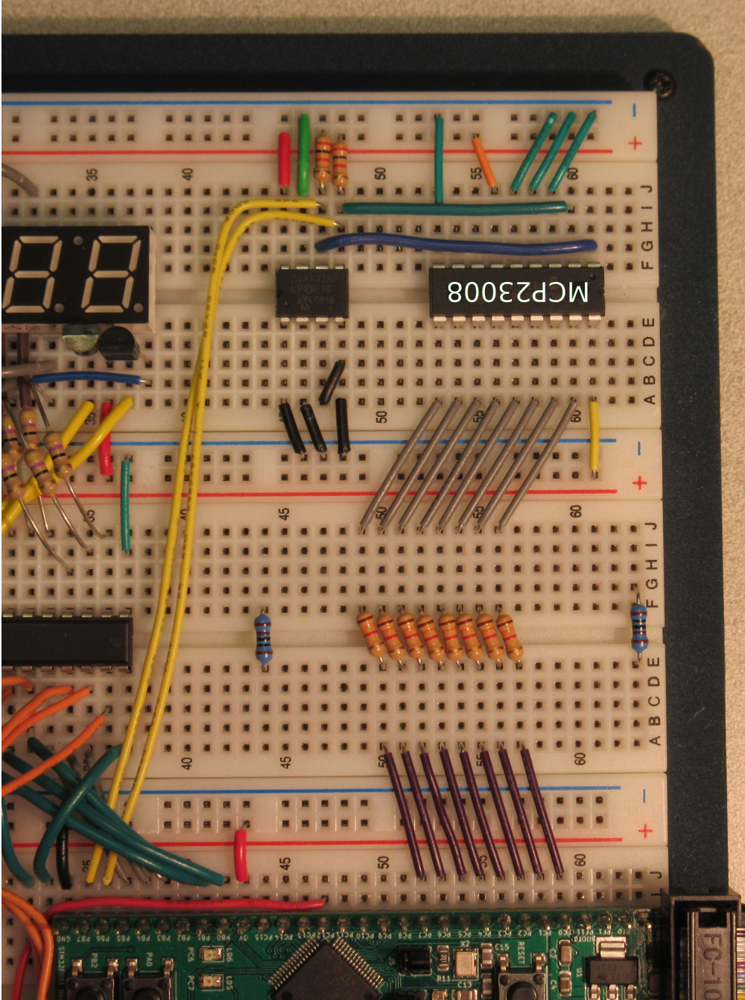

# ECE 362 Lab Experiment 9: I2C
## Introduction

Serial interface formats are convenient because they require a small number of physical connections. They are often limited in the number of devices that can be connected at once, or they require cumbersome control logic to enable and disable devices. Inter-Integrated Circuit (I2C) is a synchronous serial interface that uses an addressing scheme to select between multiple communication targets on a shared bus. Although it is generally slower than SPI, the flexibility of easily connecting multiple devices is useful when communication speed is not critical. In this lab, you will gain experience using and testing I2C devices. You will examine I2C protocol using a USB logic analyzer to identify correct and incorrect interface signals.

## Instructional Objectives
- To understand concepts of I2C interfacing and communication
- To learn how to use STM32F0 I2C hardware to interact with I2C devices

## Table of Contents
| Step	| Description	| Points |
|-------| -------------- | ------|
| 0	| Prelab Exercises	| 35 |
| 1	| Background| |
| 2	| Experiment| |
| 2.1 |	init_i2c()	| 10|
| 2.2	| Create I2C helper subroutines	| 10|
| 2.3	| Reading and writing data	| 10|
| 2.4	| Using the GPIO Expander to scan the keypad| 	15|
| 2.5	| EEPROM functions	| 20|
| 3	| Submit your postlab results	| *|
| 	| Total:	| 100|

* All the points for this lab depend on proper completion of and submission of your post-lab results.

When you are ready for your lab evaluation, review this checklist.

## Step 0: Prelab Exercises:
- Be familiar with lectures up to and including I2C - Inter-Integrated Circuit Interface
- Read Chapter 25 of the [STM32F0 Family Reference Manual](../../manuals/FRM.pdf) to become familiar with the I2C subsystem.
- Read Section 22.2 of the textbook
- The following web pages will be very helpful:
    - The official [I2C-bus specification and user manual](../../manuals/I2C-bus-specification-and-user-manual.pdf). You can probably learn everything you need from reading this, but it's a lot to read.
    - https://i2c.info/i2c-bus-specification
    - https://www.i2c-bus.org/
    - https://learn.adafruit.com/i2c-addresses?view=all
- Read the datasheet for the 24AA32AF I2C EEPROM.
- Read the datasheet for the MCP23008 I2C GPIO Extender.
- Read this entire lab document.
- Leave the devices and wiring you did for Lab 8 in place and add the things described in section 1.4.
- After doing the previous steps, including reading the entire lab document, complete the [prelab exercises](prelab9.pdf) and submit them **before** attempting the lab experiment.

## Step 1: Background
### 1.1 I2C Communication
An I2C interface allows many devices to share a two-wire bus and refer to specific neighbors by their addresses. Each device uses an open-drain output driver for each signal with the expectation that external pull-up resistors will bring the signals back to the high state when no driver is pulling them low. I2C devices work in two roles. A master device is responsible for driving a clock signal (SCL) that is seen by all other devices that share the bus. Synchronous data is conveyed by the SDA signal during the high phase of the SCL signal and the SDA signal changes while SCL is in the low phase. An exception is when SDA changes state while SCL is still in the high state. Every I2C transaction begins with a START condition represented by the SDA line transitioning from high to low while SCL is still high. Every I2C transaction ends with a STOP condition represented by the SDA line transitioning from low to high while SCL is still high.

Between the START and STOP conditions, one or more packets of nine data bits are transferred. An initial packet sent by a master to a particular slave device contains a 7-bit address followed by a one-bit intent. The intent indicates whether the transaction is going to read from the slave device (represented by a ‘1’ bit) or write to the slave device (with a ‘0’ bit). The selected slave device, whose address matches the address in the initial packet, replies to the master by sending a ‘0’ bit in reply as the ninth bit of the packet. The ninth bit is called an acknowledgement (ACK). If the slave device is not ready, if the slave device is terminating a multi-packet transaction, or if there is no such device that matches the address, then nothing will pull the SDA line low. This is called a negative acknowledgement (NACK).

The master sends the initial packet containing the slave address and intent, and the slave device sends the ACK bit. If the intent to write is indicated, multiple subsequent nine-bit exchanges can occur. If the intent to read is indicated, then multiple nine-bit exchanges can also occur, but this time the selected slave device will send the eight data bits and the master will respond with an ACK bit.

### 1.2 STM32 I2C Interface
Your STM32 development system contains two independent I2C channels, each of which have two signals that can be routed to the external pins. Each channel uses seven main I/O registers to orchestrate the I2C transactions:
1. The I2C_TIMINGR register is used to select a prescale value and four other values to configure the duration of the SCL signal’s high and low periods, as well as the expected setup and hold times for SDA with respect to SCL.
2. The I2C_CR1 register is used to set up long-term device configuration parameters as well as to enable the device (with the PE bit).
3. The I2C_CR2 register is used by a master to start or stop a transaction as well as to indicate the slave address and number of bytes to send to or receive from the slave device.
4. The I2C_TXDR register is used to send a byte to the selected target device.
5. The I2C_RXDR register is used to receive a byte from the selected target device.
6. The I2C_ISR register shows the transaction status. E.g., completed, NACK, STOP, etc.
7. The I2C_ICR register is used to clear any condition indicated by the ISR register.

By using these registers, any typical I2C transaction can be conducted.

### 1.3 Viewing I2C transactions
Debugging an I2C interface can be difficult without the ability to visualize a transaction. Here are the basic instructions for using the _protocol analyzers_ built in to the USB bench tool products you may have:

#### 1.3.1 Using an AD2 for I2C protocol analysis
The Digilent Analog Discovery 2 (AD2) has logic analyzer capabilities, and the WaveForms software can be used to visualize readings. To view I2C:
1. Connect the AD2 to your computer and invoke the WaveForms program.
2. Connect DIO 0 to SCL and DIO 1 to SDA. Make sure that one of the ground wires of the AD2 is connected to the same ground of the STM32.
3. In the WaveForms "Welcome" tab, invoke the "Logic" tool from the selections on the left side.
4. Press the "Click to Add channels" button on the left side of the
5. Select I2C from the drop-down list.
6. Set "Clock" to DIO 0 and "Data" to DIO 1, "Address" to 7 bits, and "Format" to hexadecimal.
7. Press the "Add" button.
8. Press "Run" to capture the waveform.
9. (Optional) You will have trouble capturing the signal frame. In the "Trigger" row, set trigger to "Protocol" > "I2C" > "Start". To reset to the original mode, select "Simple" instead

### 1.4 Wiring
Refer to the datasheet for the 24AA32AF I2C EEPROM on the ECE 362 reference web page. Take the 24AA32AF from your lab kit and connect the VCC and VSS pins of the EEPROM to 3V and ground, respectively. Connect the A0, A1, A2 pins to 3V, and connect the WP pin to allow normal read/write operation. Connect the SCL and SDA pins of the EEPROM to the SCL and SDA pins of the I2C1 channel of your STM32. For this experiment, use PB6 and PB7 for I2C1. Connect a 2K resistor to each of these signals to act as a pull-up. (You know, from the prelab, that this is not a precise value. If you don't have 2K resistors in your ECE master lab kit, anything between 1K and 2K should work well enough.)

Refer to the datasheet for the MCP23008 on the ECE362 reference web page. Connect the VDD of the chip to 3V, GND to GND, and SCL and SDA to the corresponding pins on your STM32 development board. Connect the active-low RESET (pin 6) to 3V. Connect A0, A1 and A2 to 3V. Connect GP0 through GP7 to the keypad through 1K resistors as shown in Figure 1, below.
  
**Figure 1: I2C device wiring**

#### 1.4.1 Physical Component Layout
To simplify wiring and keep the system compact, we recommend you install the MCP23008 "upside-down" and connect it to the resistors you used when the keypad was driven by GPIOC. Because you will not be using GPIOC (you will leave it in the default state where all pins are configured as inputs), you may leave the wires that connect it to the keypad resistors so long as you do not enable PC0-PC7 as outputs. In fact, for this lab experiment, you will not use general-purpose I/O at all. You can disconnect the wires from PC0-PC8 once you're ready.

Figure 2 shows the progression from the old keypad wiring to the new form. Figure 2(a) shows the circuit as it was for lab 5. Figure 2(b) shows the I2C chips installed and connected to PB6 and PB7. Figure 2(c) shows the same chips with a gray transparent box to demonstrate where the keypad will fit. The top row of keypad buttons will rest on the two I2C chips. Note the two 1K resistors in positions 44 and 63 of the breadboard whose only job is to keep the keypad from rocking when the '*' and 'D' keypad buttons are pressed. Figure 2(d) shows the keypad in place hiding the I2C chips.

If you have not yet clipped the leads on your keypad resistors so that they are flush with the breadboard, you need to do that now.

 a|b|c|d|
:---:|:---:|:---:|:---|
 |  |  | 

**[Figure 2: Recommended component layout]**

### 1.5 Basic Protocol
I2C peripheral devices operate with streams of writes and reads. The initial byte identifies the device that the stream is intended to interact with (its 7-bit identifier) as well as one bit to indicate if the stream is being written to or read from the device.

#### 1.5.1 MCP23008 I2C Protocol
The MCP23008 contains eleven internal registers, each of which has an address. To write one of these registers, a stream of bytes is written to the I2C channel like so:
```
        Start
        {7-bit device ID} Wr Ack        1st byte
        {Register address} Ack          2nd byte
        {New register contents} Ack     3rd byte
        Stop
```
To read from a register, the address of the particular register must first be written with a write stream. Thereafter, a read stream will deliver the contents of the selected register to the initiating master device like so:
```
        Start
        {7-bit device ID} Wr Ack        1st byte
        {Register address} Ack          2nd byte
        Stop (optional)
        Start
        {7-bit device ID} Rd Ack        1st byte
        {Register contents} Ack         2nd byte
        Stop
```
It is possible to fuse the two streams together by, instead of issuing a protocol Stop at the end of the write stream, issuing a second Start followed by the read stream. We won't necessarily do that for this lab experiment. (You are welcome to implement your subroutines in this way if you want to.)
Figure 1-1 on page 7 of the MCP23008 data sheet graphically illustrates the different I2C operations. In this figure, the **OP** refers to the opcode which is the 7-bit I2C address. The **ADDR** represents the register address in the selected I2C device. (In this way, they avoid confusion between the device address and register address.)

The MCP23008 is structurally similar to the GPIO ports of the STM32. One register (IODIR) controls the direction of the pins (inputs or outputs). The IODIR is an 8-bit register where each bit represents the direction of each corresponding GPx pin. To set a pin for output, write a '0' to its IODIR entry. To configure a pin as an input (the default) write a '1' to its IODIR entry. Another register (GPIO) is used to write values to and read values from the pins.

There is a hidden register in the MCP23008 that keeps track of the register address. Every I2C byte written to a register or read from a register causes this hidden register to be incremented. In this way, one could write to all eleven registers by selecting register address 0 followed by 11 data values. The selected register would be advanced for each successive data value.

#### 1.5.2 24AA32AF I2C Protocol
The 24AA32AF I2C EEPROM is operationally similar to the MCP23008 except that it has 4096 register addresses rather than eleven. An internal register keeps track of the selected address. It is incremented with each data read and write. Because there are so many storage locations, two bytes of data are needed to specify the storage location to start reading from or writing to. Read streams are distinct from write streams and they may be merged together by omitting the Stop bit and issuing another Start.

Two write into the storage cells at a particular (12-bit) location, the stream of bytes written to the I2C channel looks like:
```
        Start
        {7-bit device ID} Wr Ack        1st byte
        {Storage loc (4 MSB)} Ack       2nd byte
        {Storage loc (8 LSB)} Ack       3nd byte
        {Data to store} Ack             4rd byte
        ...
        Stop
```
Bytes can be written into sequential storage locations by sending multiple {Data to store} bytes.
Reading from the EEPROM involves issuing a write stream to specify the storage location with zero bytes of data, followed by a read stream:
```
        Start
        {7-bit device ID} Wr Ack        1st byte
        {Storage loc (4 MSB)} Ack       2nd byte
        {Storage loc (8 LSB)} Ack       3nd byte
        Stop (optional)
        Start
        {7-bit device ID} Rd Ack        1st byte
        {Data to store} Ack             2rd byte
        ...
        Stop
```
And many sequential storage locations can be read by continuing to read.
Since the 24AA32AF EEPROM is built using Flash memory, it takes some time to conduct an erase-rewrite cycle. Specifically, it is much slower than the I2C protocol can write to the device. In order to avoid writing faster than the device can tolerate, the writer should never write more than one 32-byte-aligned group of storage locations (e.g. 0x000 - 0x020) at a time. Thereafter, the device must be polled to determine when the write operation has completed. To do so, a new zero-byte write operation can be initiated. The device will not respond with an Ack (it is viewed as a Nack) until the prior write has completed.

## 2.0 Experiment
I2C can be difficult to get working because there are many elements to get correct. If you miss one, nothing works. In the process of diagnosing and repairing the problem, you may inadvertently introduce another problem. Then nothing works. Repeat.

This is not an unusual circumstance in embedded computing. It's almost a good experience for a lab experiment. Nevertheless, we realize that your time is finite, so we provide some steps for you to follow to ensure it does not consume too much of your life.

Create a project in SystemWorkbench called "lab9", and replace the automatically-generated main.c file with the [main.c skeleton file](src/main.c) provided for you. Also create a file named [support.c](src/support.c) that has many of the subroutines you used in the past.

For several subroutines, you will be instructed to copy the implementation from what you did in lab 8.

### 2.1 init_i2c()
Write a C subroutine named `init_i2c()` that configures PB6 and PB7 to be, respectively, SCL and SDA of the I2C1 peripheral. Enable the RCC clock to GPIO Port B and the I2C1 channel, set the MODER fields for PB6 and PB7, and set the alternate function register entries. Then configure the I2C1 channel as follows:

- First, disable the PE bit in CR1 before making the following configuration changes.
- Turn off the ANFOFF bit (turn on the analog noise filter).
- Disable the error interrupt.
- Turn off the NOSTRETCH bit in CR1 to enable clock stretching.
- Set the TIMINGR register as follows: (Note that these are configurations found on Table 83 of the Family Reference Manual. Why is I2C1's clock 8 MHz? See Figure 209 of the Reference Manual for a hint).
    - Set the prescaler to 0.
    - Set the SCLDEL field to 3.
    - Set the SDADEL field to 1.
    - Set the SCLH field to 3.
    - Set the SCLL field to 9.
- Disable both of the "own addresses", OAR1 and OAR2.
- Configure the ADD10 field of CR2 for 7-bit mode.
- Turn on the AUTOEND setting to enable automatic end.
- Enable the channel by setting the PE bit in CR1.

The code shown on page 23 of the I2C lecture will be a helpful starting point for writing this subroutine.  
**_If the TIMINGR values were far enough off that they did not work, would you be able to diagnose why? This is a very realistic situation for hardware debugging._**

**Have a TA check you off for this step** (TA Instructions: check for subroutine completion).

### 2.2 Create I2C helper subroutines
Create and test I2C subroutines to support the next steps of the experiment. You may choose to make up your own subroutines, use the textbook as a reference, or replicate the `i2c_waitidle()`, `i2c_start()`, `i2c_stop()`, `i2c_checknack()`, and `i2c_clearnack()` subroutines described on page 33 of the lecture notes. The `i2c_checknack()`, and `i2c_clearnack()` subroutines were not described in the lecture notes, but you should be able to construct them easily by referring to the ISR and ICR registers of the I2C channel. Regardless of your choice, you should construct and type the subroutines yourself. This lab experiment is a personal task. It is not a team effort.

Test your subroutines using something like the code on page 30 of the lecture notes. For instance, you might use a code stanza like the following to see an acknowledgement from the MCP23008:
```
        i2c_init();
        for(;;) {
            i2c_waitidle();
            i2c_start(0x20,0,0);
            i2c_clearnack();
            i2c_stop();
        }
```
View the results of a zero-byte write to the I2C device address of the MCP23008 on your USB logic analyzer. Make sure you see something like Figure 3. Note the presence of the acknowledge bit in the single-byte transfer. **Follow the instructions in step 1.3.1 to set up the AD2 to observe a transaction.**  

  
**Figure 3: An acknowledged zero-byte write to the MCP23008**

If you change your test subroutine to use the incorrect I2C device address, you should see something like Figure 4. Because no device responds to this address, no acknowledgement is sent.

  
**Figure 4: An unacknowledged zero-byte write to a vacant I2C device address**

There is some advice on page 39 of the lecture notes for debugging I2C problems. The instructions are useful for more than only this lab experiment. When something does not work, it is most helpful to reduce the speed, remove extraneous devices, reduce the system to a minimum to be able to analyze it. Note that not all devices respond to the "general call" address. Neither the MCP23008 nor the 24AA32AF appear to.

**Have a TA check you off for this step** (TA Instructions: have the student demonstrate successfully sending an I2C packet on the AD2 or oscilliscope).

### 2.3 Reading and writing data
Implement subroutines to write data to and read data from an I2C slave device. These build on the ones you wrote for step 2.3. You can use the suggested `i2c_senddata()`, and `i2c_recvdata()` subroutines described on pages 34 and 35 of the lecture notes. Try to get writes to work for the MCP23008 first. **The 24AA32AF is a Flash memory system with a limited number of writes. If you repeatedly write to it, it will wear out. Don't write data to the EEPROM until you know your write subroutines work correctly.**

To write data to the MCP23008, consider the following code that uses the i2c_senddata() subroutine detailed in the lecture notes:
```
        for(;;) {
            uint8_t data[2] = { 0x00, 0xff };
            i2c_senddata(0x20, data, 2);
        }
```
This sets the IODIR register of the GPIO expander to its default value of 0xff. It should produce a trace that looks like Figure 5.

**Figure 5: An acknowledged 2-byte write to the MCP23008**

Upon seeing proper AD2 traces for I2C write, you should try a read operation. In reading from the MCP23008, it will read whatever register values it points to, and then advance to the next. By doing a zero-byte write to the IODIR register (register 0), the internal pointer for the GPIO expander will be ready to read back the IODIR register. To do so, try the following code:
```
        for(;;) {
            uint8_t data[2] = { 0x00, 0x00 };
            i2c_senddata(0x20, data, 1); // Select IODIR register
            i2c_recvdata(0x20, data, 1);
        }
```
And this should produce a trace similar to that shown in Figure 5. The initial write prepares the MCP23008 to refer to register 0. The subsequent read indicates the setting of the IODIR register (which is 0xff, by default). You should see the value 0xff in element zero of the `data` array.

  
**Figure 6: An acknowledged 1-byte write to and 1-byte read from the MCP23008**

**Have a TA check you off for this step** (TA Instructions: have the student demonstrate back-to-back I2C write/read transactions that show the value of the IODIR register on the AD2 or oscilliscope). Ensure that the data shown on the scope trace is read into the array.

### 2.4 Using the GPIO Expander to scan the keypad
Use the `i2c_senddata()`, and `i2c_recvdata()` subroutines to implement two new subroutines:
- `void gpio_write(uint8_t reg, uint8_t val)`: Set the MCP23008 register number `reg` to the `val` in the second argument. To do this, set up a two-byte array with the two parameters and use the `i2c_senddata()` subroutine to send them to the MCP23008.

- `uint8_t gpio_read(uint8_t reg)`: Get the value of the MCP23008 register number `reg`. Return this value. To do this, set up a one-byte array with the register number, send it with `i2c_senddata()`. Reuse the one-byte array to read one byte from the MCP23008 with `i2c_recvdata(`).

Write a C subroutine named `init_expander()` that uses `void gpio_write(uint8_t reg, uint8_t value)` to configure the GPIO Expander. It should configure the IODIR register so that GP0-3 are outputs and GP4-7 are inputs. It should also turn on the internal pull ups on pins GP4-7 and reverse their polarity.

We have rewriten the subroutines `drive_columns()` and `read_rows()` to use the GPIO Expander. Note that for drive columns, we are now driving them in an active low manner, so the column being driven will need to be driven low while the other columns are being driven high. This is because the GPIO Expander only has pull up resistors (which we set earlier). Values read from the GPIO register are masked and inverted so that the pressed row will be a 1 and the others zero. Also note that the order of the driven columns is different (GP0 is not connected to Row4, GP1 is not connected to Row3, etc.).

Why are we messing with this bit shuffling business instead of just rewriting our keymap array? Often in software projects you will need to rewrite functions so that they maintain the same interface to their callers.

**Have a TA check you off for this step** (TA Instructions: the keypad should now function properly and shift things into the display)

### 2.5 EEPROM functions
#### 2.5.1 eeprom_write()
Write a subroutine `eeprom_write()` that calls `i2c_senddata` to write an array to the EEPROM. The length of the data will be, at most 32. The location to write the data must be evenly divisible by 32.

**Special note**: Unlike the MCP23008, writes to the 24AA32AF are not automatically stored at the last location of the internal access pointer. Write writing N bytes of data to the EEPROM, you must invoke an I2C write of N+2 bytes. The first two bytes are the 12-bit storage location, followed by the N bytes of data. It will not work to do a two-byte write to set the storage location, and then an N-byte write of the data to store there.

Since writes will be no longer than 32 bytes, we recommend you create an array of 34 bytes in this subroutine. In the first two bytes, put the decomposed 12-bit address. Copy the rest of the data into bytes 2 through 33. Invoke `i2c_senddata()` with a length that is the data size plus 2.

Notice that we call this routine in eeprom_blocking_write along with disabling Timer 7. This is because we don't want the Timer 7 ISR to be invoked while using the I2C bus is being used to access the EEPROM. The interrupt is needed to periodically check the MCP23008 to read keys. If it is invoked in the middle of an I2C EEPROM operation, the started transaction would never complete. `i2c_waitidle()` would spins endlessly until the busy flag was cleared. A more professional project would use I2C interrupts to more elegantly share the I2C bus. That's a larger lab than we have time for.

#### 2.5.2 eeprom_write_complete()
Write a C subroutine named `eeprom_write_complete()` that checks if a prior write has completed and returns an integer that indicates if it did complete. Recall that this can be checked by _polling_ a zero-byte I2C write. To do so using the examples shown in the lecture,
1. Wait for the I2C channel to be idle.
2. Initiate an i2c_start() with the correct I2C EEPROM device ID, zero length, and write-intent.
3. Wait until either the TC flag or NACKF flag is set.
4. If the NACKF flag is set, clear it, invoke i2c_stop() and return 0.
5. If the NACKF flag is not set, invoke i2c_stop() and return 1.

#### 2.5.3 eeprom_read()
Write a subroutine `eeprom_read()` that calls `i2c_senddata` to set the storage address and then `i2c_recvdata` to read data of a specified length from the EEPROM. Also disable Timer 7 before these calls and re-enable it after they are complete for the reasons explained above.

#### 2.5.4 EEPROM demonstration
The EEPROM should now be operational. Uncomment the call to `serial_ui()`. This is a subroutine supplied in the autotest.o module that implements a serial interface with commands to write and read the EEPROM. It ensures that the data written starts at a location in the EEPROM that is evenly divisible by 32 and that the data is, at most, 32 bytes long. Use it as follows:

        > write 0 This is a test.
        Writing to 0x0: 'This is a test.'
        > write 10 Another test.
        Address 0x10 is not evenly divisible by 32.
        > write 20 Another test.
        Writing to 0x20: 'Another test.'
        > read 0
        String at 0x0 is: 'This is a test.'
        > read 20
        String at 0x20 is: 'Another test.'
        >

**Have a TA check you off for this step** (TA Instructions: Enter some data, power cycle the board, read the same data back).

## 3 Submit your postlab results
For this lab, and most to follow, you must also submit the program that you wrote so that it can be checked by the course staff. Either upload the file or copy it from SystemWorkbench and paste it into the text box. Make sure that your entire program is shown there.

>Questions or comments about the course and/or the content of these webpages should be sent to the Course Webmaster. All the materials on this site are intended solely for the use of students enrolled in ECE 362 at the Purdue University West Lafayette Campus. Downloading, copying, or reproducing any of the copyrighted materials posted on this site (documents or videos) for anything other than educational purposes is forbidden.
