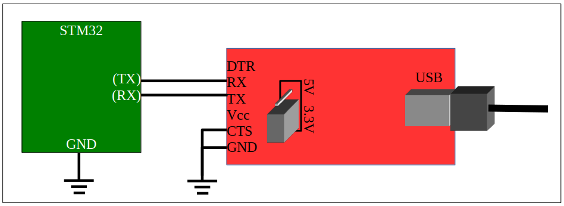

# ECE 362 Lab Experiment 10: UART
## Introduction
 Asynchronous serial communication using a Universal Asynchronous Receiver/Transmitter (UART) has been a staple of inter-computer communication since its introduction in the 1960s. Although asynchronous serial has been largely supplanted by more specialized communication protocols that are faster or more specially structured, it remains the only interface on your microcontroller that can be readily used for ad hoc interactive bidirectional communication. In this lab, you will use a UART to implement communication with an interactive program. You will examine the asynchronous serial protocol using an oscilloscope to identify the communication payload.

## Instructional Objectives
- To understand the configuration and programming of the STM32F0 USART
- To examine and analyze a serial data stream
- To write software to configure and interact with the STM32 USART
- To build a command line interface that is useful for interacting with complex devices.

## Table of Contents
| Step	| Description	| Points |
| ------| -----------   | ------ |
| 0	| Prelab Exercises	| 25     |
| 1	| Background        |        |
| 2.1	| Initialize the USART	| 35|
| 2.2	| Support for printf() and fgets()| 	20|
| 2.3	| Basic line editing	| 10|
| 2.4	| Interrupt-and-DMA-driven serial I/O	| 10|
| 3	| Submit your postlab results| 	*|
| 4	| Using SPI for the TFT LCD and SD card| |
| 5	| Using a command line interpreter| |
| 6	| Interpreter Command Reference| |
|  	| Total:	| 100|

* All the points for this lab depend on proper completion of and submission of your post-lab results.

When you are ready for your lab evaluation, review this checklist.

## Step 0: Prelab Exercises:
- Be familiar with lectures up to and including UART: Universal Asynchronous Receiver/Transmitter
- Read Chapter 26 of the STM32F0 Family Reference Manual to become familiar with the USART subsystem.
- Read Section 22.3 of the textbook
- Read the serial adapter reference page and select a terminal emulator for your own computer.
- Look over the the schematics for the MSP2202 TFT LCD display to see how the SPI interface for both the graphic display as well as the SD card is set up.
- Read this entire lab document.
- Leave the devices and wiring you did for previous labs in place and add the things described in later sections of this lab document.
- Complete the prelab exercises and submit them before attempting the lab experiment.
- Make sure you take your AD2 system to your lab session.

## Step 1: Background
### 1.1 Asynchronous Serial Communication
An asynchronous serial connection allows information to be sent between two devices using three wires: receive (RX), transmit (TX), and ground. Optional "handshake" lines can add flow control. For example a receiver can use a signal to output a "request to send" (RTS) to a transmitter. This tells the transmitter that it is "clear to send" (CTS). Data and handshake lines are connected between devices reciprocally. The RX signal on one device is connected to the TX signal on the other device, and similarly for RTS and CTS.

An asynchronous receiver and transmitter translates between parallel bytes and serial encodings of those bytes framed by start and stop bits. An optional parity bit in each word can be added to detect errors. When such a hardware transceiver can be configured for multiple word sizes, parity types, and number of stop bits, it is called a Universal Asynchronous Receiver/Transmitter (UART). When it can also optionally support Synchronous transmission, it is called a USART.

A USART, at minimum, supports two I/O registers used to put new bytes into the transmitter and read new bytes from the receiver. Other I/O registers are used to determine when the transmitter is ready for another byte and when the receiver contains a new character than can be read. Still other I/O registers can be used to control the generation of interrupts and DMA requests for the receiver and transmitter.

### 1.2 STM32 USART Peripheral
Your STM32 development system contains eight independent USART channels, each of which have two signals that can be routed to the external pins. Each channel uses eight main I/O registers to orchestrate the asynchronous serial communication:

1. The USART_BRR register is used to select a baud rate which is generated by dividing the 48MHz clock by a 16-bit number.
2. The USART_CR1 register is used to set up long-term channel configuration parameters as well as to enable the device (with the UE bit). Most of these parameters may be changed only when the UE bit is clear.
3. The USART_CR2 register is used to configure a few other long-term channel parameters such as the length of the stop bit. The ability to change them also depends on CR1_UE being clear.
4. The USART_CR3 register is used to configure still more long-term channel parameters. The ability to change many of them also depends on CR1_UE being clear.
5. The USART_ISR register contains the flags that show the state of the channel as well as interrupt status.
6. The USART_ICR register is used to clear bits in the ISR. Usually, only error flags must be manually cleared using this register. Normal flags used to indicate receiver and transmitter readiness are automatically cleared by input/output operations as described below.
7. The USART_RDR register is used to read a new byte from the receiver. Reading from this register will automatically clear the RXNE bit of the ISR.
8. The USART_TDR register is used to write a new byte into the transmitter. Writing to this register will automatically clear the TXE bit of the ISR.

### 1.3 Viewing an asynchronous serial transaction
The AD2 or ADALM2K logic analyzer has a built-in protocol display for a UART. Add a display in a similar manner as you did for I2C. Make sure that one of the ground wires of the USB logic analyzer is shared with the STM32. Connect DIO 0 to the STM32 pin set up for "Rx". Connect DIO 1 to the STM32 pin set up for "Tx". Since each UART analyzer looks at only half of a bidirectional connection, you will need to set up two analyzers.

Press the "Run" button in the Logic tool and, while continuous serial communication is in operation (e.g. press and hold a key in a serial terminal), watch the Logic tool trace. Zoom in on one of the waveforms. If you press the "Single" button controls, you will freeze the display after one snapshot of the communication. The receiver and transmitter are shown in different signals and interpreted. If you run a program on the STM32 that continually reads bytes from the USART and immediately writes them back, you would see something like this on the Logic tool trace. (h2F is the hexadecimal code for an [ASCII](../../manuals/ascii_table.md) slash [/]. Notice that the binary value 00101111 is sent in reverse order.)  
  
**[Figure 1: Logic tool trace of a <space> character being sent and received]**

### 1.4 Using a serial terminal emulator program
 Decades ago, most *mainframe* computing equipment was large and was usually centralized in special rooms. Devices called *serial terminals*, like the one pictured on the left, were used to interact with the computers from a distance. The only function of these terminals was to take characters typed on a keyboard and send them through an asynchronous serial connection to the computer and receive characters back through the serial connection and display them on the screen. They were often called *dumb terminals* because they did not constitute a programmable computer system by themselves. All programmable computation happened on the remote computer.

It was very easy for a personal computer to do everything a dumb terminal could, and more. All that was needed was a program to connect the keyboard and text screen to the bidirectional serial port. This program was called a *terminal emulator*. There are several kinds available for any computer. Read about them [on the serial adapter reference page.](../../manuals/serial_adapter_ref.md)

Sadly, your personal computer (likely) does not have RS-232 serial connectors. Even if it did, RS-232 voltage levels are not compatible with the serial port on the STM32. Instead, you will use a FTDI232 (also known as an FT232RL) to add a UART to your computer that is controlled through a USB connection. The pinout for the FTDI232 and connections to the STM32 are shown in Figure 1. Ensure that the FTDI232 is set for 3.3V operation. To do so, remove the two-pin header from the two pins labeled 5V and replace it on the two pins labeled 3.3V. (You probably did this months ago, but it's good to check again.)


We will continue to use USART5 and the same microcontroller pins for the serial adapter as we have used all semester. There's only one pin for GPIO Port D, and only so many things we can do with it. For this lab experiment, use PC12 for the STM32 Tx and PD2 for the STM32 Rx. These should be cross-connected to the Rx and Tx pins on the FT232RL. Again, this is the configuration you have been using all semester. Use it again this week.

## 2.0 Experiment
Getting asynchronous serial communication to work for the first time is fairly easy. The following steps will incrementally set up subroutines of increasing sophistication. That way, you'll be able to quickly see the first results.

Create a project in SystemWorkbench called "lab10", and incrementally add entries to the automatically-generated main.c file. In later steps, you will add more support files to the project. For now, the main.c file will be enough. Several other files will be provided for you to implement other complicated functionality:
- fifo.c
- fifo.h
- tty.c
- tty.h

Create and populate each of the .c files in the "src" directory. Create and populate each of the .h files in the "inc" directory.

### 2.1 Initialize the USART
Create a subroutine named `init_usart5()`. It should do the following things:
- Enable the RCC clocks to GPIOC and GPIOD.
- Do all the steps necessary to configure pin PC12 to be routed to USART5_TX.
- Do all the steps necessary to configure pin PD2 to be routed to USART5_RX.
- Enable the RCC clock to the USART5 peripheral.
- Configure USART5 as follows:
    - (First, disable it by turning off its UE bit.)
    - Set a word size of 8 bits.
    - Set it for one stop bit.
    - Set it for no parity.
    - Use 16x oversampling.
    - Use a baud rate of 115200 (115.2 kbaud). Refer to table 96 of the Family Reference Manual, or simply divide the system clock rate by 115200.
    - Enable the transmitter and the receiver by setting the TE and RE bits.
    - Enable the USART.
    - Finally, you should wait for the TE and RE bits to be acknowledged by checking that TEACK and REACK bits are both set in the ISR. This indicates that the USART is ready to transmit and receive.

Put this near the top of the main.c file. You will use it for all steps of this lab experiment.

Set up the `main()` function to be the following:
```
        #define STEP21
        #if defined(STEP21)
        int main(void)
        {
            init_usart5();
            for(;;) {
                while (!(u->ISR & USART_ISR_RXNE)) { }
                char c = u->RDR;
                while(!(u->ISR & USART_ISR_TXE)) { }
                u->TDR = c;
            }
        }
        #endif
```
The program will initialize USART5, and continually wait for a character to be received (RXNE), read it, wait
for the transmitter to be empty (TXE), and send the received character.

#### Test it
Run your program to check that it works. Connect the AD2 as described above to check that characters are being sent and received. Use a serial terminal emulator to try the following things:
- Press letters and digits to make sure they are echoed back to the terminal emulator.
- Press [Enter] on the terminal to send a carriage return that moves the cursor back to the beginning of the line. You can then overwrite the characters you typed (and echoed) earlier.
- Press [Ctrl]-J to issue a linefeed that moves the cursor to the next line. Pressing [Ctrl] with any letter sends a byte that is the numeric offset of that letter. For instance, an 'A' is the first letter, so pressing [Ctrl]-A sends the ASCII value 1, pressing [Ctrl]-B sends the ASCII value 2, and so on. A linefeed has the ASCII code 10. 'J' is the 10th letter of the alphabet, so pressing [Ctrl]-J sends a linefeed. These low-numbered ASCII codes are distinct from normal letters and numbers. For instance, the ASCII code for an 'A' is 65 (0x41), and an 'a' is 97 (0x61). Control codes are used to do special things with the terminal that do not result in a visible character appearing.
- Press [Ctrl]-H (ASCII code 8) to send a backspace character that moves the cursor left one space. You can then type a [Space] to overwrite the character written there. Sending one more [Ctrl]-H accomplishes a deleting backspace operation that you expect to happen when you are editing a command line. I.e., to delete the last character typed, issue backspace-space-backspace. (Note that the [Backspace] key you see on your keyboard may not really send a backspace code. More likely, it sends a DEL (code 0x7F) byte. Meanwhile, the [Delete] key on your keyboard probably sends the four-byte sequence Escape [ 3 ~. We apologize that the world is so complicated.) You might confirm this by capturing the signal trace using the AD2.
- Press the arrow keys to move the cursor around on the screen. Each of these keys sends a multi-byte code that acts as a cursor command.

Get used to referring to the [ASCII table](../../manuals/ascii_table.md) on the course references page. You don't need to memorize the numeric values for characters, but it is good to be familiar with how to look them up and interpret them. In particular, the control characters each have descriptive names (e.g., CR, LF, HT, BS, etc). Know which one to use and when you should.

#### Demonstrate it
Connect your AD2 to the serial port as described above. Set it for a [Single] capture, and type the first letter of your ECN login. Show this to your TA. (TA Instructions: Confirm the signal trace of the first letter of the login, and then confirm that the student can type characters that are echoed, backspace with [Ctrl]-H, issue a carriage-return with [Enter], send a linefeed with [Ctrl]-J, and move around using the cursor keys.)

### 2.2 Support for printf() and fgets()
For this lab experiment, it is most convenient to comment out entire blocks of code where each one might have multiple functions. Disable the main() function you wrote for Step 2.1 by commenting the #define STEP21 statement like so:
```
        //#define STEP21
        #if defined(STEP21)
        int main(void)
        {
            init_usart5();
            for(;;) {
                while (!(USART5->ISR & USART_ISR_RXNE)) { }
                char c = USART5->RDR;
                while(!(USART5->ISR & USART_ISR_TXE)) { }
                USART5->TDR = c;
            }
        }
        #endif
```
After doing so, SystemWorkbench will show the section of code in gray to indicate that it is not compiled. If you want to re-enable the code for compilation, do so by uncommenting
```
        #define STEP21
```
at some point above the code section. This will define a *preprocessor symbol* that the **#if defined(STEP21)** is looking for.
Once we have bidirectional communication working with the STM32, we usually want to use the standard functions we're familiar with. The standard peripheral library for the STM32 has standard I/O libraries that are built to call two central input and output subroutines &emdash; if they exist. These subroutines are declared in the syscalls.c file that is created for any project in SystemWorkbench:
```
        extern int __io_putchar(int ch) __attribute__((weak));
        extern int __io_getchar(void) __attribute__((weak));
```
The strange `__attribute__((weak))` stanza declares these references to be weak symbols. That means that you can create your own functions with these names and prototypes, and standard library subroutines, such as putchar(), getchar(), and printf() will use them.
In a new **#if defined** block, create the two central input/output functions and a new `main()` function like so:
```
        #define STEP22
        #if defined(STEP22)
        #include
        int __io_putchar(int c) {
            while(!(USART5->ISR & USART_ISR_TXE)) { }
            USART5->TDR = c;
            return c;
        }

        int __io_getchar(void) {
             while (!(USART5->ISR & USART_ISR_RXNE)) { }
             char c = USART5->RDR;
             return c;
        }

        int main() {
            init_usart5();
            setbuf(stdin,0);
            setbuf(stdout,0);
            setbuf(stderr,0);
            printf("Enter your name: ");
            char name[80];
            fgets(name, 80, stdin);
            printf("Your name is %s", name);
            printf("Type any characters.\n")
            for(;;) {
                char c = getchar();
                putchar(c);
            }
        }
        #endif
```
The calls to the `setbuf()` functions turn off buffering. By default, the first call to a function like `printf()` or `fgets()` allocates an internal buffer to store 1024 characters before it releases anything. (It actually calls `malloc()` to create this buffer.) This buffering makes the system more efficient, but results in confusion about why the first 1023 characters printed are not seen. We turn off buffering to avoid those problems. Always make sure you make these three calls to `setbuf()` to ensure buffering is turned off when using standard I/O functions.

You will find that the program prompts for you to enter a name, reads the name, (without echoing characters), **you must use [Ctrl]-J to finish typing the name**, and it prints and advances to a new line, but it doesn't set the cursor back to the beginning of the line. That's because it sends only a '\n' (newline) and not '\r' (carriage return). After that, the program echoes every character you type as it did in Step 2.1. This time, it is using `getchar()` and `putchar()` to handle characters.

#### Turn on character echo and carriage-return handling
To work around the defciencies of the implementation, you *could* add a '\r' to the line printed so that the carriage return is emitted as well as write your own version of `fgets()` that echoes characters as it reads. It would be better, however, if these problems were fixed in the system software so that you could use the standard calls as they were intended.

Modify the code so that it does three things:
- In `_io_putchar()`, if the character passed as the argument `c` is a '\n' first write a '\r' to the USART5->TDR. Students often have a difficult time thinking about this. The things to remember are this
    - Two characters will be written to the TDR when a linefeed ('\n') is passed. The first should be a carriage return ('\r'), and the second should be the linefeed ('\n').
    - You must wait for the TXE flag to be sent before writing any character to TDR. When a linefeed ('\n') is written, the TXE flag must be checked before writing the carriage return as well as writing the linefeed.
    The recommendation is to just add an if statement to check if the character is a linefeed. If it is, then wait on the TXE flag and write a '\r'. After that, the usual code that waits on the TXE flag and writes the original character passed is invoked.
- In `_io_getchar()`, if the character read, c, is a carriage return ('\r'), change it to a linefeed ('\n').
- Also in `_io_getchar()`, echo the character read to the output by calling `_io_putchar(c)` just before it is returned.
With these three improvements, the name entered will be echoed as it is typed, you can use a carriage return to complete it, and the carriage return will be written in addition to the newline. The session should look like the following:
```
        Enter your name: Example Name
        Your name is Example Name
        Type any characters.
```
After that, you can still type any characters, but each one will appear *twice*. This is the expected operation when you use getchar() and putchar() together when putchar() returns for every character pressed. This is a consequence of the I/O system not handling line-oriented input.

#### Demonstrate it
**Ask a TA to check your work.** (TA instructions: Browse the functions to ensure they are implemented, then start the program. Type a name when prompted, make sure it is echoed. Complete it by typing [Enter]. Check that the next two lines are printed with carriage returns as well as linefeeds.

### 2.3 Basic Line Editing
Even though the work in Step 2.2 allows characters to be echoed, you would still need to type carefully. Think about how many times per day you press the [Backspace] key when you make a mistake. It doesn't work here. Let's fix that problem.

Making characters visible as they are typed is as simple as printing each character as it is read. Making backspace work relies on knowing what those characters were. We normally expect that we can hit backspace and edit characters that were typed until we press [Return] to commit to the line we just entered. What we need is a way to *buffer* an entire line and undo parts of that line until [Return] is pressed. Since `fgets()` calls `__io_getchar()` to read one character at a time, it means that reading a single character should not return until the line buffer contains a newline. As long as a newline exists in the line buffer, each call to `__io_getchar()` should return the next character in the line buffer.

The data structure needed to do this is a FIFO (First-In, First-Out) queue. An implementation is already provided for you that has a built-in check for a newline character. It is in the fifo.h and fifo.c files.

A second set of files, tty.c and tty.h, implement a higher-level TTY (an abbreviation for a tele-typewriter) interface. It contains a new version of the line reader called `line_buffer_getchar()`. This implements the algorithm described above. It also checks and clears the ORE flag. This flag is set if multiple characters are received by the USART without the program reading them. When this happens, the USART will stop setting the RXNE flag, and it becomes useless.

#### Test it
Do the following steps:
- Copy the **#if defined(STEP22)** block to a new one designated as **#if defined(STEP23)**. Make sure it is the only block enabled for compilation.
- At the top of the **#if defined block**, add
```
            #include "fifo.h"
            #include "tty.h"
```
- Update `__io_getchar()` to call `line_buffer_getchar()` instead of the code that was there before. Be sure to return the value that is returned from `line_buffer_getchar()`.

At this point, characters will be echoed when you type, and you will be able to use the [Backspace] (or [Delete]) key to do simple line editing. The loop that follows also allows you to do line editing because `getchar()` does not return until a linefeed exists in the FIFO.

This is the start of a system known as a device driver. It constitutes the software that lies between the main program and the low-level peripheral hardware.

#### Demonstrate it
**Show your work to your TA.** (TA instructions: Make sure that the input and output work as before, but now the name entered can be edited by pressing [Backspace].)

### 2.4 Interrupt-and-DMA-Driven Serial I/O
A final remaining deficiency with our serial terminal interface is that, if the CPU is busy doing something other than reading characters, multiple characters might be received by the USART. These characters will be lost. We can use the interrupt features of the USART to enable event-driven update of the input FIFO.

For many systems, enabling interrupts, alone, would be enough to ensure reliable input and avoid dropped characters. For the STM32, it is not. Since the USART does not have a built-in hardware FIFO, it can hold only one received character at a time. If that character is not read before the next character arrives, an overrun situation will occur.

We lack a convenient way of demonstrating this to you. However, you might consider the case of your previous labs where characters were continually being sent to the 7-segment displays or the keypad was being checked for button presses. When the system is busy with other activities, those activities have a higher priority than the USART interrupt, and data is being sent to the serial receiver fast enough (as in the case when someone copies and pastes a lot of characters into the terminal), then serial input data will be lost due to overruns. For instance, for the Spring 2022 lab experiment 9, if you copy and paste a command into the terminal to write bytes into the EEPROM, some characters will be lost. Go back to lab 9 and try it.

The general solution to the overrun problem with the STM32 USART is to use DMA for the receiver. If you look at Table 33 of the Family Reference Manual, you will see the mappings for the second DMA controller are mostly dedicated to handling USARTs. We will use one with USART5 to implement the FIFO that it lacks in hardware.

#### Implement it
Copy the **#if defined(STEP23)** block to a new one designated as **#if defined(STEP24)**. Make sure it is the only block enabled for compilation. Implement the following data structures and subroutines.

#### 2.4.1 DMA data structures
Create a global array of characters named `serfifo` and an offset counter named `seroffset` like so:
```
        #define FIFOSIZE 16
        char serfifo[FIFOSIZE];
        int seroffset = 0;
```
The first will be the circular buffer that DMA deposits characters into. The second will keep track of the offset in the buffer of the next character read from it.

#### 2.4.2 enable_tty_interrupt()
Construct a subroutine named `enable_tty_interrupt()` that configures USART5 to do two things each time a character is received:

- Raise an interrupt every time the receive data register becomes not empty. Remember to set the proper bit in the NVIC ISER as well. Note that the name of the bit to set is difficult to determine. It is `USART3_8_IRQn`.
- Trigger a DMA operation every time the receive data register becomes not empty.

Both of these are simple flag updates in the USART CR1 and CR3 (and the NVIC ISER). They can be done after the USART is initialized and while it is already enabled for operation.
The subroutine should also enable the RCC clock for DMA Controller 2. Table 33 shows that Channel 2 of Controller 2 can be used with USART5_RX. To do so, however, the "remap" register must be set to allow it. The initialization looks like this:
```
        RCC->AHBENR |= RCC_AHBENR_DMA2EN;
        DMA2->RMPCR |= DMA_RMPCR2_CH2_USART5_RX;
        DMA2_Channel2->CCR &= ~DMA_CCR_EN;  // First make sure DMA is turned off
        ...
        DMA2_Channel2->CCR |= DMA_CCR_EN;
```
Then, configure DMA2_Channel2 for the following:
- CMAR should be set to the address of serfifo.
- CPAR should be set to the address of the USART5 RDR.
- CNDTR should be set to FIFOSIZE.
- The DIRection of copying should be from peripheral to memory.
- Neither the total-completion nor the half-transfer interrupt should be enabled.
- Both the MSIZE and the PSIZE should be set for 8 bits.
- MINC should be set to increment the CMAR.
- PINC should not be set so that CPAR always points at the USART5 RDR.
- Enable CIRCular transfers.
- Do not enable MEM2MEM transfers.
- Set the Priority Level to highest.
- Finally, make sure that the channel is enabled for operation.

#### 2.4.3 interrupt_getchar()
Create a subroutine named `interrupt_getchar()` that works like `line_buffer_getchar()`, except that it should neither check or clear the ORE flag, nor wait on new characters to be received by the USART. In fact, it should not touch the USART at all. All it needs to do is check if the input_fifo contains a newline. **While** it does not, it should do an inline assembly WFI:
```
        asm volatile ("wfi"); // wait for an interrupt
```
If it does contain a newline, it should remove the first character from the fifo and return it. Use the `line_buffer_getchar()` subroutine in tty.c as a template for creating this new subroutine.
Update `__io_getchar()` to call `interrupt_getchar()` instead of `line_buffer_getchar()`.

#### 2.4.4 Interrupt Service Routine for USART5
To fill the `input_fifo`, construct an interrupt handler for USART5. (You remember how to look up the name of an interrupt handler, right? You definitely want to copy and paste the name of that ISR.)

Now that the USART characters received are being copied by DMA, overrun is no longer possible. Instead, what might happen is that there might be two or more characters available in the `serfifo`. All that is needed is to copy them into the `input_fifo` and advance the `seroffset` to indicate we have done so. The code looks like this:
```
        void name_of_ISR(void) {
            while(DMA2_Channel2->CNDTR != sizeof serfifo - seroffset) {
                if (!fifo_full(&input_fifo))
                    insert_echo_char(serfifo[seroffset]);
                seroffset = (seroffset + 1) % sizeof serfifo;
            }
        }
```
This seems a little too magical, which is why we just give it to you. Here's how it works:
Throughout a circular DMA operation, a DMA channel's CNDTR is decremented. The CNDTR can be read to find out how many more transfers must be done before CNDTR reset back to the original value. For instance, before any characters are received, the CNDTR will be FIFOSIZE (16). That is the same as `sizeof serfifo - seroffset`. When one character is received, the character will be transferred from USART5_RDR to serfifo[0], and CNDTR will be decremented to 15. Then the while loop body will be invoked to put serfifo[0] into the `input_fifo`. The `seroffset` is incremented by one to indicate that the character has been read. If it is already 15, it will wrap around back to zero.

There is no need to manually acknowledge USART5. When the DMA reads from the RDR, it will acknowledge the interrupt.

You should be able to follow the progression of characters through the system by setting a breakpoint on the ISR.

#### 2.4.5 Adjust main() to enable interrupts and DMA
In `main()` add a call to `enable_tty_interrupt()` just after the call to `init_usart5()`

#### Test it
There is a great deal of things going on here. How should you debug it when it does not work?

- Set a breakpoint in the USART ISR and type a character. If it is never reached, the interrupt was not enabled, or the name of the ISR was mistyped, or the interrupt was not unmasked in the NVIC_ISER. Check the IO Register debugger to see the value of the USART receive interrupt enable flag.
- If the ISR is invoked, is the character at the position `serfifo[seroffset]` the one you typed? Examine the array to find out. If not, perhaps DMA is not working. Check the IO Register debugger to see the values for DMA2_Channel2 and the USART receive DMA enable.
- If the ISR is invoked, while the debugger is paused in the ISR, type more characters. Does the while loop continue for each of the characters?

#### Demonstrate it
**Show your work to your TA.** (TA instructions: Look over the code to ensure that it looks correct. Run the code to make sure that the input can be edited and printing is correct.

## 3 Submit your postlab results
Once all steps of your lab experiment work to your satisfaction, submit your main.c file to the into the post-lab submission for this lab experiment so that it can be checked by the course staff. It should contain the following things which will be checked:

## 4 Using SPI for the TFT LCD and SD card
Having a bidirectional serial communication link means that you can use the STM32 as though it were one of the old computing systems described above. The utility of the STM32 is somewhat limited since it has so little persistent storage. Nevertheless, the MSP2202 graphical TFT LCD module has an SD card port that allows you to add a large amount of storage.

Wire the TFT LCD and SD card interface as shown in Figure 3. Note that, although the SD card's SPI interface is separate from the SPI interface for the LCD, it is still powered by the VDD and VSS pins for the display. There are five pins on the SD card SPI interface, but pin 5 is for an on-board SPI Flash memory chip (which is not populated). Pin 5 is not used.

To connect the SD card interface, use the male-to-female jumper wires in your lab kit to plug in to the pin header and breadboard.
  

The TFT LCD is best used as a unidirection SPI device like the ones used previously. Data will only be sent to it. There is a complex initialization procedure (provided for you) that must be used before the display will be useful. A code library is also provided for you that can be used to draw objects and pictures on the display. Once it is initialized, and subroutines are set up to send SPI data to it, the TFT LCD is easy to use.

By comparison, an SD card is obviously a bidirectional communication device. Until now, lab experiments have only sent data to SPI peripherals (like the OLED display, the TFT LCD, and the shift registers used for the 7-segment drivers). Here is a brief overview of how bi-directional SPI works.

Recall that an SPI transaction is one where a parallel word on the master device is exchanged with a parallel word on a slave device through the MOSI and MISO pins. When doing only writes to a slave device, the MISO pin is not even needed. When doing reads, the master device must first tell the slave device what it expects to read. In doing that, it reads back a word through the MISO pin. The slave device cannot respond to a read request before it has received information on what must be read, so this word read from the slave device is junk.

Recall that I2C devices also used a write/read protocol. To read from the I2C EEPROM, you needed to first write the address you wanted to read from, and then issue a read request. To read from the GPIO pins of the MCP23008, you needed first write the register number, and then issue a read request. SPI devices are similar, except that every transaction involves an exchange of data between the master device and slave device. The data is only meaningful in one direction at a time.

Once the SPI master device has finished telling the slave device what it wants to read, the next transfer will read back data from the slave device. Every SPI transaction is a two-way transfer, so the master device must write something to conduct the read. In this case, the master device sends junk to the slave device.

The SPI master device alternates between sending commands and reading back junk, and sending junk and reading back data. Usually, this "junk" is something like 0xff that will not be misinterpreted as a command or data. That's exactly what the SD card interface does.

An SD card uses this "write command/read junk" and "write junk/read data" protocol to send and receive blocks of data. Historically, these blocks have been 512 (29) bytes in size, and that is what we'll use.

An SD card has a native interface protocol that is similar to SPI, but not quite the same. It can be forced into "SPI mode" by holding the NSS and MOSI signals high, and completing at least 74 oscillations of the SCK signal at a rate between 100 kHz and 400 kHz. This can be accomplished by using the SPI hardware to send ten repetitions of 0xff for 80 clock oscillations. An SD card does not need to have transactions bounded by asserting and deasserting NSS, and the words sent and received are expected to be much longer than can be supported by the SPI peripheral in the STM32. This is similar to how you set up the MSP2202 TFT LCD display to work. A GPIO pin will be used to assert NSS for the duration of a an entire SD card command or block transfer. Enabling and disabling NSS is helpful when using a protocol analyzer to figure out why the SD card protocol is not working.

After forcing an SD card into SPI mode and sending some initialization commands, it is ready for block transfer. It can also run at a much higher rate. The SD card electrical interface recommends a 10 kΩ pull-up resistor on the MISO pin, but there is not such a pull-up built in to the MSP2202 display assembly. You should add one. The interface will not work without a pull-up resistor. In that regard, the MISO pin of the SD card interface is similar to I2C. An SD card should be able to run with a 24 MHz SPI clock, but certain conditions like long wires may require using a slower communication rate.

The 3.0V output on the STM32 development board is sometimes inadequate to power the SD card interface due to resistive losses in your breadboard connections. Modern SD cards are specified to work with supply voltages between 2.7 V and 3.6 V. If too much current is being drawn by other devices (such as the 7-segment LEDs), the supply voltage may fall below 2.7 V. To compensate for this, wire the MSP2202 supply as close to the development board as possible. The suggested capacitors for the power and ground pins are also helpful. Be sure to put the capacitors as close as possible to the power and ground pins of the TFT LCD assembly. If you are unable to get the SD card initialization routine to work, consider adding a 3.3 V external power supply, such as the AD2 power supply. As usual, **be sure to never set the power supply to higher than 3.3 V or the STM32 chip will be irreparably damaged.**

The SD card transfer protocol consists of single-byte commands that are always followed by a 32-bit argument, and a single-byte CRC (cyclic redundancy check). (When operating in SPI mode, an SD card requires correct CRC bytes for only two commands. Thereafter, the CRC is ignored.)

The initialization and block read/write subroutines for SD card access are provided for you in the diskio.c and diskio.h files. Reading and writing simple 512-byte blocks would force an embedded system designer to come up with allocation and organization mechanisms for coordinating storage — a daunting task. Instead, these subroutines are meant to work with the [FatFs filesystem module](http://elm-chan.org/fsw/ff/00index_e.html). This system provides a higher-level file system view of the SD card. This is generally what you think of when you work with an SD card. It also allows you to move the SD card between the STM32 and your computer to share these files. All that is necessary is a program on the STM32 that uses the FatFs subroutines to read and write the files.

## 5 Using a command line interpreter
Copy the following files into your project:
- commands.c
- diskio.c
- ff.c
- lcd.c
- commands.h
- diskio.h
- ff.h
- ffconf.h
- lcd.h

Then create a new stanza in your main file for **#define STEP5**. Copy the things you did for Step 2.4, but replace the main() contents with the following:
```
        #include "commands.h"
        int main() {
            init_usart5();
            enable_tty_interrupt();
            setbuf(stdin,0);
            setbuf(stdout,0);
            setbuf(stderr,0);
            command_shell();
        }
```
This will set up an interpreter that understands the commands listed below.
You will need to add the following functions to your main module to set up the SPI configuration and enable and disable various output signals:

### 5.1 init_sdcard_spi()
This function should configure SPI2 and the GPIOB and GPIOC MODER and AFR registers for pins PB10 (SCK), PC3 (MISO), and PC2 (MOSI). Configure it as follows:
- Set the baud rate divisor to the maximum value to make the SPI baud rate as low as possible.
- Set it to Master Mode.
- Set the word size to 8-bit.
- Configure "Software Slave Management" and "Internal Slave Select".
- Set the "FIFO reception threshold" bit in CR2 so that the SPI channel immediately releases a received 8-bit value.
- Enable the SPI channel.

In addition, configure PC11 as a GPIO output and set its ODR entry to be a 1 by calling `disable_sdcard()`.

### 5.2 enable_sdcard()
This function should set PC11 low to enable the SD card.

### 5.3 disable_sdcard()
This function should set PC10 high to disable the SD card.

### 5.4 sdcard_high_speed
This function is called after SPI2 is initialized. It should do the following:
- Disable the SPI2 channel.
- Set the SPI1 Baud Rate register so that the clock rate is 12 MHz. (**You may need to set this lower if your SD card does not reliably work at this rate.**)
- Re-enable the SPI2 channel.

### 5.5 Try the SD card
With the previous five functions written, try the following commands with the command line interpreter:
```
        Enter current date 20211108103000
        This is the STM32 command shell.
        Type 'mount' before trying any file system commands.
        Type 'lcd_init' before trying any draw commands.
        > mount
        > input abc.txt
        To end input, enter a line with a single '.'
        one
        two
        three
        .
        > ls
        ABC.TXT
        > cat abc.txt
        one
        two
        three
        >
```
### 5.6 Initialize the LCD
Create a subroutine named `init_lcd_spi()` that does the same things it did in homework 8.

### 5.7 Try the LCD
With the previous function written, try the following commands with the command line interpreter:
```
        Enter current date 20211108103000
        This is the STM32 command shell.
        Type 'mount' before trying any file system commands.
        Type 'lcd_init' before trying any draw commands.
        > lcd_init
        > clear 0000
        > drawfillrect 0 0 200 200 f81f
        > drawline 0 0 200 200 0
        > drawline 1 0 200 199 0
        > drawline 0 1 199 200 0
        >
```
## 6 Interpreter Command Reference
Insert the SD card in your lab kit into the slot on the side of the MSP2202 TFT LCD display. If you can't find that particular SD card, you can use another, but make sure it is no larger than 32 gb in size. If it is any larger, it will likely be formatted with the exFAT file system, and that's not going to easily work with this software.

Re-comment all of the other test code, and uncomment the code for section 2.8. The `command_shell()` subroutine is a simple command interpreter. When it starts, it first prompts you for the current date and time:
```
          Enter current date 20211108103000
```
You can simply press [Return] or edit the line to set a more accurate date and time.
You will see a > prompt where you can type something. The command shell has the following built-in commands:
- append <filename>: Add lines to an existing file. Example:
```
            > append foo.txt
            To end append, enter a line with a single '.'
            Next line.
            Line after that.
            .
            >
```
- cat <filename> ... : Catenate (output one after another) the following files. Example:
```
            > cat foo.txt
            One line
            > cat bar.txt
            Another line.
            Yet another.
            > cat foo.txt bar.txt
            One line
            Another line.
            Yet another.
            >
```
- cd <directory>: Change to a different directory. Example:
```
            > cd subdir
            > pwd
            /SUBDIR
            > cd ..
            > pwd
            /
            >
```
- date [YYYYMMDDHHMMSS]: Print or set the current date/time. Example:
```
          > date 20210412021046
          > date
          2021-Apr-12 02:10:52
          > date
          2021-Apr-12 02:11:10
          >
```
- dino: Should be easy to figure this one out.

- input <filename>: Input a new file. Example:
```
            > input bar.txt
            To end input, enter a line with a single '.'
            Another line.
            Yet another.
            .
            > cat bar.txt
            Another line.
            Yet another.
            >
```
- ls [-l] [<directory> ...]: List the contents of the specified directory (present directory, if none). Example:
```
          > ls
          HELLO.TXT
          FOO.TXT
          > ls -l
          2021-Apr-12 02:45:46     14 ----A HELLO.TXT
          2021-Apr-12 02:44:10     40 ----A FOO.TXT
          2021-Apr-12 02:47:02      0 D---- SUBDIR
          > ls -l subdir
          2021-Apr-12 02:47:48      7 ----A subdir/A.A
          2021-Apr-12 02:47:58      9 ----A subdir/B.B
          >
```
- mkdir <directory>: Create a new directory. Example:
```
            > mkdir subdir
            > cd subdir
            > cd ..
            >
```
- mount: Configure the SD card for use. Example:
```
            > mount
            > mount
            Already mounted.: Hard error in low-level disk I/O layer
            >
```
- pwd: Show the present working directory. Example:
```
            > pwd
            /
            > cd subdir
            > pwd
            /SUBDIR
            >
```
- rm <filename> ...: Remove one or more files or directories. (It won't remove directories that contain files.) Example:
```
          > ls -l
          2021-Apr-12 02:45:46     14 ----A HELLO.TXT
          2021-Apr-12 02:44:10     40 ----A FOO.TXT
          2021-Apr-12 02:47:02      0 D---- SUBDIR
          > rm hello.txt foo.txt subdir
          subdir: Permission denied
          > ls -l
          2021-Apr-12 02:47:02      0 D---- SUBDIR
          >
```
- shout: Stress-test the serial output for a while.

#### Testbench interfaces for project development
Developing a project that contains a microprocessor can be frustrating if debugging it means changing code, recompiling, and restarting a program for... Every. Single. Change. One of the most useful ways of interacting with a microprocessor system in development is to use a serial terminal to interact with a program running on the microprocessor. This program can be customized to perform various utility functions directly on the hardware rather than having to rewrite software on the development host. When you examine the internals of almost any microprocessor-based product, you will find a serial test interface. More likely than not, this interface is still functional in the completed product!

Look at how the subroutines in command.c are organized and consider adding some of your own. If you read through the API documentation for FatFs, you will see how to do any file operation you need. Could you write a subroutine named `play()` that allows you to specify a file name to be opened and its contents written to the DAC? It wouldn't be difficult at this point. If you were developing a music player, you might start with a text interface like this before switching to a graphical interface.

#### Secondary command list
The command interpreter supports a secondary command list that can be used in your main module. It effectively appends new command functions to the available list. Here is an example of functions you can put in your main.c module to do simple addition and multiplication.
```
        void add(int argc, char *argv[])
        {
            int sum = 0;
            for(int i=2; i < argc; i++) {
                sum += strtol(argv[i], 0, 0);
            }
            printf("The sum is %d\n", sum);
        }

        void mul(int argc, char *argv[])
        {
            int prod = 1;
            for(int i=2; i < argc; i++) {
                prod *= strtol(argv[i], 0, 0);
            }
            printf("The product is %d\n", prod);
        }

        struct commands_t usercmds[] = {
             { "add",    add },
             { "mul",    mul },
        }
```
If you try these, you should see an example like the following:
```
        > add 3 5 7
        The sum is 12
        > mul 3 4 5
        The product is 20
        >
```
It's not as good as a real interpreted language, but good enough for development support.
At this point, you should be able to use the lab 10 code to build a command interpreter that will enable you to build and test complex systems. When you create your mini-project, keep the command line interface in mind. Development is easy when you can dynamically invoke parts of your application by typing commands rather than writing code and recompiling.

>Questions or comments about the course and/or the content of these webpages should be sent to the Course Webmaster. All the materials on this site are intended solely for the use of students enrolled in ECE 362 at the Purdue University West Lafayette Campus. Downloading, copying, or reproducing any of the copyrighted materials posted on this site (documents or videos) for anything other than educational purposes is forbidden.
