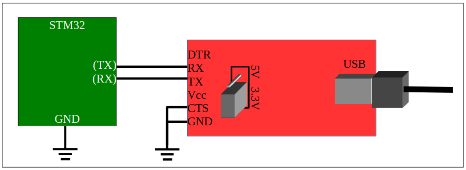

# Using the FTDI USB-to-serial adapter with STM32
The FTDI USB-to-serial board is a device that allows modern computer systems with USB ports to communicate with simple serial devices. The I/O for this adapter is not RS-232, but something called TTL serial which is a similar protocol but different voltage levels for signalling. The STM32 has two Universal Synchronous/Asynchronous Receiver/Transmitters that can be routed to a variety of pins. This document describes how to connect and use the serial adapter.

## STM32 Pin Selection
Tables 14 – 19 of the [STM32F091xBC datasheet](STM32F091xBC_datasheet.pdf) lists the possible pins to which the USARTs can be routed. The possibilities are as follows:
| Pin Name	| Function	| Alternate Function Code|
| ----------| ----------| -----------------------|
| PA0	| USART4_TX	| AF4|
| PA1	| USART4_RX	| AF4|
| PA2	| USART2_TX	| AF1|
| PA3	| USART2_RX	| AF1|
| PA4	| USART6_TX	| AF5|
| PA5	| USART6_RX	| AF5|
| PA9	| USART1_TX	| AF1|
| PA10	| USART1_RX	| AF1|
| PA14	| USART2_TX| 	AF1|
| PA15	| USART2_RX	| AF1|
| PB3	| USART5_TX	| AF4|
| PB4	| USART5_RX	| AF4|
| PB6	| USART1_TX| 	AF0|
| PB7| 	USART1_RX	| AF0|
| PB10	| USART3_TX| 	AF4|
| PB11	| USART3_RX| 	AF4|
| PC0	| USART7_TX	| AF1|
| PC1	| USART7_RX	| AF1|
| PC0	| USART6_TX	| AF2|
| PC1	| USART6_RX	| AF2|
| PC2	| USART8_TX	| AF2|
| PC3	| USART8_RX	| AF2|
| PC4	| USART3_TX	| AF1|
| PC5	| USART3_RX	| AF1|
| PC6	| USART7_TX	| AF1|
| PC7	| USART7_RX	| AF1|
| PC8	| USART8_TX| 	AF1|
| PC9	| USART8_RX	| AF1|
| PC10	| USART4_TX	| AF0|
| PC11	| USART4_RX| 	AF0|
| PC10	| USART3_TX	| AF1|
| PC11	| USART3_RX	| AF1|
| PC12	| USART5_TX	| AF2|
| PD2	| USART5_RX	| AF2|

## Configuration and connection of the adapter board
There are four important elements to connecting the adapter board as shown in Figure 1.
USB-to-serial adapter connection to the STM32

**[Figure 1: USB-to-serial adapter connection to the STM32]**

- Just out of the package, the default configuration for the USB-to-serial adapter is for 5V operation. You may irreparably destroy your development board if you connect 5V to it. Pull out and reattach the jumper connector block so that it connects the center pin with the "3.3V" pin. The 5V pin should be unattached as shown in Figure 1.
- Make sure that the STM32 and adapter board share a ground connection. If not, the systems will not communicate at all.
- Make sure that the CTS pin on the adapter board is also connected to the shared ground. If this is forgotten, the USB system will be able to receive bytes from the STM32, but it will be unable to send data to the STM32. This is because the CTS pin will float high and will tell the USB system that it is "not clear to send".
- Connect TX on the adapter board to the selected RX pin on the STM32, and connect RX on the adapter board to the selected TX pin on the STM32.

## Identifying the Serial Device in your OS
Once you have the USB adapter wired up, you will need to identify the serial device to use in your operating system. Serial devices lack any identifying characteristics, so your computer is not going to tell you "This is the serial port for the STM32". And the problem is that you might have several serial devices in use at once. (Hardware like STM32 Nucleo boards have a serial device, Digilent Analog Discovery 2 systems have one, the FPGA development systems used for ECE 270 have a serial port, etc). The easiest way to find out what serial device is created on your machine is to look at the devices, **THEN** plug in the FTDI USB-to-serial adapter, then look at the devices again and identify the new one. Every time you plug in, unplug, and plug in a USB serial adapter, it may be given a new device name.

- On Linux, you should type:
	`ls -l /dev/ttyUSB*`
to see a list of USB serial interfaces. For the instructions below, we assume that the device is /dev/ttyUSB0

- On MacOS, open a terminal and type:
	`ls /dev/tty.*`
to see a list of serial interfaces. Maybe plug in and unplug your USB-to-serial adapter to see how the list changes. That way you can identify which device is the one you want to use.

- On Windows, use the terminal emulator you select below to attempt to open a connection. See the serial devices that are available. They should be named things like COM3, COM4, COM5, COM6,... For the instructions below, we assume that the device is COM4. You may also need to install a device driver so that the OS is able to create a COMx interface for the adapter. You can find instructions for that on this page.

## Using a terminal emulator program
A terminal emulator is a program used to configure the communication characteristics of a serial port, send characters from the keyboard to the serial port, and display received characters from the serial port on the screen. Several free terminal emulators are available. You can use almost anything you want. If you have no idea what to use, we list a few suggestions here.

Kermit (for Everything)
Kermit has been available for decades. Its sometimes-you-have-to-pay-for-it license status limited its adoption as other (free) terminal programs gained popularity, but it's completely free now, well documented (in 25 languages!), and runs on almost any platform. Because it works on everything, it's easiest to describe. Consult [The Kermit Project](https://www.kermitproject.org/) for installation instructions.

## Using Kermit
Once a serial connection is wired, and kermit is running, connection to the serial device is done with the following commands. (This is for a Unix system. Your platform may have a graphical user interface to select and configure the serial port.)
```
	set line /dev/ttyUSB0
	set speed 115200
	set carrier-watch off
	connect              (you can abbreviate this as just 'c')
```
The default parity setting is "none" with one stop bit. The FTDI adapter does not set the DCD pin, so Kermit thinks there is no connection, warns you about this, and sternly refuses to enter connection mode unless you use the "set carrier-watch off" command. (Alternately, you may choose to connect the DCD pin on the side of the FTDI board to ground to indicate a "carrier".)

Once in connected mode, the screen will display characters from and send key presses to the serial port. To escape from (exit) the serial connection state, press the key sequence <ctrl>-\ C. (I.e., hold down control and backslash, then press the C key.)

## Minicom (for Unix)
[Minicom](https://help.ubuntu.com/community/Minicom) is a terminal emulator for Unix systems. If you're using that, you probably know what you're doing already. Just for the sake of speeding things up, you can connect to a serial device and set the baud rate quickly with the following command:
]
```
	minicom -D /dev/ttyUSB0 -b 115200
```
You can also press -A to get a menu that will show you how to, among other things, terminate the program.

## Screen (for Unix and MacOS)
If you've used the "screen" program, you've probably used it to pull the trick where you can detach the program from the current terminal, go away, log in from somewhere else, and then reattach to the running program again. *Voodoo*. It turns out that "screen" is also useful to attach your terminal window to a serial port. Just type the following command:
```
	screen /dev/ttyUSB0 115200
```
The escape sequence for "screen" is <ctrl>-A. To get a list of options, press <ctrl>-A ?. To exit, press <ctrl>-A \.

Refer to [these instructions](https://geekinc.ca/using-screen-as-a-serial-terminal-on-mac-os-x/) for using the "screen" program.

## Serial (for MacOS)
There are people that like to use a program called "Serial" that is available from something called an "App Store". You can try this out and let the webpage writer know what you think.

Serial is now payware, and it's surprising that anyone would be willing to pay for a terminal emulator.

## PuTTY (for Windows)
[PuTTY](https://putty.org/) is a terminal emulator specifically for Windows. If you really must use Windows, and you can't figure out how to use (or how to install) Kermit, you can give PuTTY a try and tell us more about how to use options to configure your serial port.

## Tera Term (for Windows)
You might use Windows systems where [Tera Term](https://ttssh2.osdn.jp/) is already installed. For such machines, to use the USB-to-serial adapter you can invoke Tera Term, and on the configuration box that appears, you can select "Serial" instead of "TCP/IP". Select "COM4" as the serial device. Choose the menu option Setup -> Serial Port. Configure the baud rate for 115200, 8 bits, no parity, one stop bit.

## Miscellaneous notes about serial terminals
Here are a few other collected bits of wisdom about using serial ports.

### Mismatch with baud rate, parity, and stop bits
Since it is the fastest and most useful mode, we almost always use a 115200 baud, eight bits, no parity, one stop bit (aka 8-N-1) configuration for the serial port. This is the description we use for all of the terminal emulators. If the STM32 or the terminal emulator doesn't match these configuration values, you may see unusual characters on the screen. Diagnosing the mismatch by examining the strange characters is almost impossible. It's better to simply double-check the configuration values in the terminal emulator and on the STM32.

Sometimes, we deliberately change the baud rate just for the sake of experimentation. When that happens, you'll know what to do.

### Local Echo
By default, a serial connection does not echo characters. In other words, when characters are sent from a keyboard, those characters do not appear on the screen. Many people find this very unusable because they cannot see what they type. To compensate for this, some terminal programs allow you to turn on what is known as local echo. This means that the terminal program, itself, puts every character that you type on the screen. This is almost certainly not what you want since it gives you no indication that the serial port is actually working.

If you are interacting with a program via a serial port, that program should print back every character you type. This lets you know that the program is working. If you don't see the characters you type, then you know something is wrong. Simple enough. If you turn on local echo to compensate for a badly-written program, or when you just don't see characters, it doesn't make the program work better. Furthermore, when the program is repaired, the result of local echo and "remote echo" working together---sometimes out of sync---creates a very strange effect.

Fix it the right way. Make the program echo characters that are sent to it.
